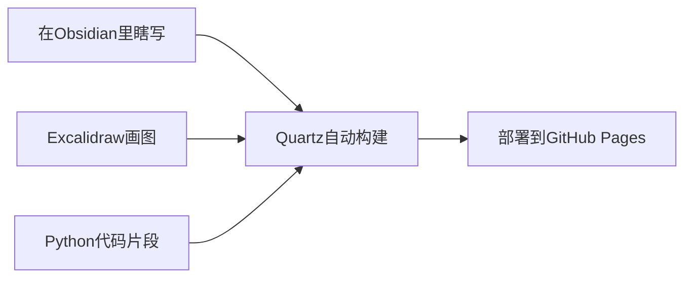

---
# 🤖 嗨，我在这里记录AI Agent开发的点点滴滴

> _"每一个bug都是通往智能的阶梯"_ 😅

这是我的个人学习笔记，主要记录在AI Agent开发和Python后端开发中的各种折腾。用Obsidian写，Quartz发布，偶尔画个图解释复杂概念。

## 👋 关于我在搞什么

最近主要在玩AI Agent开发，经常被各种框架搞得头大，所以决定把学到的东西都记下来，免得过两天又忘了。

### 🔧 我主要的AI开发工具箱 
- **🤖 Agent框架**： 
	- LangChain：老牌框架，生态丰富，太重了，不喜欢。
	- LangGraph：状态管理更清晰 ，但是用了一段时间放弃了。
	- Pydantic AI：类型安全，代码更优雅，支持依赖注入和工具书自动调用，完美的选择。
	- AutoGen: 玩具。
	- ADK：轻量的玩具。
	- Openai SDK：轻量，但是需要自己写的东西太多了。
- 🧸 **LLMdops
	- dify：也是最早用的，做demo可以，后端是同步的，并发有很大问题，分片部署才稳定。
	- fastgpt： 还行，技术栈代码好二开，知识库一般般。
	- n8n：挺好，并发好，可以并行，适合开发用，快速验证一些想法，但是现在更偏向用于pydantic ai。
	- ragflow：主要是知识库做的很全，企业用差点意思，需要改造不少。
	
- **🐍 Python后端**： 
	- FastAPI：API开发首选 ，异步框架。
	- Sanic：追求性能时的选择 ，底层uloop，io密集情况下并发是fastapi的两倍。
	
- **💾 数据存储**： 
	- PostgreSQL：关系数据 
	- Milvus：向量搜索

### 📝 这里有什么

#### 🤖 **AI Agent相关**

- **框架对比**：LangChain vs LangGraph vs Pydantic AI 的真实使用感受
- **踩坑记录**：那些让我熬夜的bug和解决方案
- **实践项目**：从hello world到真正能用的agent
- **思考杂谈**：关于AI发展的一些瞎想

#### 🐍 **Python开发**

- **后端实践**：FastAPI和Sanic的实际使用对比
- **数据处理**：PostgreSQL + Milvus 的组合使用心得
- **性能优化**：那些让代码跑得更快的小技巧
- **工具分享**：好用的Python库和开发工具

#### 💡 **学习笔记**

- **概念梳理**：把复杂的技术概念用人话说清楚
- **代码片段**：一些常用的代码模板和最佳实践
- **资源收集**：值得收藏的文档、教程和工具

## 🧭 怎么找东西

这里没啥复杂的分类，就是想到啥写啥：

- **🏷️ 标签**：我随手打的标签，比如 `#langchain` `#踩坑` `#好用`
- **🔍 搜索**：直接搜关键词，比搜索引擎好用（真的）
- **🌐 图谱**：右边那个蜘蛛网，可以看到笔记之间的联系
- **📖 侧边栏**：文件夹结构，不过我经常乱放文件...

## 📊 一些数字

```python
# 这些数据会动态更新的（希望如此😅）
stats = {
    "笔记数量": "还在慢慢积累中...",
    "代码片段": "能跑就行系列",
    "踩坑总数": "数不清了",
    "有用的发现": "偶尔有那么几个",
    "TODO项目": "列表很长，完成很少"
}
```

## 🎯 最近在折腾

- 🤔 **研究中**：怎么让AI Agent更靠谱一点
- 🔧 **在写**：一个能实际用的多Agent协作系统
- 📚 **在读**：各种AI paper，看懂一半算不错了
- 🐛 **在调试**：Milvus的奇怪行为，vector search怎么这么玄学

## 💭 一些碎碎念

### 🤖 关于AI Agent开发

说实话，这个领域变化太快了。昨天还在用LangChain，今天就出了新的framework。不过这种快速迭代也挺有意思的，每次都有新东西可以玩。

最大的感受是：**理论很美好，现实很骨感**。Demo很容易做，但要做一个真正稳定可用的Agent系统，坑真的不少。

### 🐍 关于Python后端

FastAPI真香，但有时候觉得太重了，最近在试Sanic，速度确实快不少。PostgreSQL + Milvus的组合用起来还不错，就是有时候数据同步会有点头疼。

### 📝 关于写笔记

开始是想系统地整理知识，后来发现还是随性一点比较好。有灵感就记下来，有坑就写下来，有好用的工具就分享一下。

## 📬 想聊天？

如果你也在搞AI Agent，或者对Python开发有啥想法，欢迎来交流（怕生，发邮件或者在github留言即可）：

- 📧 **邮箱**：yancyyu.ok@gmail.com
- 🐱 **GitHub**：[github.com/yancyuu](https://github.com/yancyuu) （代码质量不保证🙈）

## 🛠️ 这个站点是怎么搞的

简单说就是：



[部署教程](https://dev.to/defenderofbasic/host-your-obsidian-notebook-on-github-pages-for-free-8l1)

技术栈：
- **✍️ 写作**：Obsidian + Markdown
- **🎨 绘图**：Excalidraw
- **🚀 发布**：Quartz 4.0 + GitHub Pages

## 🔄 更新节奏

- 🤖 **AI相关**：有新发现就记录，通常一周几篇
- 🐍 **Python开发**：踩坑了就写，解决了就分享
- 💡 **随想**：想到啥写啥，完全看心情
- 🔧 **工具推荐**：发现好用的东西会及时更新

## 📄 关于内容

这里的内容都是我个人的学习笔记和实践经验，不一定是最佳实践，但都是真实踩过的坑和实际用过的方案。

如果你发现有啥问题或者有更好的方法，随时欢迎指正！学无止境嘛 😊

---

_💡 最后说一句：AI时代变化太快，这里的内容也在持续更新。有些想法可能过段时间看起来会很幼稚，但这就是学习的过程嘛~_

_📅 站点搭建于 2025年，持续更新中..._