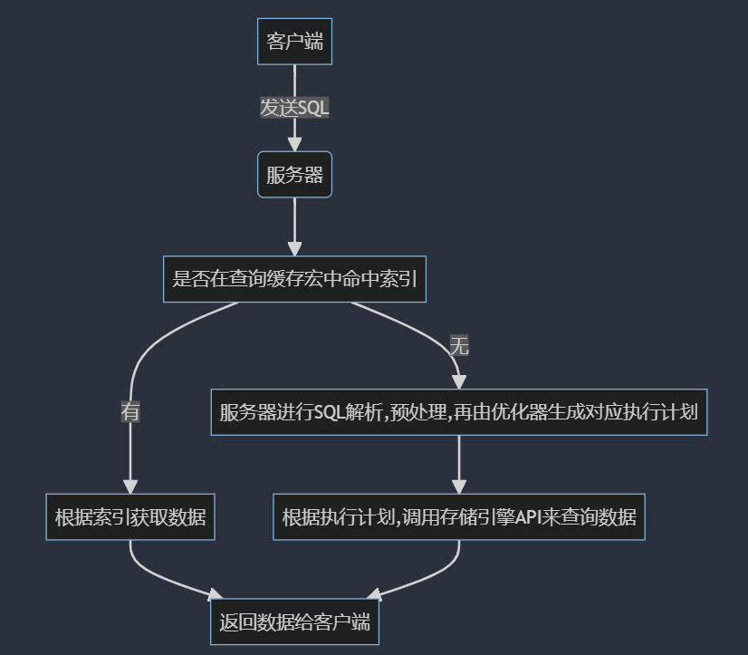

# 7、sql查询优化

Owner: yancy yu
Tags: mysql



## 如何获取有性能问题的SQL

- 通过用户反馈获取存在性能问题的SQL
- 通过慢日志获取存在性能问题的SQL
- 实时获取存在性能问题的SQL

### 使用慢查询日志获取有性能问题的SQL

- 存储日志所需要大量的磁盘空间。(所以需要通过一下参数控制)

**SQL慢查询的情况**

SQL慢查询是一个很常见的数据库性能问题。这种情况通常出现在数据库负载较高、查询复杂或数据量巨大的场景中。慢查询可能导致应用性能下降、用户体验差，甚至可能影响整个系统的稳定性。

**如何定位到SQL慢查询**

1. **慢查询日志**: 大多数数据库管理系统（如MySQL）都有慢查询日志功能，可以记录查询执行时间超过某个阈值的所有SQL语句。
2. **性能分析工具**: 使用如`EXPLAIN`等数据库自带的性能分析工具，或者第三方的数据库监控工具。
3. **应用级别日志**: 在应用代码中加入时间戳，记录查询开始和结束的时间，以确定是否存在慢查询。
4. **数据库性能指标**: 通过数据库管理系统自带的性能监控或使用第三方工具，观察CPU、内存、I/O等性能指标。

### SQL慢查询日志

在MySQL中，你可以通过以下几个步骤开启慢查询日志：

1. 打开MySQL配置文件（例如`my.cnf`或`my.ini`）。
2. 在`[mysqld]`部分下添加或修改`slow_query_log`和`slow_query_log_file`，例如：
    
    ```sql
    slow_query_log = 1
    slow_query_log_file = /var/log/mysql-slow.log
    long_query_time = 2
    
    ```
    
3. 重新启动MySQL服务。

这样，执行时间超过`long_query_time`（单位：秒）设置的查询将会被记录到`/var/log/mysql-slow.log`文件中。

### `EXPLAIN`的语句分析

`EXPLAIN`是一种用于查询优化的工具，通常用在`SELECT`、`INSERT`、`UPDATE`、`DELETE`等SQL语句前面。它提供了查询执行计划，说明数据库是如何执行这些SQL的。

以下是一些关键字段：

- `id`: 查询标识符
- `select_type`: 查询类型（例如：SIMPLE, SUBQUERY）
- `table`: 涉及的表
- `type`: 连接类型（例如：ALL, INDEX, RANGE）
- `possible_keys`: 可能用到的索引
- `key`: 实际用到的索引
- `key_len`: 索引长度
- `ref`: 参考字段
- `rows`: 预估需要读取的行数
- `Extra`: 额外信息（例如：Using where, Using index）

使用`EXPLAIN`可以帮助你理解SQL查询的执行过程，并据此进行优化。在实际的数据库性能优化工作中，通常会结合慢查询日志和`EXPLAIN`工具来诊断和解决问题。

### 实时获取有性能问题的SQL

- 使用mysql的information_schema数据库下的RPOCESSLIST表来实现

sql语句：select id,user,host,DB,command,time,state,info FROM information_schema.RPOCESSLIST WHERE TIME ≥60

### 特定SQL的查询优化

- 大表数据的跟新和删除(分批处理
- 大表的表结构的修改
    - 新表重命名<--数据同步→老表触发器 同步后老表加排他锁，重新命名俩表 删除老表
    - 使用工具pt-online-schema-change