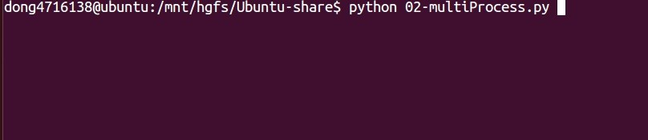
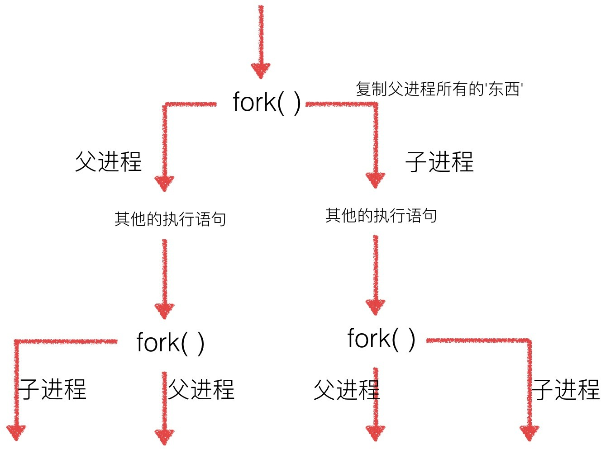
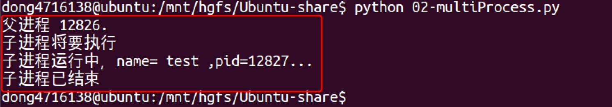
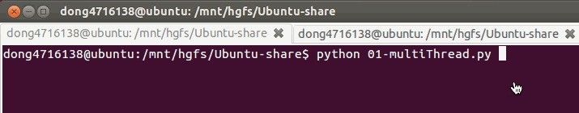
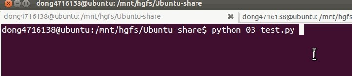
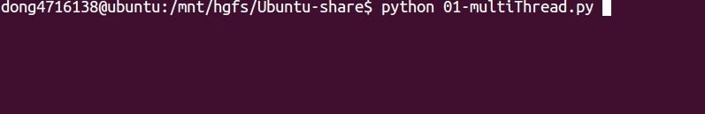
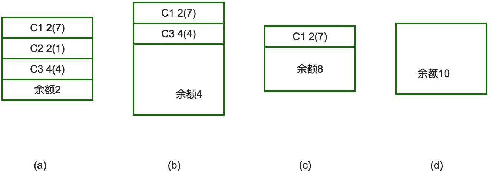

# 系统编程

Owner: yancy yu
Tags: Computer Principles

> 之前程序执⾏都是⼀条腿⾛路，甚⾄是⽤⼀杆枪来打天下
> 


> 通过系统编程的学习，会让⼤家有“多条腿”⼀起⾛路，就好⽐有了⼀把机关枪
> 


# 多任务的引入

## 1. 现实⽣活中

> 有很多的场景中的事情是同时进⾏的，⽐如开⻋的时候 ⼿和脚共同来驾驶汽
> 
> 
> ⻋，再⽐如唱歌跳舞也是同时进⾏的；
> 
> 如下视频是：迈克杰克逊的⼀段视频
> 
> [http://v.youku.com/v_show/id_XMzE5NjEzNjA0.html?](http://v.youku.com/v_show/id_XMzE5NjEzNjA0.html) &sid=40117&from=y1.2-1.999.6
> 
> 试想，如果把唱歌和跳舞这2件事情分开依次完成的话，估计就没有那么好的效果了（想⼀下场景：先唱歌，然后在跳舞，O(∩_∩)O哈哈~）
> 

```python
# coding=utf-8
from time import sleep

def sing():
    for i in range(3):
        print("正在唱歌...%d" % i)
        sleep(1)

def dance():
    for i in range(3):
        print("正在跳舞...%d" % i)
        sleep(1)

if __name__ == '__main__':
    sing()  # 唱歌
    dance()  # 跳舞
```

## 2. 程序中

> 如下程序，来模拟“唱歌跳舞”这件事情
> 
> 
> 
> 

## !!!注意

> 很显然刚刚的程序并没有完成唱歌和跳舞同时进⾏的要求
> 
> 
> 如果想要实现“唱歌跳舞”同时进⾏，那么就需要⼀个新的⽅法，叫做：**多任务**
> 

# 多任务的概念

> 什么叫“多任务”呢？简单地说，就是操作系统可以同时运⾏多个任务。打个
> 
> 
> ⽐⽅，你⼀边在⽤浏览器上⽹，⼀边在听MP3，⼀边在⽤Word赶作业， 这就是多任务，⾄少同时有3个任务正在运⾏。还有很多任务悄悄地在后台 同时运⾏着，只是桌⾯上没有显示⽽已。
> 


> 现在，多核CPU已经⾮常普及了，但是，即使过去的单核CPU，也可以执⾏多任务。由于CPU执⾏代码都是顺序执⾏的，那么，单核CPU是怎么执⾏多 任务的呢？
> 
> 
> 答案就是操作系统轮流让各个任务交替执⾏，任务1执⾏0.01秒，切换到任务2，任务2执⾏0.01秒，再切换到任务3，执⾏0.01秒……这样反复执⾏下去。 表⾯上看，每个任务都是交替执⾏的，但是，由于CPU的执⾏速度实在是太 快了，我们感觉就像所有任务都在同时执⾏⼀样。
> 
> 真正的并⾏执⾏多任务只能在多核CPU上实现，但是，由于任务数量远远多于CPU的核⼼数量，所以，操作系统也会⾃动把很多任务轮流调度到每个核心上执⾏。
> 


# 进程的创建-fork

## 1. 进程 VS 程序

> 编写完毕的代码，在没有运⾏的时候，称之为程序正在运⾏着的代码，就成为进程
> 
> 
> 进程，除了包含代码以外，还有需要运⾏的环境等，所以和程序是有区别的
> 

## 2. fork( )

> Python的os模块封装了常⻅的系统调⽤，其中就包括fork，可以在Python程序中轻松创建⼦进程：
> 

```python
import os
# 注意，fork函数，只在Unix/Linux/Mac上运行，windows不可以
pid = os.fork()
if pid == 0:
    print('哈哈1')
else:
    print('哈哈2')
```


**说明：**

- 程序执⾏到os.fork()时，操作系统会创建⼀个新的进程（⼦进程），然后**复制⽗进程的所有信息到⼦进程中**
- 然后**⽗进程和⼦进程都会从fork()函数中得到⼀个返回值，在⼦进程中这个值⼀定是0**，**⽽⽗进程中是⼦进程的 id号**

在Unix/Linux操作系统中，提供了⼀个fork()系统函数，它⾮常特殊。

普通的函数调⽤，调⽤⼀次，返回⼀次，但是fork()调⽤⼀次，返回两次， 因为操作系统⾃动把当前进程（称为⽗进程）复制了⼀份（称为⼦进程），然后，分别在⽗进程和⼦进程内返回。

**⼦进程永远返回0，⽽⽗进程返回⼦进程的ID。**

这样做的理由是，⼀个⽗进程可以fork出很多⼦进程，所以，⽗进程要记下每个⼦进程的ID，⽽⼦进程只需要调⽤getppid()就可以拿到⽗进程的ID 。

## 3. getpid()、getppid()

```python
import os

rpid = os.fork()
if rpid < 0:
    print("fork调用失败。")
elif rpid == 0:
    print("我是子进程（%s），我的父进程是（%s）" % (os.getpid(), os.getppid()))
    x += 1
else:
    print("我是父进程（%s），我的子进程是（%s）" % (os.getpid(), rpid))
    print("父子进程都可以执行这里的代码")
```

> 运⾏结果：
> 

```python
我是⽗进程（19360），我的⼦进程是（19361）
⽗⼦进程都可以执⾏这⾥的代码
我是⼦进程（19361），我的⽗进程是（19360）
⽗⼦进程都可以执⾏这⾥的代码
```

# 多进程修改全局变量

```python
# coding=utf-8
import os
import time

num = 0
# 注意，fork函数，只在Unix/Linux/Mac上运行，windows不可以
pid = os.fork()

if pid == 0:
    num += 1
    print('哈哈1---num=%d' % num)
else:
    time.sleep(1)
    num += 1
    print('哈哈2---num=%d' % num)
```

执行结果



**总结：**

- 多进程中，每个进程中所有数据（包括全局变量）都各有拥有⼀份，互不影响

# 多次fork问题

> 如果在⼀个程序，有2次的fork函数调⽤，是否就会有3个进程呢？
> 

```python
# coding=utf-8
import os
import time

# 注意，fork函数，只在Unix/Linux/Mac上运行，windows不可以
pid = os.fork()
if pid == 0:
    print('哈哈1')
else:
    print('哈哈2')

pid = os.fork()
if pid == 0:
    print('哈哈3')
else:
    print('哈哈4')

time.sleep(1)
```

执行结果：


### **说明：**



**⽗⼦进程的执⾏顺序**

⽗进程、⼦进程执⾏顺序没有规律，完全取决于操作系统的调度算法

# multiprocessing

> 如果你打算编写多进程的服务程序，Unix/Linux⽆疑是正确的选择。由于Windows没有fork调⽤，难道在Windows上⽆法⽤Python编写多进程的程 序？
> 
> 
> 由于Python是跨平台的，⾃然也应该提供⼀个跨平台的多进程⽀持。
> 
> multiprocessing模块就是跨平台版本的多进程模块。
> 
> multiprocessing模块提供了⼀个Process类来代表⼀个进程对象，下⾯的例⼦演示了启动⼀个⼦进程并等待其结束：
> 
> ```python
> # coding=utf-8
> from multiprocessing import Process
> import os
> 
> # 子进程要执行的代码
> def run_proc(name):
>     print('子进程运行中，name= %s ,pid=%d...' % (name, os.getpid()))
> 
> if __name__ == '__main__':
>     print('父进程 %d.' % os.getpid())
>     p = Process(target=run_proc, args=('test',))
>     print('子进程将要执行')
>     p.start()
>     p.join()
>     print('子进程已结束')
> ```
> 
> 
> 
> **说明**
> 
> 创建⼦进程时，只需要传⼊⼀个执⾏函数和函数的参数，创建⼀个Process实例，⽤start()⽅法启动，这样创建进程⽐fork()还要简单。join()⽅法可以等待⼦进程结束后再继续往下运⾏，通常⽤于进程间的同步。
> 

## Process语法结构如下：

> Process([group [, target [, name [, args [, kwargs]]]]]) target：表示这个进程实例所调⽤对象；
> 
> 
> args：表示调⽤对象的位置参数元组； kwargs：表示调⽤对象的关键字参数字典； name：为当前进程实例的别名；
> 
> group：⼤多数情况下⽤不到； Process类常⽤⽅法：
> 
> is_alive()：判断进程实例是否还在执⾏；
> 
> join([timeout])：是否等待进程实例执⾏结束，或等待多少秒； start()：启动进程实例（创建⼦进程）；
> 
> run()：如果没有给定target参数，对这个对象调⽤start()⽅法时，就将执
> 
> ⾏对象中的run()⽅法；
> 
> terminate()：不管任务是否完成，⽴即终⽌； Process类常⽤属性：
> 
> name：当前进程实例别名，默认为Process-N，N为从1开始递增的整数；
> 
> pid：当前进程实例的PID值；
> 
> **实例1**
> 
> ```python
> # coding=utf-8
> from multiprocessing import Process
> import os
> 
> # 子进程要执行的代码
> def run_proc(name):
>     print('子进程运行中，name= %s ,pid=%d...' % (name, os.getpid()))
> 
> if __name__ == '__main__':
>     print('父进程 %d.' % os.getpid())
>     p = Process(target=run_proc, args=('test',))
>     print('子进程将要执行')
>     p.start()
>     p.join()
>     print('子进程已结束')
> ```
> 
> 运⾏结果:
> 
> 
> 

### 实例2

> #coding=utf-8
> 
> 
> from multiprocessing import Process import time
> 
> import os
> 
> #两个⼦进程将会调⽤的两个⽅法def worker_1(interval):
> 
> print("worker_1,⽗进程(%s),当前进程(%s)"%(os.getppid(),os.getp
> 
> t_start = time.time()
> 
> time.sleep(interval) #程序将会被挂起interval秒t_end = time.time()
> 
> print("worker_1,执⾏时间为'%0.2f'秒"%(t_end - t_start))
> 
> def worker_2(interval):
> 
> print("worker_2,⽗进程(%s),当前进程(%s)"%(os.getppid(),os.getp t_start = time.time()
> 
> time.sleep(interval) t_end = time.time()
> 
> print("worker_2,执⾏时间为'%0.2f'秒"%(t_end - t_start))
> 
> #输出当前程序的ID
> 
> print("进程ID：%s"%os.getpid())
> 
> #创建两个进程对象，target指向这个进程对象要执⾏的对象名称， #args后⾯的元组中，是要传递给worker_1⽅法的参数，
> 
> #因为worker_1⽅法就⼀个interval参数，这⾥传递⼀个整数2给它，
> 
> #如果不指定name参数，默认的进程对象名称为Process-N，N为⼀个递增的整数
> 
> p1=Process(target=worker_1,args=(2,)) p2=Process(target=worker_2,name="dongGe",args=(1,))
> 
> #使⽤"进程对象名称.start()"来创建并执⾏⼀个⼦进程，
> 
> #这两个进程对象在start后，就会分别去执⾏worker_1和worker_2⽅法中的内容
> 
> p1.start() p2.start()
> 
> #同时⽗进程仍然往下执⾏，如果p2进程还在执⾏，将会返回True
> 
> print("p2.is_alive=%s"%p2.is_alive())
> 
> #输出p1和p2进程的别名和pid print("p1.name=%s"%p1.name) print("p1.pid=%s"%p1.pid) print("p2.name=%s"%p2.name) print("p2.pid=%s"%p2.pid)
> 
> #join括号中不携带参数，表示⽗进程在这个位置要等待p1进程执⾏完成后， #再继续执⾏下⾯的语句，⼀般⽤于进程间的数据同步，如果不写这⼀句，
> 
> #下⾯的is_alive判断将会是True，在shell（cmd）⾥⾯调⽤这个程序时
> 
> #可以完整的看到这个过程，⼤家可以尝试着将下⾯的这条语句改成p1.join(1)，
> 
> #因为p2需要2秒以上才可能执⾏完成，⽗进程等待1秒很可能不能让p1完全执⾏完成， #所以下⾯的print会输出True，即p1仍然在执⾏
> 
> p1.join() print("p1.is_alive=%s"%p1.is_alive())
> 
> 执⾏结果:
> 

# 进程的创建-Process⼦类

> 创建新的进程还能够使⽤类的⽅式，可以⾃定义⼀个类，继承Process类，每次实例化这个类的时候，就等同于实例化⼀个进程对象，请看下⾯的实例：
> 
> 
> ```python
> from multiprocessing import Process
> import time
> import os
> 
> # 继承Process类
> class Process_Class(Process):
> 
>     # 因为Process类本身也有__init__方法，这个子类相当于重写了这个方法，
>     # 但这样就会带来一个问题，我们并没有完全的初始化一个Process类，所以就需要调用基类的__init__方法
>     def __init__(self, interval):
>         Process.__init__(self)
>         self.interval = interval
> 
>     # 重写了Process类的run()方法
>     def run(self):
>         print("子进程(%s) 开始执行，父进程为（%s）" % (os.getpid(), os.getppid()))
>         t_start = time.time()
>         time.sleep(self.interval)
>         t_stop = time.time()
>         print("(%s)执行结束，耗时%0.2f秒" % (os.getpid(), t_stop - t_start))
> 
> if __name__ == "__main__":
>     t_start = time.time()
>     print("当前程序进程(%s)" % os.getpid())
>     p1 = Process_Class(2)
>     # 对一个不包含target属性的Process类执行start()方法，就会运行这个类中的run()方法
>     p1.start()
>     p1.join()
>     t_stop = time.time()
>     print("(%s)执行结束，耗时%0.2f" % (os.getpid(), t_stop - t_start))
> ```
> 

# 进程池Pool

> 当需要创建的⼦进程数量不多时，可以直接利⽤multiprocessing中的Process 动态成⽣多个进程，但如果是上百甚⾄上千个⽬标，⼿动的去创建进程的⼯作量巨⼤，此时就可以⽤到multiprocessing模块提供的Pool⽅法。
> 
> 
> 初始化Pool时，可以指定⼀个最⼤进程数，当有新的请求提交到Pool中时， 如果池还没有满，那么就会创建⼀个新的进程⽤来执⾏该请求；但如果池中的进程数已经达到指定的最⼤值，那么该请求就会等待，直到池中有进程结束，才会创建新的进程来执⾏，请看下⾯的实例：
> 
> ```python
> from multiprocessing import Pool
> import os, time, random
> 
> def worker(msg):
>     t_start = time.time()
>     print("%s开始执行,进程号为%d" % (msg, os.getpid()))
>     # random.random()随机生成0~1之间的浮点数
>     time.sleep(random.random() * 2)
>     t_stop = time.time()
>     print(msg, "执行完毕，耗时%0.2f" % (t_stop - t_start))
> 
> po = Pool(3)  # 定义一个进程池，最大进程数3
> 
> for i in range(0, 10):
>     # Pool.apply_async(要调用的目标,(传递给目标的参数元祖,))
>     # 每次循环将会用空闲出来的子进程去调用目标
>     po.apply_async(worker, (i,))
> 
> print("----start----")
> po.close()  # 关闭进程池，关闭后po不再接收新的请求
> po.join()  # 等待po中所有子进程执行完成，必须放在close语句之后
> print("-----end-----")
> ```
> 
> 运⾏结果:
> 
> ```python
> ----start----
> 0开始执⾏,进程号为21466
> 1开始执⾏,进程号为21468
> 2开始执⾏,进程号为21467
> 0 执⾏完毕，耗时1.01
> 3开始执⾏,进程号为21466
> 2 执⾏完毕，耗时1.24
> 4开始执⾏,进程号为21467
> 3 执⾏完毕，耗时0.56
> 5开始执⾏,进程号为21466
> 1 执⾏完毕，耗时1.68
> 6开始执⾏,进程号为21468
> 4 执⾏完毕，耗时0.67
> 7开始执⾏,进程号为21467
> 5 执⾏完毕，耗时0.83
> 8开始执⾏,进程号为21466
> 6 执⾏完毕，耗时0.75
> 9开始执⾏,进程号为21468
> 7 执⾏完毕，耗时1.03
> 8 执⾏完毕，耗时1.05
> 9 执⾏完毕，耗时1.69
> -----end-----
> ```
> 
> multiprocessing.Pool常⽤函数解析：
> 
> - apply_async(func[, args[, kwds]]) ：使⽤⾮阻塞⽅式调⽤func（并⾏执⾏，堵塞⽅式必须等待上⼀个进程退出才能执⾏下⼀个进程），args为传递给func的参数列表，kwds为传递给func的关键字参数列表；
> - apply(func[, args[, kwds]])：使⽤阻塞⽅式调⽤func close()：关闭Pool，使其不再接受新的任务；
> - terminate()：不管任务是否完成，⽴即终⽌；
> - join()：主进程阻塞，等待⼦进程的退出， 必须在close或terminate之后使⽤；

# **apply堵塞式**

```python
当然，以下是格式化后的代码：

```python
from multiprocessing import Pool
import os, time, random

def worker(msg):
    t_start = time.time()
    print("%s开始执行,进程号为%d" % (msg, os.getpid()))
    # random.random()随机生成0~1之间的浮点数
    time.sleep(random.random() * 2)
    t_stop = time.time()
    print(msg, "执行完毕，耗时%0.2f" % (t_stop - t_start))

po = Pool(3)  # 定义一个进程池，最大进程数3
for i in range(0, 10):
    po.apply(worker, (i,))
print("----start----")
po.close()  # 关闭进程池，关闭后po不再接收新的请求
po.join()  # 等待po中所有子进程执行完成，必须放在close语句之后
print("-----end-----")
```

该代码块展示了使用`Pool`来管理进程的示例，定义了一个进程池，并通过`apply`方法将任务分配给各个进程。代码格式化后，可读性更强。
```

运⾏结果:

```python
----start----
0开始执⾏,进程号为21532
0 执⾏完毕，耗时1.91
1开始执⾏,进程号为21534
1 执⾏完毕，耗时1.72
2开始执⾏,进程号为21533
2 执⾏完毕，耗时0.50
3开始执⾏,进程号为21532
3 执⾏完毕，耗时1.27
4开始执⾏,进程号为21534
4 执⾏完毕，耗时1.05
5开始执⾏,进程号为21533
5 执⾏完毕，耗时1.60
python基础语⾔
26 进程池Pool
6开始执⾏,进程号为21532
6 执⾏完毕，耗时0.25
7开始执⾏,进程号为21534
7 执⾏完毕，耗时0.63
8开始执⾏,进程号为21533
8 执⾏完毕，耗时1.21
9开始执⾏,进程号为21532
9 执⾏完毕，耗时0.60
-----end-----
```

# 进程间通信-Queue

Process之间有时需要通信，操作系统提供了很多机制来实现进程间的通信。

1. **Queue的使⽤**

> 可以使⽤multiprocessing模块的Queue实现多进程之间的数据传递，Queue 本身是⼀个消息列队程序，⾸先⽤⼀个⼩实例来演示⼀下Queue的⼯作原理：
> 
> 
> 运⾏结果:
> 
> **说明**
> 
> 初始化Queue()对象时（例如：q=Queue()），若括号中没有指定最⼤可接收的消息数量，或数量为负值，那么就代表可接受的消息数量没有上限（直到内存的尽头）；
> 
> Queue.qsize()： 返 回 当 前 队 列 包 含 的 消 息 数 量 ； Queue.empty()：如果队列为空，返回True，反之False ； Queue.full()：如果队列满了，返回True,反之False；
> 
> Queue.get([block[, timeout]])：获取队列中的⼀条消息，然后将其从列队中移除，block默认值为True；
> 
1. 如果block使⽤默认值，且没有设置timeout（单位秒），消息列队如果为空，此时程序将被阻塞（停在读取状态），直到从消息列队读到消息为⽌， 如果设置了timeout，则会等待timeout秒，若还没读取到任何消息，则抛

> 出"Queue.Empty"异常；
> 
1. 如果block值为False，消息列队如果为空，则会⽴刻抛出"Queue.Empty"异常；

> Queue.get_nowait()：相当Queue.get(False)；
> 
> 
> Queue.put(item,[block[, timeout]])：将item消息写⼊队列，block默认值为True；
> 
1. 如果block使⽤默认值，且没有设置timeout（单位秒），消息列队如果已经没有空间可写⼊，此时程序将被阻塞（停在写⼊状态），直到从消息列队腾出空间为⽌，如果设置了timeout，则会等待timeout秒，若还没空间，则抛出"Queue.Full"异常；
2. 如果block值为False，消息列队如果没有空间可写⼊，则会⽴刻抛出"Queue.Full"异常；

> Queue.put_nowait(item)：相当Queue.put(item, False)；
> 

## Queue实例

> 我们以Queue为例，在⽗进程中创建两个⼦进程，⼀个往Queue⾥写数据，
> 
> 
> ⼀个从Queue⾥读数据：
> 
> ```python
> # coding=utf-8
> from multiprocessing import Queue
> 
> q = Queue(3)  # 初始化一个Queue对象，最多可接收三条put消息
> q.put("消息1")
> q.put("消息2")
> print(q.full())  # False
> q.put("消息3")
> print(q.full())  # True
> 
> # 因为消息队列已满下面的try都会抛出异常，第一个try会等待2秒后再抛出异常，第二个try会立刻抛出异常
> try:
>     q.put("消息4", True, 2)
> except:
>     print("消息队列已满，现有消息数量:%s" % q.qsize())
> 
> try:
>     q.put_nowait("消息4")
> except:
>     print("消息队列已满，现有消息数量:%s" % q.qsize())
> 
> # 推荐的方式，先判断消息队列是否已满，再写入
> if not q.full():
>     q.put_nowait("消息4")
> 
> # 读取消息时，先判断消息队列是否为空，再读取
> if not q.empty():
>     for i in range(q.qsize()):
>         print(q.get_nowait())
> ```
> 

运⾏结果：

```python
False
True
消息列队已满，现有消息数量:3
消息列队已满，现有消息数量:3
消息1
消息2
消息3
```

**说明**

初始化Queue()对象时（例如：q=Queue()），**若括号中没有指定最⼤可接收的消息数量，或数量为负值，那么就代表可接受的消息数量没有上限（直到内存的尽头）**；

- Queue.qsize()：返回当前队列包含的消息数量；
- Queue.empty()：如果队列为空，返回True，反之False ；
- Queue.full()：如果队列满了，返回True,反之False；
- Queue.get([block[, timeout]])：获取队列中的⼀条消息，然后将其从列队中移除，block默认值为True；
1. 如果block使⽤默认值，且没有设置timeout（单位秒），消息列队如果为空，此时程序将被阻塞（停在读取状态），直到从消息列队读到消息为⽌，如果设置了timeout，则会等待timeout秒，若还没读取到任何消息，则抛出"Queue.Empty"异常；
2. 如果block值为False，消息列队如果为空，则会⽴刻抛出"Queue.Empty"异常；
    - Queue.get_nowait()：相当Queue.get(False)；
    - Queue.put(item,[block[, timeout]])：将item消息写⼊队列，block默认值为True；
3. 如果block使⽤默认值，且没有设置timeout（单位秒），消息列队如果已经没有空间可写⼊，此时程序将被阻塞（停在写⼊状态），直到从消息列队腾出空间为⽌，如果设置了timeout，则会等待timeout秒，若还没空间，则抛出"Queue.Full"异常；
4. 如果block值为False，消息列队如果没有空间可写⼊，则会⽴刻抛出"Queue.Full"异常；
    - Queue.put_nowait(item)：相当Queue.put(item, False)；

## 进程池中的Queue

> **如果要使⽤Pool创建进程，就需要使⽤multiprocessing.Manager()中的Queue()，⽽不是multiprocessing.Queue()**，否则会得到⼀条如下的错误信息：
> 
> 
> RuntimeError: Queue objects should only be shared between processes through inheritance.
> 
> 下⾯的实例演示了进程池中的进程如何通信：
> 
> ```python
> # coding=utf-8
> from multiprocessing import Queue
> 
> q = Queue(3)  # 初始化一个Queue对象，最多可接收三条put消息
> q.put("消息1")
> q.put("消息2")
> print(q.full())  # False
> q.put("消息3")
> print(q.full())  # True
> 
> # 因为消息队列已满下面的try都会抛出异常，第一个try会等待2秒后再抛出异常，第二个try会立刻抛出异常
> try:
>     q.put("消息4", True, 2)
> except:
>     print("消息队列已满，现有消息数量:%s" % q.qsize())
> 
> try:
>     q.put_nowait("消息4")
> except:
>     print("消息队列已满，现有消息数量:%s" % q.qsize())
> 
> # 推荐的方式，先判断消息队列是否已满，再写入
> if not q.full():
>     q.put_nowait("消息4")
> 
> # 读取消息时，先判断消息队列是否为空，再读取
> if not q.empty():
>     for i in range(q.qsize()):
>         print(q.get_nowait())
> ```
> 

运⾏结果:

```python
(21156) start
writer启动(21162),⽗进程为(21156)
reader启动(21162),⽗进程为(21156)
reader从Queue获取到消息：d
reader从Queue获取到消息：o
reader从Queue获取到消息：n
reader从Queue获取到消息：g
reader从Queue获取到消息：G
reader从Queue获取到消息：e
(21156) End
```

# 多线程-threading

### python的thread模块是⽐较底层的模块，python的threading模块是对thread做了⼀些包装的，可以更加⽅便的被使⽤

## **1. 使用模threading块**

### 单线程执行

```python
#coding=utf-8
import time

def saySorry():
    print("亲爱的，我错了，我能吃饭了吗？")
    time.sleep(1)

if __name__ == "__main__":
    for i in range(5):
        saySorry()
```

> 运⾏结果：
> 


### 多线程执行

```python
#coding=utf-8
import threading
import time

def saySorry():
    print("亲爱的，我错了，我能吃饭了吗？")
    time.sleep(1)

if __name__ == "__main__":
    for i in range(5):
        t = threading.Thread(target=saySorry)
        t.start() #启动线程，即让线程开始执行
```

> 运⾏结果：
> 


> 说明
> 
1. **可以明显看出使⽤了多线程并发的操作，花费时间要短很多**
2. **创建好的线程，需要调⽤ start() ⽅法来启动**

## 2. **主线程会等待所有的⼦线程结束后才结束**

```python
#coding=utf-8
import threading
from time import sleep, ctime

def sing():
    for i in range(3):
        print("正在唱歌...%d" % i)
        sleep(1)

def dance():
    for i in range(3):
        print("正在跳舞...%d" % i)
        sleep(1)

if __name__ == '__main__':
    print('---开始---:%s' % ctime())
    t1 = threading.Thread(target=sing)
    t2 = threading.Thread(target=dance)
    t1.start()
    t2.start()
    #sleep(5) # 屏蔽此行代码，试试看，程序是否会立即结束？
    print('---结束---:%s' % ctime())
```

> 运⾏结果：
> 

```python
---开始---:Tue Aug 22 12:12:07 2023
正在唱歌...0
---结束---:Tue Aug 22 12:12:07 2023正在跳舞...0

正在唱歌...1
正在跳舞...1
正在唱歌...2
正在跳舞...2
```

## 3. **查看线程数量**

```python
#coding=utf-8
import threading
from time import sleep, ctime

def sing():
    for i in range(3):
        print("正在唱歌...%d" % i)
        sleep(1)

def dance():
    for i in range(3):
        print("正在跳舞...%d" % i)
        sleep(1)

if __name__ == '__main__':
    print('---开始---:%s' % ctime())
    t1 = threading.Thread(target=sing)
    t2 = threading.Thread(target=dance)
    t1.start()
    t2.start()
    while True:
        length = len(threading.enumerate())
        print('当前运行的线程数为：%d' % length)
        if length <= 1:
            break
        sleep(0.5)
```

> 运⾏结果：
> 

```python
---开始---:Tue Aug 22 12:17:08 2023当前运行的线程数为：3
正在唱歌...0
正在跳舞...0
当前运行的线程数为：3
当前运行的线程数为：3
正在唱歌...1正在跳舞...1

当前运行的线程数为：3
当前运行的线程数为：3正在跳舞...2正在唱歌...2

当前运行的线程数为：3当前运行的线程数为：1
```

# threading注意点

## 线程执⾏代码的封装

> 通过上⼀⼩节，能够看出，通过使⽤threading模块能完成多任务的程序开 发，为了让每个线程的封装性更完美，所以使⽤threading模块时，往往会定义⼀个新的⼦类class，只要继承threading.Thread 就可以了，然后重写 run ⽅ 法
> 
> 
> 示例如下：
> 
> ```python
> import threading
> import time
> 
> class MyThread(threading.Thread):
>     def run(self):
>         for i in range(3):
>             time.sleep(1)
>             msg = "I'm " + self.name + ' @ ' + str(i)  # name属性中保存的是当前线程的名字
>             print(msg)
> 
> if __name__ == '__main__':
>     t = MyThread()
>     t.start()
> ```
> 

**说明**

**python的threading.Thread类有⼀个run⽅法，⽤于定义线程的功能函 数，可以在⾃⼰的线程类中覆盖该⽅法**。⽽创建⾃⼰的线程实例后， 通过Thread类的start⽅法，可以启动该线程，交给python虚拟机进⾏调度，当该线程获得执⾏的机会时，就会调⽤run⽅法执⾏线程。

## 线程的执⾏顺序

> 执⾏结果：(运⾏的结果可能不⼀样，但是⼤体是⼀致的)
> 
> 
> **说明**
> 
> 从代码和执⾏结果我们可以看出，多线程程序的执⾏顺序是不确定的。当执
> 
> ⾏到sleep语句时，线程将被阻塞（Blocked），到sleep结束后，线程进⼊就绪（Runnable）状态，等待调度。⽽线程调度将⾃⾏选择⼀个线程执⾏。上
> 
> ⾯的代码中只能保证每个线程都运⾏完整个run函数，但是线程的启动顺序、
> 
> run函数中每次循环的执⾏顺序都不能确定。
> 

## 总结

1. 每个线程⼀定会有⼀个名字，尽管上⾯的例⼦中没有指定线程对象的

> name，但是python会⾃动为线程指定⼀个名字。
> 
1. 当线程的run()⽅法结束时该线程完成。
2. ⽆法控制线程调度程序，但可以通过别的⽅式来影响线程调度的⽅式。
3. 线程的⼏种状态

> 
> 

# 多线程-共享全局变量

> 运⾏结果:
> 
> 
> **列表当做实参传递到线程中**
> 
> 运⾏结果:
> 

## 总结：

> 在⼀个进程内的所有线程共享全局变量，能够在不适⽤其他⽅式的前提
> 
> 
> 下完成多线程之间的数据共享（这点要⽐多进程要好）
> 
> 缺点就是，线程是对全局变量随意遂改可能造成多线程之间对全局变量的混乱（即线程⾮安全）
> 

# 进程VS线程

## 功能

> 进程，能够完成多任务，⽐如 在⼀台电脑上能够同时运⾏多个QQ 线程，能够完成多任务，⽐如 ⼀个QQ中的多个聊天窗⼝
> 
> 
> 
> 

## 定义的不同

> 进程是系统进⾏资源分配和调度的⼀个独⽴单位.
> 
> 
> 线程是进程的⼀个实体,是CPU调度和分派的基本单位,它是⽐进程更⼩的 能独⽴运⾏的基本单位.线程⾃⼰基本上不拥有系统资源,只拥有⼀点在运
> 
> ⾏中必不可少的资源(如程序计数器,⼀组寄存器和栈),但是它可与同属⼀个进程的其他的线程共享进程所拥有的全部资源.
> 

## 区别

> ⼀个程序⾄少有⼀个进程,⼀个进程⾄少有⼀个线程.
> 
> 
> 线程的划分尺度⼩于进程(资源⽐进程少)，使得多线程程序的并发性⾼。 进程在执⾏过程中拥有独⽴的内存单元，⽽多个线程共享内存，从⽽极⼤地提⾼了程序的运⾏效率
> 
> 线线程不能够独⽴执⾏，必须依存在进程中
> 

## 优缺点

> 线程和进程在使⽤上各有优缺点：线程执⾏开销⼩，但不利于资源的管理和 保护；⽽进程正相反。
> 

# 同步的概念

## 多线程开发可能遇到的问题

> 假设两个线程t1和t2都要对num=0进⾏增1运算，t1和t2都各对num修改10 次，num的最终的结果应该为20。
> 
> 
> 但是由于是多线程访问，有可能出现下⾯情况：
> 
> 在num=0时，t1取得num=0。此时系统把t1调度为”sleeping”状态，把t2转换为”running”状态，t2也获得num=0。然后t2对得到的值进⾏加1并赋给num， 使得num=1。然后系统⼜把t2调度为”sleeping”，把t1转为”running”。线程t1
> 
> ⼜把它之前得到的0加1后赋值给num。这样，明明t1和t2都完成了1次加1⼯作，但结果仍然是num=1。
> 
> 运⾏结果(可能不⼀样，但是结果往往不是2000000)：
> 
> 取消屏蔽之后，再次运⾏结果如下：
> 
> 问题产⽣的原因就是没有控制多个线程对同⼀资源的访问，对数据造成破坏，使得线程运⾏的结果不可预期。这种现象称为“线程不安全”。
> 

## 什么是同步

> 同步就是协同步调，按预定的先后次序进⾏运⾏。如:你说完，我再说。
> 
> 
> "同"字从字⾯上容易理解为⼀起动作
> 
> 其实不是，"同"字应是指协同、协助、互相配合。
> 
> 如进程、线程同步，可理解为进程或线程A和B⼀块配合，A执⾏到⼀定程度 时要依靠B的某个结果，于是停下来，示意B运⾏;B依⾔执⾏，再将结果给A;A再继续操作。
> 

## 解决问题的思路

> 对于本⼩节提出的那个计算错误的问题，可以通过 线程同步 来进⾏解决思路，如下:
> 
1. 系统调⽤t1，然后获取到num的值为0，此时上⼀把锁，即不允许其他现在操作num
2. 对num的值进⾏+1
3. 解锁，此时num的值为1，其他的线程就可以使⽤num了，⽽且是num的值不是0⽽是1
4. 同理其他线程在对num进⾏修改时，都要先上锁，处理完后再解锁，在上锁的整个过程中不允许其他线程访问，就保证了数据的正确性

# 互斥锁

> 当多个线程⼏乎同时修改某⼀个共享数据的时候，需要进⾏同步控制线程同步能够保证多个线程安全访问竞争资源，最简单的同步机制是引⼊互斥锁。互斥锁为资源引⼊⼀个状态：锁定/⾮锁定。
> 
> 
> **某个线程要更改共享数据时，先将其锁定，此时资源的状态为“锁定”，其他线程不能更改**；直到该线程释放资源，将资源的状态变成“⾮锁定”，其他的线程才能再次锁定该资源。互斥锁保证了每次只有⼀个线程进⾏写⼊操作， 从⽽保证了多线程情况下数据的正确性。
> 


> threading模块中定义了Lock类，可以⽅便的处理锁定：
> 
> 
> 其中，锁定⽅法acquire可以有⼀个blocking参数。
> 
> 如果设定blocking为True，则当前线程会堵塞，直到获取到这个锁为⽌
> 
> （如果没有指定，那么默认为True）
> 
> 如果设定blocking为False，则当前线程不会堵塞
> 
> 使⽤互斥锁实现上⾯的例⼦的代码如下：
> 
> 运⾏结果：
> 
> 可以看到，加⼊互斥锁后，运⾏结果与预期相符。
> 
> **上锁解锁过程**
> 
> 当⼀个线程调⽤锁的acquire()⽅法获得锁时，锁就进⼊“locked”状态。
> 
> 每次只有⼀个线程可以获得锁。如果此时另⼀个线程试图获得这个锁，该线程就会变为“blocked”状态，称为“阻塞”，直到拥有锁的线程调⽤锁的release()⽅法释放锁之后，锁进⼊“unlocked”状态。
> 
> 线程调度程序从处于同步阻塞状态的线程中选择⼀个来获得锁，并使得该线程进⼊运⾏（running）状态。
> 

## 总结

> 锁的好处：
> 
> 
> 确保了某段关键代码只能由⼀个线程从头到尾完整地执⾏锁的坏处：
> 
> 阻⽌了多线程并发执⾏，包含锁的某段代码实际上只能以单线程模式执
> 
> ⾏，效率就⼤⼤地下降了
> 
> 由于可以存在多个锁，不同的线程持有不同的锁，并试图获取对⽅持有的锁时，可能会造成死锁
> 

# 多线程-⾮共享数据

> 对于全局变量，在多线程中要格外⼩⼼，否则容易造成数据错乱的情况发⽣
> 
> 
> **1. ⾮全局变量是否要加锁呢？**
> 
> 运⾏结果:
> 
> 
> 



## ⼩总结

> 在多线程开发中，全局变量是多个线程都共享的数据，⽽局部变量等是各⾃线程的，是⾮共享的
> 

# 死锁

> 现实社会中，男⼥双⽅都在等待对⽅先道歉
> 


> 如果双⽅都这样固执的等待对⽅先开⼝，弄不好，就分搜了
> 
1. **死锁**

> 在线程间共享多个资源的时候，如果两个线程分别占有⼀部分资源并且同时等待对⽅的资源，就会造成死锁。
> 
> 
> 尽管死锁很少发⽣，但⼀旦发⽣就会造成应⽤的停⽌响应。下⾯看⼀个 死锁的例⼦
> 
> 
> 
> 此时已经进⼊到了死锁状态，可以使⽤ctrl-z退出
> 

## 说明

> 
> 
1. **避免死锁**

> 程序设计时要尽量避免（银⾏家算法） 添加超时时间等
> 

## 附录-银⾏家算法

> [背景知识]
> 
> 
> ⼀个银⾏家如何将⼀定数⽬的资⾦安全地借给若⼲个客户，使这些客户既能借到钱完成要⼲的事，同时银⾏家⼜能收回全部资⾦⽽不⾄于破产，这就是银⾏家问题。这个问题同操作系统中资源分配问题⼗分相似：银⾏家就像⼀个操作系统，客户就像运⾏的进程，银⾏家的资⾦就是系统的资源。
> 
> [问题的描述]
> 
> ⼀个银⾏家拥有⼀定数量的资⾦，有若⼲个客户要贷款。每个客户须在⼀开始就声明他所需贷款的总额。若该客户贷款总额不超过银⾏家的资⾦总 数，银⾏家可以接收客户的要求。客户贷款是以每次⼀个资⾦单位（如1 万RMB等）的⽅式进⾏的，客户在借满所需的全部单位款额之前可能会 等待，但银
> 
> ⾏家须保证这种等待是有限的，可完成的。
> 
> 例如：有三个客户C1，C2，C3，向银⾏家借款，该银⾏家的资⾦总额为10 个资⾦单位，其中C1客户要借9各资⾦单位，C2客户要借3个资⾦单位，C3 客户要借8个资⾦单位，总计20个资⾦单位。某⼀时刻的状态如图所示。
> 



> 对于a图的状态，按照安全序列的要求，我们选的第⼀个客户应满⾜该客户所需的贷款⼩于等于银⾏家当前所剩余的钱款，可以看出只有C2客户能被满
> 
> 
> ⾜：C2客户需1个资⾦单位，⼩银⾏家⼿中的2个资⾦单位，于是银⾏家把1个资⾦单位借给C2客户，使之完成⼯作并归还所借的3个资⾦单位的 钱，进
> 
> ⼊b图。同理，银⾏家把4个资⾦单位借给C3客户，使其完成⼯作，在c图中，只剩⼀个客户C1，它需7个资⾦单位，这时银⾏家有8个资⾦单位，所以C1也能顺利借到钱并完成⼯作。最后（⻅图d）银⾏家收回全部10个资⾦单位，保证不赔本。那麽客户序列{C1，C2，C3}就是个安全序列，按照这个序列贷款，银⾏家才是安全的。否则的话，若在图b状态时，银⾏家把⼿中的4 个资⾦单位借给了C1，则出现不安全状态：这时C1，C3均不能完成⼯作，⽽银⾏家⼿中⼜没有钱了，系统陷⼊僵持局⾯，银⾏家也不能收回投资。
> 
> 综上所述，银⾏家算法是从当前状态出发，逐个按安全序列检查各客户谁能完成其⼯作，然后假定其完成⼯作且归还全部贷款，再进⽽检查下⼀个能完成⼯作的客户 。如果所有客户都能完成⼯作，则找到⼀个安全序列，银⾏家才是安全的。
> 

# 同步应⽤

## 多个线程有序执⾏

> from threading import Thread,Lock from time import sleep
> 
> 
> class Task1(Thread): def run(self):
> 
> while True:
> 
> if lock1.acquire():
> 
> print("------Task 1 ")
> 
> sleep(0.5) lock2.release()
> 
> class Task2(Thread): def run(self):
> 
> while True:
> 
> if lock2.acquire():
> 
> print("------Task 2 ")
> 
> sleep(0.5) lock3.release()
> 
> class Task3(Thread): def run(self):
> 
> while True:
> 
> if lock3.acquire():
> 
> print("------Task 3 ")
> 
> sleep(0.5) lock1.release()
> 
> #使⽤Lock创建出的锁默认没有“锁上” lock1 = Lock()
> 
> #创建另外⼀把锁，并且“锁上”
> 
> 运⾏结果:
> 

| Task | 1 |  |
| --- | --- | --- |
| Task | 2 |  |
| Task | 3 |  |
| Task | 1 |  |
| Task | 2 |  |
| Task | 3 |  |
| Task | 1 |  |
| Task | 2 |  |
| Task | 3 |  |
| Task | 1 |  |
| Task | 2 |  |
| Task | 3 |  |
| Task | 1 |  |
| Task | 2 |  |
| Task
...省略... | 3 |  |

> 总结
> 
> 
> 可以使⽤互斥锁完成多个任务，有序的进程⼯作，这就是线程的同步
> 

# ⽣产者与消费者模式

## 队列

> 先进先出
> 


## 栈

> 先进后出
> 
> 
> 
> 
> Python的Queue模块中提供了同步的、线程安全的队列类，包括FIFO（先⼊先出)队列Queue，LIFO（后⼊先出）队列LifoQueue，和优先级队列PriorityQueue。这些队列都实现了锁原语（可以理解为原⼦操作，即要么不做，要么就做完），能够在多线程中直接使⽤。可以使⽤队列来实现线程间的同步。
> 
> ⽤FIFO队列实现上述⽣产者与消费者问题的代码如下：
> 
> global queue count = 0 while True:
> 
> if queue.qsize() < 1000: for i in range(100): count = count +1
> 
> msg = '⽣成产品'+str(count)
> 
> queue.put(msg) print(msg)
> 
> time.sleep(0.5)
> 
> class Consumer(threading.Thread): def run(self):
> 
> global queue while True:
> 
> if queue.qsize() > 100: for i in range(3):
> 
> msg = self.name + '消费了 '+queue.get()
> 
> print(msg) time.sleep(1)
> 
> if   name   == '   main   ': queue = Queue()
> 
> for i in range(500): queue.put('初始产品'+str(i))
> 
> for i in range(2): p = Producer() p.start()
> 
> for i in range(5): c = Consumer() c.start()
> 

## Queue的说明

1. 对于Queue，在多线程通信之间扮演重要的⻆⾊
2. 添加数据到队列中，使⽤put()⽅法
3. 从队列中取数据，使⽤get()⽅法
4. 判断队列中是否还有数据，使⽤qsize()⽅法

## 4. ⽣产者消费者模式的说明

> 为什么要使⽤⽣产者和消费者模式
> 
> 
> 在线程世界⾥，⽣产者就是⽣产数据的线程，消费者就是消费数据的线程。 在多线程开发当中，如果⽣产者处理速度很快，⽽消费者处理速度很慢，那么⽣产者就必须等待消费者处理完，才能继续⽣产数据。同样的道理，如果消费者的处理能⼒⼤于⽣产者，那么消费者就必须等待⽣产者。为了解决这个问题于是引⼊了⽣产者和消费者模式。
> 
> 什么是⽣产者消费者模式
> 
> ⽣产者消费者模式是通过⼀个容器来解决⽣产者和消费者的强耦合问题。⽣产者和消费者彼此之间不直接通讯，⽽通过阻塞队列来进⾏通讯，所以⽣ 产者⽣产完数据之后不⽤等待消费者处理，直接扔给阻塞队列，消费者不 找⽣产者要数据，⽽是直接从阻塞队列⾥取，阻塞队列就相当于⼀个缓冲区，平衡了⽣产者和消费者的处理能⼒。
> 
> 这个阻塞队列就是⽤来给⽣产者和消费者解耦的。纵观⼤多数设计模式，都 会找⼀个第三者出来进⾏解耦，
> 

# ThreadLocal

> 在多线程环境下，每个线程都有⾃⼰的数据。⼀个线程使⽤⾃⼰的局部变量
> 
> 
> ⽐使⽤全局变量好，因为局部变量只有线程⾃⼰能看⻅，不会影响其他线程，⽽全局变量的修改必须加锁。
> 
1. **使⽤函数传参的⽅法**

> 但是局部变量也有问题，就是在函数调⽤的时候，传递起来很麻烦：
> 
> 
> 每个函数⼀层⼀层调⽤都这么传参数那还得了？⽤全局变量？也不⾏，因为每个线程处理不同的Student对象，不能共享。
> 

## 使⽤全局字典的⽅法

> 如果⽤⼀个全局dict存放所有的Student对象，然后以thread⾃身作为key获得 线程对应的Student对象如何？
> 
> 
> 这种⽅式理论上是可⾏的，它最⼤的优点是消除了std对象在每层函数中的传递问题，但是，每个函数获取std的代码有点low。
> 
> 有没有更简单的⽅式？
> 

## 使⽤ThreadLocal的⽅法

> ThreadLocal应运⽽⽣，不⽤查找dict，ThreadLocal帮你⾃动做这件事：
> 
> 
> 执⾏结果：
> 
> **说明**
> 
> 全局变量local_school就是⼀个ThreadLocal对象，每个Thread对它都可以读写student属性，但互不影响。你可以把local_school看成全局变量，但每个属性如local_school.student都是线程的局部变量，可以任意读写⽽互不⼲扰，也不⽤管理锁的问题，ThreadLocal内部会处理。
> 
> 可以理解为全局变量local_school是⼀个dict，不但可以⽤
> 
> local_school.student，还可以绑定其他变量，如local_school.teacher等等。
> 
> ThreadLocal最常⽤的地⽅就是为每个线程绑定⼀个数据库连接，HTTP请 求，⽤户身份信息等，这样⼀个线程的所有调⽤到的处理函数都可以⾮常⽅便地访问这些资源。
> 

## ⼩结

> ⼀个ThreadLocal变量虽然是全局变量，但每个线程都只能读写⾃⼰线程的独
> 
> 
> ⽴副本，互不⼲扰。ThreadLocal解决了参数在⼀个线程中各个函数之间互相 传递的问题
> 

# 异步

> 同步调⽤就是你 喊 你朋友吃饭 ，你朋友在忙 ，你就⼀直在那等，等你朋友忙完了 ，你们⼀起去
> 
> 
> 异步调⽤就是你 喊 你朋友吃饭 ，你朋友说知道了 ，待会忙完去找你 ， 你就去做别的了。
> 
> 运⾏结果：
>