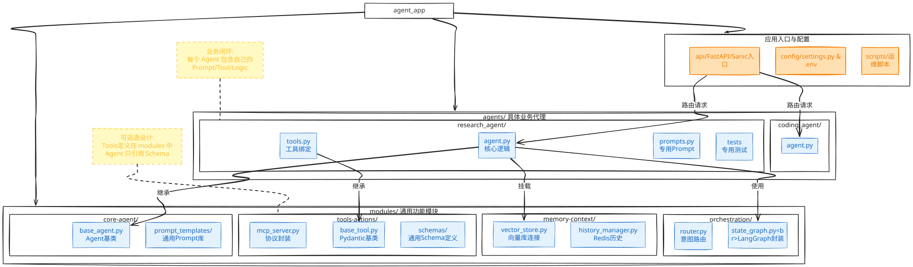
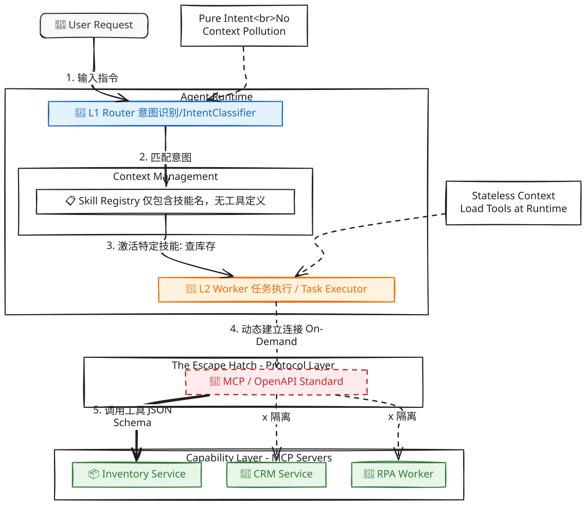

> **摘要**：当 DeepSeek V3 发布的那个深夜，你的架构能扛得住“24小时内无缝切换模型”的指令吗？本文揭秘了一套面向极速迭代的防御性架构标准——“可逃逸架构 (Escapable Architecture)”。

**作者：yancyyu**

---

## 0. 引言：DeepSeek 倒逼的架构革命

去年，Deepseek 横空出世，性能逼近 GPT-4，成本却是零头。老板在群里问了一句：“我们能马上切过去吗？”

对于大多数团队，这个问题的答案是沉默，或者是“需要两周重构”。因为代码里写死了 `OpenAI_API_Key`，因为业务逻辑耦合在 LangChain 的 Chain 里，因为 Prompt 严重依赖 128k 的超长上下文。

在 AI 技术栈“半衰期”只有 3 个月的今天，**紧耦合就是最大的技术债**。

为了应对这种极端的易变性，我们在集团内部推行了一套全新的架构标准——**Design for Replacement (为随时被替换而设计)**。我们将这套标准命名为**“可逃逸架构”**。

---
![][]
## 1. 什么是“可逃逸架构”？

在 AI 项目中，我们强制要求：任何依赖项（LLM 模型、Agent 框架、RPA 工具、向量数据库、Web 框架）都必须被视为**“临时组件” (Disposable Components)**。

我们设立了一条红线考核标准：

> **“当我们需要把底层模型从 GPT-4 换成 DeepSeek，或者把编排框架从 LangGraph 换成 PydanticAI 时，必须在 24 小时内完成迁移，且业务核心逻辑代码 0 修改。”**

做不到这一点的，视为架构设计不合格。

---

## 2. 四大逃逸设计原则 (The 4 Laws of Escape)

为了实现上述目标，我们在架构设计上确立了四条不可撼动的原则：

### 原则一：核心逻辑剥离 (Pure Functions)

**拒绝胶水代码污染。** 所有的业务逻辑（计算折扣、校验库存、清洗数据）必须写成**与 AI 无关的纯 Python/Go 函数**。Agent 框架（无论是 LangChain 还是 Agno）仅仅作为“胶水”来调用这些函数。

- **判断标准：** 如果删掉 `import langgraph`，你的业务计算逻辑还能单独跑通单元测试吗？
    

### 原则二：协议优于框架 (Protocol over Framework)

**拒绝框架锁定。** 代码中严禁充斥着框架特有的对象。

- **工具层：** 必须封装为标准的 **MCP (Model Context Protocol)** 或 OpenAPI 接口。
    
- **判断标准：** 如果明天放弃 LangChain 改用 Python 原生代码写 Agent，你的 Tools 代码需要重写吗？（如果遵循 MCP 标准，是不需要的）。
    

### 原则三：模型无关性 (Model Agnostic)

**拒绝硬编码。** 代码中严禁出现 `gpt-4`、`claude-3.5` 等具体模型名称，严禁硬编码 API Key。

- **实现：** 必须通过 **OneAPI / LiteLLM** 等网关层调用。
    
- **判断标准：** 切换到国产模型，是改一行配置（Config），还是要去改代码？改代码即不合格。
    

### 原则四：路由架构与按需加载 (Router-Worker Architecture)

**拒绝“万能 Agent”。** 严禁将 ERP、CRM、OA 等 50+ 个工具一次性注入到 System Prompt 中。这会导致对长窗口模型的强依赖，且不仅贵，还慢。

- **实现：** 采用渐进式披露 **L1 Router (意图识别) -> L2 Worker (任务执行)** 的分层架构。Worker 只有在被激活时，才动态加载该领域下的 MCP Tools。
    
- **判断标准：** **“8k 挑战”** —— 你的 Agent 能否在限制 8k 上下文的小模型（如本地 Llama 3）上跑通核心流程？

---

## 3. 后端开发强制规范 (The Red Lines)

### 3.1 MCP 服务架构：Client-Server 物理隔离

我们要求 Agent 与工具实现**物理隔离**。

- **Server 端（供给方）：** 独立进程/容器，运行业务逻辑，暴露 JSON Schema。
    
- **Client 端（Agent）：** 仅配置连接方式（Stdio/SSE），不包含任何工具实现的 Python 代码。
    

**[代码整洁度考核]** 你是否混淆了“函数”与“工具”？

- `string_split` 是函数，属于实现细节，**禁止**暴露给 AI。
    
- `check_inventory` 是工具，代表业务意图，**必须**封装为 MCP。
    

### 3.2 状态管理：Pydantic First

严禁在代码中传递无结构的 `Dict` 或 `Any`。

- LangGraph 的 `State` 必须清晰注释。
    
- Agent 的 `response_model` 必须强制指定 Pydantic 对象，**严禁**依赖 Prompt 让 AI 返回纯文本然后用正则去解析。
    

---

## 4. 前端开发强制规范 (AI Native)

传统的 CRUD 页面已死。

### 4.1 生成式界面 (Generative UI)

前端不再是“写死页面”，而是“渲染组件”。 当后端 AI 返回 `{ "type": "stock_chart", "data": [...] }` 时，前端应自动渲染图表组件。

- **考核点：** 新增一个业务查询场景，前端代码变更行数应为 **0**。
    

### 4.2 流式优先 (Streaming First)

用户发出指令后，首字响应时间 (TTFT) 必须 < 1秒。严禁出现“转圈恭候 10 秒再一次性吐出结果”的情况。

---

## 5. 存量系统与 RPA 的“代码化逃逸”

对于老旧系统或无接口的黑盒系统：

1. **Code-First RPA：** 优先使用 Playwright/Selenium 等开源代码库。
    
2. **严禁低代码：** 严禁使用无法导出源码、无法 Git 管理、无法 CI/CD 的可视化 RPA 工具，比如影刀，用agentbay代替或者用opensandbox。
    
3. **读写分离：** 读操作可直接暴露给 AI；写操作（如退款）必须封装为包含 Pre-check 的固定工作流，AI 仅负责触发。
    

---

## 6. 团队实战：“可逃逸能力”压力测试

为了验证架构的有效性，我们在团队内部推行了**“Fire Drill (消防演习)”**。无法通过以下测试的系统，禁止上线。

### 测试 A：模型大挪移

- **指令：** “现在，把你的 Agent 底层模型从 Azure OpenAI 切换到本地部署的 Ollama (Llama 3)。”
    
- **合格：** 更改 `.env` 配置文件，重启服务，5分钟内恢复运行。
    
- **淘汰：** “Llama 3 的接口格式不一样，我要改两天代码。”
    

### 测试 B：框架大逃杀

- **指令：** “现在的 LangGraph 太重了，我要你把目前的业务逻辑迁移到简单的 Agno 或者 Python 原生代码里。”
    
- **合格：** 核心 Tool 和 Prompt 都是独立的，只需要重写一下 `main.py` 的调用逻辑，半天搞定。
    
- **淘汰：** “我的逻辑都写在 Graph 的 Node 里面了，抽不出来……”——这就是典型的**框架奴隶**。
    

---

## 7. 结语

Gemini 不会是最后一个打破格局的模型，LangGraph 也不会是最终的框架形态。

作为架构师，我们无法预测未来哪个技术栈会赢，但我们可以设计一套**“无论谁赢，我都能随时切换过去”**的架构。

这就是**“可逃逸架构”**的意义——让业务逻辑从技术的洪流中逃逸出来，获得永生。