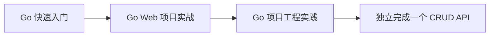

---
tags:
  - basic-knowledge
  - kb/programming/go
  - kb/meta
  - go
---

# 🐹 Go 知识索引

> 目标：用最短路线掌握 **Go 1.22+**，学完即可创建一个带路由、数据库、超时、测试、健康检查和优雅退出的后端 API。先掌握语言的值语义和显式错误，再学习并发与 Runtime 细节。

## 推荐学习顺序

1. [Go快速入门](Go快速入门.md)：类型、结构体、接口、错误、切片、Map 和并发基础。
2. [Go-Web项目实战](Go-Web项目实战.md)：使用标准库 `net/http` 创建 REST API，再接 PostgreSQL。
3. [Go项目工程实践](Go项目工程实践.md)：目录、Context、测试、Race、pprof、Docker 和优雅退出。

## 三天速成安排

| 时间    | 学习与实践                                         | 当天产物                     |
| ------- | -------------------------------------------------- | ---------------------------- |
| 第 1 天 | 完成 Go 快速入门，手写 Slice、接口、错误和 Context | 一个 Go Module 命令行项目    |
| 第 2 天 | 跟做 `net/http` API，再接 PostgreSQL               | 可用 curl 调用的 CRUD API    |
| 第 3 天 | 增加 table-driven test、Race、优雅退出和 Docker    | 可测试、可打包、可部署的服务 |

每天至少自己重写一次关键代码，并故意制造一个错误后完成排查。三天后再深入 Scheduler、GC 和性能调优。

## 学完后的验收标准

- 能使用 Go Module 创建、构建、测试和运行项目；
- 能解释 slice、map、interface、pointer 和零值；
- 能写 Handler、Service、Repository，并通过接口隔离依赖；
- 能正确传递 `context.Context`，设置 HTTP 和数据库超时；
- 能连接 PostgreSQL，完成增删改查和事务；
- 能写 table-driven test，并运行 `go test -race ./...`；
- 能实现健康检查与优雅退出；
- 能构建静态二进制或 Docker 镜像。

## 第一个练手项目

实现“任务清单 API”：

| 接口                     | 功能         |
| ------------------------ | ------------ |
| `POST /api/todos`        | 创建任务     |
| `GET /api/todos`         | 查询列表     |
| `GET /api/todos/{id}`    | 查询单个任务 |
| `PUT /api/todos/{id}`    | 修改任务     |
| `DELETE /api/todos/{id}` | 删除任务     |
| `GET /healthz`           | 存活检查     |
| `GET /readyz`            | 就绪检查     |

## 高频面试入口

| 问题                     | 先说什么                                       |
| ------------------------ | ---------------------------------------------- |
| slice 是什么？           | 指向底层数组的描述符：指针、长度、容量         |
| map 并发安全吗？         | 普通 map 不是；并发写会出问题                  |
| interface 何时为 nil？   | 动态类型和值都为空才等于 nil                   |
| Goroutine 为什么轻量？   | 小栈可增长、用户态调度、M-P-G 模型             |
| Channel 是不是越多越好？ | 不是；用于所有权转移和协调，不替代全部锁       |
| Context 做什么？         | 取消、截止时间和请求级元数据；沿调用链传递     |
| 如何排查 Go 服务变慢？   | 指标/Trace → pprof → Goroutine → GC → 下游依赖 |

## 相关笔记

- [进程、线程、协程](../计算机原理/进程、线程、协程.md)
- [API设计与幂等](../计算机原理/API设计与幂等.md)
- [PostgreSQL连接池与事务](../postgresql/PostgreSQL连接池与事务.md)
- [可观测性与线上排障](../运维/可观测性与线上排障.md)

## 参考

- [The Go Programming Language](https://go.dev/)
- [A Tour of Go](https://go.dev/tour/)
- [Effective Go](https://go.dev/doc/effective_go)
- [Go Modules Reference](https://go.dev/ref/mod)
