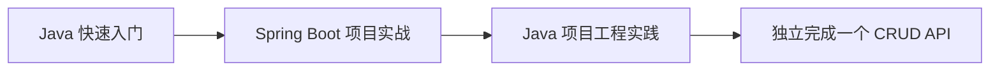

---
tags:
  - basic-knowledge
  - kb/programming/java
  - kb/meta
  - java
---

# ☕ Java 知识索引

> 目标：用最短路线掌握 **Java 21 + Spring Boot**，学完即可创建一个带校验、数据库、测试和健康检查的后端 API 项目。不要先背完整 JVM 规范，先做出项目，再按问题回补原理。

## 推荐学习顺序

1. [Java快速入门](Java快速入门.md)：语法、集合、异常、面向对象和常用 API。
2. [Spring-Boot项目实战](Spring-Boot项目实战.md)：从零创建 REST API，再接 PostgreSQL。
3. [Java项目工程实践](Java项目工程实践.md)：分层、配置、日志、测试、Docker 和排障。

## 三天速成安排

| 时间    | 学习与实践                                        | 当天产物                     |
| ------- | ------------------------------------------------- | ---------------------------- |
| 第 1 天 | 完成 Java 快速入门，手写 Todo、集合操作和异常处理 | 一个 Maven 命令行项目        |
| 第 2 天 | 跟做 Spring Boot 内存版 API，再接 PostgreSQL      | 可用 curl 调用的 CRUD API    |
| 第 3 天 | 增加测试、Flyway、Actuator、Docker 和优雅错误处理 | 可测试、可打包、可部署的服务 |

每天至少自己重写一次关键代码，不要只复制。三天后再按项目问题补 JVM、并发和 Spring 源码原理。

## 学完后的验收标准

- 能使用 Maven 创建、构建和运行项目；
- 能写 Controller、Service、Repository 三层代码；
- 能设计 REST API，并处理参数校验和统一错误；
- 能连接 PostgreSQL，完成增删改查和数据库迁移；
- 能写至少一个单元测试和一个接口集成测试；
- 能通过 Actuator 查看健康状态；
- 能构建 Jar 或 Docker 镜像并启动服务；
- 出错时能先看异常链、日志和 HTTP 状态，而不是盲目重启。

## 第一个练手项目

建议实现“任务清单 API”：

| 接口                     | 功能               |
| ------------------------ | ------------------ |
| `POST /api/todos`        | 创建任务           |
| `GET /api/todos`         | 查询任务列表       |
| `GET /api/todos/{id}`    | 查询单个任务       |
| `PUT /api/todos/{id}`    | 修改标题或完成状态 |
| `DELETE /api/todos/{id}` | 删除任务           |
| `GET /actuator/health`   | 健康检查           |

完成基础 CRUD 后，再增加：分页、截止时间、用户鉴权、审计字段和缓存。

## 高频面试入口

| 问题                              | 先说什么                                              |
| --------------------------------- | ----------------------------------------------------- |
| Java 是值传递还是引用传递？       | 只有值传递；对象参数复制的是引用值                    |
| `==` 与 `equals`？                | 引用身份与逻辑相等；重写 `equals` 同步重写 `hashCode` |
| `ArrayList` 与 `HashMap`？        | 动态数组；哈希桶，冲突严重时树化                      |
| checked 与 unchecked 异常？       | 编译期强制处理与运行时异常；业务边界按可恢复性设计    |
| Spring 为什么能注入对象？         | IoC 容器负责创建 Bean、解析依赖和生命周期             |
| `@Transactional` 为什么可能失效？ | 代理边界、自调用、异常类型和方法可见性                |
| 如何排查慢接口？                  | Trace/日志 → SQL → 外部调用 → 线程池 → GC             |

## 相关笔记

- [API设计与幂等](../计算机原理/API设计与幂等.md)
- [PostgreSQL连接池与事务](../postgresql/PostgreSQL连接池与事务.md)
- [软件测试策略与测试金字塔](../运维/软件测试策略与测试金字塔.md)
- [Docker基础原理与最佳实践](../运维/docker/Docker基础原理与最佳实践.md)

## 参考

- [Java Documentation](https://docs.oracle.com/en/java/)
- [Spring Boot Reference](https://docs.spring.io/spring-boot/reference/)
- [Spring Initializr](https://start.spring.io/)
- [Maven Getting Started](https://maven.apache.org/guides/getting-started/)
