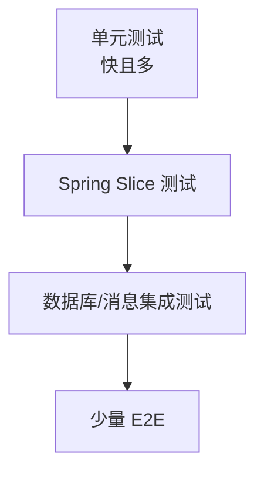

---
tags:
  - basic-knowledge
  - kb/programming/java
  - kb/programming/java/engineering
  - java
  - testing
---

# Java 项目工程实践

> 一句话定义：能运行只是开始；可维护的 Java 服务还需要明确分层、外部化配置、测试、日志、健康检查、数据库迁移和可回滚发布。

## 一、项目结构

小中型服务推荐按业务模块组织，而不是把全项目拆成巨大的 controller/service/repository 目录：

```text
com.example.app/
├── AppApplication.java
├── common/
│   ├── error/
│   └── config/
├── todo/
│   ├── TodoController.java
│   ├── TodoService.java
│   ├── TodoRepository.java
│   ├── TodoEntity.java
│   └── TodoDto.java
└── user/
    └── ...
```

模块内部仍然保持 HTTP、业务和持久化边界。不要让 Controller 直接操作 Repository。

## 二、依赖注入

优先构造器注入：

```java
@Service
public class TodoService {
    private final TodoRepository repository;

    public TodoService(TodoRepository repository) {
        this.repository = repository;
    }
}
```

优点：依赖明确、字段可为 `final`、测试易替换、避免对象处于未完整初始化状态。避免字段注入。

## 三、配置与环境

```yaml
app:
  request-timeout: ${APP_REQUEST_TIMEOUT:3s}
  page-size: ${APP_PAGE_SIZE:20}
```

使用类型安全配置：

```java
@ConfigurationProperties(prefix = "app")
public record AppProperties(Duration requestTimeout, int pageSize) {}
```

规则：

- 默认值适合本地开发，但生产关键配置缺失时应启动失败；
- Secret 通过环境变量或 Secret Manager 注入；
- Dev/Test/Prod 差异放配置，不放 `if (env)` 业务分支；
- 启动日志只输出非敏感配置摘要。

## 四、日志与错误

```java
private static final Logger log = LoggerFactory.getLogger(TodoService.class);

log.info("todo created id={} titleLength={}", todo.getId(), todo.getTitle().length());
```

最佳实践：

- 使用参数化日志，不拼接字符串；
- 请求链路携带 Trace ID；
- 日志记录“发生了什么、对象标识、耗时、结果”，不记录密码和 Token；
- 业务可预期错误通常不需要 ERROR 堆栈；
- 未知异常记录一次完整堆栈，避免每层重复打印。

## 五、测试策略



### 单元测试

```java
@Test
void createsTodo() {
    TodoRepository repository = mock(TodoRepository.class);
    TodoService service = new TodoService(repository);

    when(repository.save(any())).thenAnswer(invocation -> invocation.getArgument(0));

    var result = service.create("learn java");

    assertThat(result.title()).isEqualTo("learn java");
    verify(repository).save(any());
}
```

测试行为和业务结果，不要把每个私有方法都单独测试。

### 集成测试

- `@WebMvcTest`：Controller、校验和状态码；
- `@DataJpaTest`：JPA 映射与 Repository；
- `@SpringBootTest`：完整上下文，数量应少；
- Testcontainers：需要真实 PostgreSQL、Redis、Kafka 语义时使用。

## 六、并发与线程池够用版

Spring Web 默认一个请求占用一个工作线程。项目初期需知道：

- 不要在请求线程中无限等待；
- 外部 HTTP、数据库连接都要设置超时；
- 自定义线程池必须有界，明确队列和拒绝策略；
- 不要随意使用 `parallelStream()`；
- 共享可变状态需要同步或改为无状态设计；
- `CompletableFuture` 任务要显式指定合适的 Executor。

线程池不是越大越好：CPU 密集受核心数约束，IO 密集还受下游容量、连接池和超时约束。

## 七、数据库实践

- 使用 Flyway/Liquibase 管理 Schema；
- 迁移脚本只向前执行，发布前演练；
- Entity 不直接作为外部 API；
- 列表必须有分页和稳定排序；
- 对唯一业务键建立数据库唯一约束；
- 事务尽量短，不在事务中等待外部接口；
- 排查慢 SQL 时看执行计划、扫描行数、锁等待和连接池。

## 八、健康检查与可观测性

启用 Actuator 后至少关注：

```text
/actuator/health
/actuator/metrics
/actuator/prometheus  # 接入对应 registry 后
```

区分：

- Liveness：进程是否需要重启；
- Readiness：是否可以接收流量；
- 业务指标：创建任务数量、失败率、处理耗时；
- 技术指标：HTTP 延迟、JVM Heap、GC Pause、线程池、连接池。

## 九、Docker 化

为了让下面的 Dockerfile 使用固定文件名，在 Spring Initializr 生成的 `pom.xml` 现有 `<build>` 节点中加入：

```xml
<build>
    <finalName>app</finalName>
    <!-- 保留项目原有的 spring-boot-maven-plugin -->
</build>
```

执行 `./mvnw package` 后应生成 `target/app.jar`，再构建镜像：

```dockerfile
FROM eclipse-temurin:21-jre
WORKDIR /app
COPY target/app.jar app.jar
USER 10001
EXPOSE 8080
ENTRYPOINT ["java", "-jar", "/app/app.jar"]
```

构建：

```bash
./mvnw clean verify
./mvnw package

docker build -t todo-api:local .
docker run --rm -p 8080:8080 todo-api:local
```

更成熟的项目可使用 Spring Boot Buildpacks。镜像中不要放源码、密钥和本地配置。

## 十、开发到上线检查表

- [ ] `./mvnw verify` 通过；
- [ ] API 参数校验和错误模型稳定；
- [ ] 数据库迁移在空库和升级库都验证；
- [ ] 所有外部调用配置连接、读取和总超时；
- [ ] 无明文密码、Token 和私钥；
- [ ] 健康检查能区分存活与就绪；
- [ ] 日志可通过 Trace ID 关联；
- [ ] 列表接口有分页和上限；
- [ ] 发布方案包含回滚与数据库兼容策略。

## 十一、常见排障顺序

```text
现象与时间范围
→ HTTP 状态和 Trace ID
→ 应用异常链
→ 数据库慢 SQL / 锁 / 连接池
→ 外部依赖延迟
→ JVM Heap / GC / 线程
→ 最近发布与配置变化
```

不要一上来就调大 Heap、线程池或连接池，这可能只是把故障推迟并放大下游压力。

## 相关笔记

- [Java知识索引](Java知识索引.md)
- [Spring-Boot项目实战](Spring-Boot项目实战.md)
- [可观测性与线上排障](../运维/可观测性与线上排障.md)
- [CI-CD与发布策略](../运维/CI-CD与发布策略.md)

## 参考

- [Spring Boot Production-ready Features](https://docs.spring.io/spring-boot/reference/actuator/)
- [JUnit 5 User Guide](https://junit.org/junit5/docs/current/user-guide/)
- [Testcontainers for Java](https://java.testcontainers.org/)
- [Java Troubleshooting Guide](https://docs.oracle.com/en/java/javase/21/troubleshoot/)
