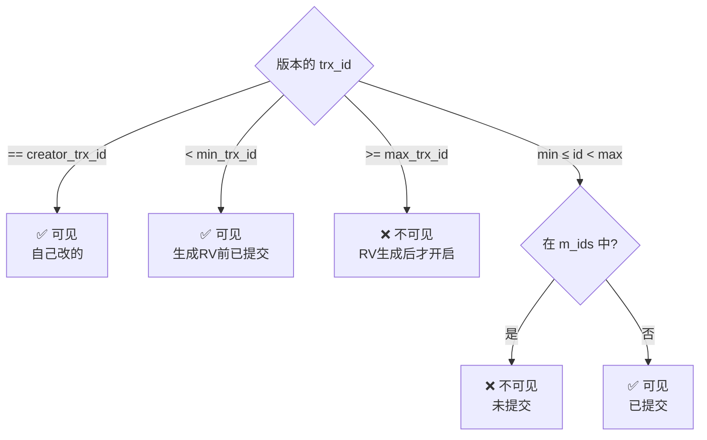

---
tags:
  - basic-knowledge
  - kb/database/mysql
  - kb/database/mysql/transaction
  - mvcc
  - undo-log
  - readview
---

# MVCC（多版本并发控制）

> MVCC 让「读-写」不互相阻塞，是 MySQL InnoDB 实现 **RR/RC 隔离级别**的核心。理解它要抓住三件套：**隐藏字段 + undo log 版本链 + ReadView**。

## 相关笔记

- [事务](事务.md)：隔离级别、ACID
- [MySQL并发控制--锁](MySQL并发控制--锁.md)：MVCC 解决读-写，锁解决写-写
- [mysql日志](mysql日志.md)：undo log 是版本链的基础

---

## 一、为什么需要 MVCC

没有 MVCC 时，读和写互相加锁阻塞，并发性能差。MVCC 让**普通 select（快照读）不加锁**，读的是历史版本快照，从而：

- **读不阻塞写，写不阻塞读**
- 不同事务看到各自一致的快照（实现 RC/RR）

> 写-写冲突仍需用[锁](MySQL并发控制--锁.md)解决，MVCC 只管读-写。

---

## 二、当前读 vs 快照读

| 类型       | 含义                               | 例子                                                                             |
| ---------- | ---------------------------------- | -------------------------------------------------------------------------------- |
| **快照读** | 读 MVCC 的历史版本快照，**不加锁** | 普通 `SELECT`                                                                    |
| **当前读** | 读**最新已提交**数据，**加锁**     | `UPDATE/DELETE/INSERT`、`SELECT ... FOR UPDATE`、`SELECT ... LOCK IN SHARE MODE` |

> MVCC 只作用于**快照读**。当前读走加锁 + 最新数据。

---

## 三、三件套之一：隐藏字段

InnoDB 每行记录隐藏了几个字段：

| 字段               | 作用                                              |
| ------------------ | ------------------------------------------------- |
| **`trx_id`**       | 最近修改这行的事务 ID                             |
| **`roll_pointer`** | 指向 undo log 中该行的上一个版本（回滚 + 版本链） |

---

## 四、三件套之二：undo log 版本链

每次 update/delete，旧版本写入 undo log，通过 `roll_pointer` 串成**版本链**：

> 一行数据的历史版本都链式保存在 undo log，事务回滚或快照读时用。

---

## 五、三件套之三：ReadView（可见性判断核心）

事务执行**快照读**时生成一个 ReadView，包含四个字段：

| 字段             | 含义                                                 |
| ---------------- | ---------------------------------------------------- |
| `m_ids`          | 生成 ReadView 时**当前活跃（未提交）**的事务 ID 列表 |
| `min_trx_id`     | `m_ids` 中的最小值                                   |
| `max_trx_id`     | 下一个将分配的事务 ID（即 m_ids 上界 +1）            |
| `creator_trx_id` | 生成该 ReadView 的事务 ID                            |

### 可见性判断规则（对版本链上每个版本的 trx_id）

不可见就顺 `roll_pointer` 找上一个版本，直到找到可见的。

---

## 六、RC vs RR：ReadView 生成时机（关键差异）

| 隔离级别           | ReadView 生成时机                    | 效果                              |
| ------------------ | ------------------------------------ | --------------------------------- |
| **RC（读已提交）** | **每次 select 都生成新** ReadView    | 能看到别的事务新提交 → 不可重复读 |
| **RR（可重复读）** | **只在第一次 select 生成**，后续复用 | 多次读结果一致 → 可重复读         |

> 这就是 RR 实现「可重复读」的本质：**复用同一个 ReadView**，而不是加锁。

---

## 七、MVCC 能解决幻读吗？

**部分能**：

- **快照读**：RR 下复用 ReadView，多次查询结果一致 → **无幻读**
- **当前读**：`SELECT ... FOR UPDATE` 走当前读，可能看到别的事务新插入的行 → **有幻读**。需靠**间隙锁/临键锁**（Next-Key Lock）解决

> 所以 RR 下「快照读无幻读，当前读靠间隙锁防幻读」。若事务内先快照读再当前读，可能因 ReadView 重新生成而出现幻读。

---

## 八、面试速答

> **Q：MVCC 是什么？怎么实现的？**
> A：多版本并发控制，让读不加锁、读不阻塞写。InnoDB 靠三件套：行隐藏字段（trx_id/roll_pointer）+ undo log 版本链 + ReadView。快照读时按 ReadView 规则判断版本可见性。

> **Q：RC 和 RR 的 MVCC 区别？**
> A：ReadView 生成时机不同。RC 每次 select 都新建（能看到新提交，有不可重复读）；RR 只在首次 select 新建并复用（可重复读）。

> **Q：MVCC 能解决幻读吗？**
> A：快照读能（复用 ReadView）；当前读不能，需间隙锁。所以 RR 下当前读仍可能幻读，靠 Next-Key Lock 防护。

> **Q：快照读和当前读区别？**
> A：快照读读历史版本不加锁（普通 SELECT）；当前读读最新已提交数据并加锁（UPDATE/DELETE/SELECT FOR UPDATE）。

---

## 参考

- [MySQL 官方 · InnoDB Multi-Versioning](https://dev.mysql.com/doc/refman/8.0/en/innodb-multi-versioning.html)
- 《高性能 MySQL》第 1 章
- 丁奇《MySQL 实战 45 讲》第 3 讲（事务隔离）、第 8 讲（事务隔离 MVCC）
