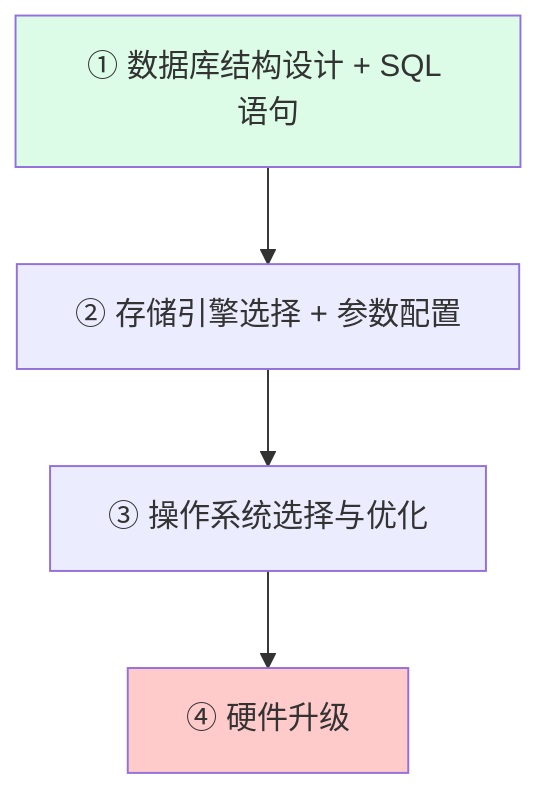
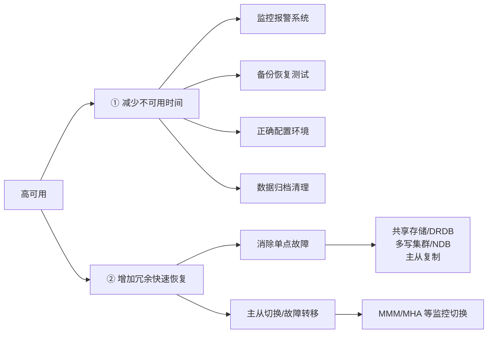

---
tags:
  - basic-knowledge
  - kb/database/mysql
  - kb/database/mysql/performance
  - performance
  - optimization
  - benchmark
---

# MySQL 性能优化

> 性能优化是系统工程：从**硬件 → 系统配置 → 数据库结构 → SQL → 索引**逐层优化。本文整合架构设计、基准测试、高可用、SQL 优化四大块。

## 相关笔记

- [MySQL索引原理与优化](MySQL索引原理与优化.md)：索引是性能优化的第一抓手
- [EXPLAIN](EXPLAIN.md)：分析执行计划
- [mysql日志](mysql日志.md)：慢查询日志、binlog、redo log
- [mysql复制](mysql复制.md)：主从复制与高可用基础
- [数据范式](数据范式.md)：表结构设计
- [事务](事务.md)：大事务的危害与隔离级别

---

## 一、性能优化的优先级



> **原则**：先优化软件层面（收益高、成本低），最后才动硬件。硬件升级是兜底手段。

---

## 二、影响性能的因素（硬件与系统）

### 2.1 CPU

- MySQL 不支持同一 SQL 的 CPU 并行（单条 SQL 单核）
- **Web 类应用**（并发高）：CPU **数量** > 频率
- **CPU 密集型 / 复杂 SQL**：CPU **频率** > 数量
- 64 位 CPU 必须配 64 位操作系统

### 2.2 内存

内存能解决大部分 IO 瓶颈，尽可能大、频率尽可能高（主板支持的最高频率）。InnoDB 用内存缓存数据和索引。

### 2.3 磁盘

IO 性能排序：`PCIe SSD > SATA SSD > RAID10 > 机械盘 > SAN`

### 2.4 网络

带宽是关键。大结果集返回、主从复制都吃带宽。

### 2.5 操作系统与文件系统

- Windows：MySQL **大小写不敏感**；Linux：**大小写敏感**（表名）
- Linux 推荐 XFS / ext4

### 2.6 存储引擎选择

按事务、崩溃恢复、备份需求选择，**不建议混合使用存储引擎**。

---

## 三、数据库稳定性风险（监控指标）

生产环境重点监控以下指标，它们是性能问题的信号：

| 监控指标                | 风险阈值/场景                                          |
| ----------------------- | ------------------------------------------------------ |
| **并发量 + CPU 使用率** | 连接数占满（`max_connections` 默认 100）；CPU 耗尽宕机 |
| **QPS / TPS**           | 效率低下的 SQL 拖垮整体 QPS                            |
| **磁盘 IO**             | IO 性能突降；大量计划任务抢占 IO                       |
| **网卡流量**            | 大结果集 / 主从同步打满带宽（1000Mb ≈ 125MB/s）        |

### 三大典型风险

| 风险         | 定义                         | 危害                                         |
| ------------ | ---------------------------- | -------------------------------------------- |
| **大表**     | 记录超千万行 或 表数据超 10G | DDL 锁表（MySQL<5.5）/ 主从延迟；连接数猛增  |
| **大事务**   | 执行时间长、操作数据多       | 锁太多数据→阻塞/锁超时；回滚耗时长；主从延迟 |
| **网卡流量** | 单次传输过大                 | 打满带宽                                     |

### 解决方法

| 风险     | 对策                                                        |
| -------- | ----------------------------------------------------------- |
| 大表     | 分库分表；历史数据归档（如订单归档 1 年前）                 |
| 大事务   | 避免一次处理太多数据；移除事务中不必要的 SELECT             |
| 网卡流量 | 减少 `SELECT *`；分级缓存；分离业务网与存储网；减少从库数量 |

---

## 四、如何测量系统性能

### 基准测试 vs 压力测试

| 类型         | 特点                                                 |
| ------------ | ---------------------------------------------------- |
| **基准测试** | 不关心业务逻辑，可能与真实业务无关，用于建立性能基线 |
| **压力测试** | 针对真实业务场景，用真实数据和查询                   |

**测试目的**：建立性能基线 → 模拟更高负载找瓶颈 → 测试不同软硬件配置 → 验证新硬件配置。

### 测试范围

- **整个系统**：覆盖 Web + 缓存 + 数据库，反映组件间性能问题（但耗时长、复杂）
- **单独 MySQL**：聚焦数据库本身（推荐先用工具聚焦）

### 常用工具

#### mysqlslap（MySQL 自带）

| 参数                  | 作用                       |
| --------------------- | -------------------------- |
| `--auto-generate-sql` | 自动生成 SQL 脚本          |
| `--concurrency`       | 并发数                     |
| `--engine`            | 存储引擎（多个逗号分隔）   |
| `--iterations`        | 测试运行次数               |
| `--number-of-queries` | 每线程查询数               |
| `--create-schema`     | 测试库名（**勿用线上库**） |
| `--only-print`        | 只打印脚本不执行           |

#### sysbench（更强大）

| 参数                 | 作用                                     |
| -------------------- | ---------------------------------------- |
| `--test`             | 测试类型（fileio / cpu / memory / oltp） |
| `--mysql-db`         | 测试库名                                 |
| `--oltp-table-count` | 测试表数量                               |
| `--oltp-table-size`  | 每表行数                                 |
| `--num-threads`      | 并发线程数                               |
| `--max-time`         | 最大测试时间                             |

三个阶段：`prepare`（准备数据）→ `run`（测试）→ `cleanup`（清理数据）

---

## 五、高可用架构设计

> **高可用（HA）**：通过缩短日常维护和突发崩溃导致的停机时间，提高系统可用性。

### 影响高可用的因素

1. 严重的主从延迟
2. 主从复制中断
3. 锁引起大量阻塞

### 实现高可用的两条路



**消除单点故障的手段**：

- 共享存储（SUN）或 DRDB 磁盘复制
- 多写集群或 NDB 集群
- **MySQL 主从复制**（最常用）→ 详见 [mysql复制](mysql复制.md)

**故障转移**：用 MMM / MHA 等工具监控主从健康，自动切换。若无自动切换，人工切换可能需 30 分钟。

---

## 六、SQL 查询优化

### 6.1 发现慢 SQL 的途径

1. 用户反馈
2. **慢查询日志**（最常用）
3. 实时查询 `information_schema.PROCESSLIST`

```sql
-- 实时获取执行超过 60s 的 SQL
SELECT id, user, host, db, command, time, state, info
FROM information_schema.PROCESSLIST
WHERE TIME >= 60;
```

### 6.2 开启慢查询日志

```ini
# my.cnf [mysqld]
slow_query_log = 1
slow_query_log_file = /var/log/mysql-slow.log
long_query_time = 2   -- 超过 2s 记录
```

> 注意：慢查询日志会占磁盘空间，生产环境按需开启并定期清理。

### 6.3 用 EXPLAIN 分析

在 SQL 前加 `EXPLAIN`，重点看：

| 字段            | 含义                                                                                             |
| --------------- | ------------------------------------------------------------------------------------------------ |
| `type`          | 连接类型（`ALL` 全表扫描最差，`const`/`eq_ref`/`ref` 较好）                                      |
| `possible_keys` | 可能用到的索引                                                                                   |
| `key`           | 实际用到的索引（为空说明没走索引）                                                               |
| `rows`          | 预估扫描行数                                                                                     |
| `Extra`         | `Using index`（覆盖索引，好）/ `Using filesort`（额外排序，差）/ `Using temporary`（临时表，差） |

> 完整字段说明见 [EXPLAIN](EXPLAIN.md)。

### 6.4 特定 SQL 优化

| 场景            | 优化手段                                                                                          |
| --------------- | ------------------------------------------------------------------------------------------------- |
| 大表更新/删除   | **分批处理**，避免长事务锁表                                                                      |
| 大表改表结构    | 影子表法：新表建好→数据同步→老表加排他锁→改名→删旧表；或用 `pt-online-schema-change` 工具在线改表 |
| 避免 `SELECT *` | 只查需要的列，可能命中覆盖索引                                                                    |

---

## 七、数据库结构优化

**目标**：减少数据冗余 → 避免更新/插入/删除异常 → 节约存储 → 提高查询效率。

- **插入异常**：某实体依赖另一实体而存在
- **更新异常**：改一个属性需更新多行
- **删除异常**：删一实体导致其他实体消失

手段：合理设计表结构，遵循**数据范式**（1NF/2NF/3NF/BCNF）→ 详见 [数据范式](数据范式.md)。实际项目会在范式与性能间权衡（适当反范式 + 冗余字段）。

---

## 参考

- 《高性能 MySQL》第 3 版，第 3 章（基准测试）、第 4 章（优化）、第 9 章（高可用）
- [MySQL 官方文档 · Optimization](https://dev.mysql.com/doc/refman/8.0/en/optimization.html)
- [sysbench GitHub](https://github.com/akopytov/sysbench)
- [pt-online-schema-change 文档](https://docs.percona.com/percona-toolkit/pt-online-schema-change.html)
- 丁奇《MySQL 实战 45 讲》
