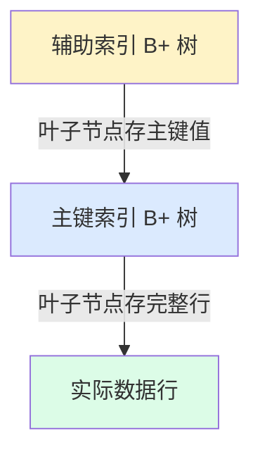
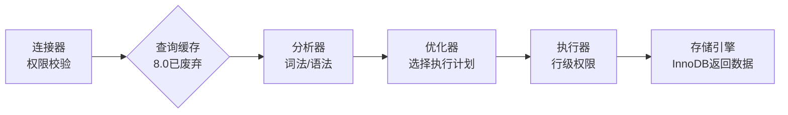
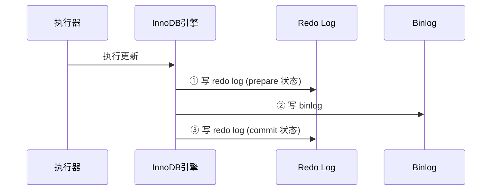

---
tags:
  - basic-knowledge
  - kb/database/mysql
  - kb/database/mysql/index
  - index
  - b-plus-tree
  - innodb
---

# MySQL 索引原理与优化

> 索引是 MySQL 面试**最高频**的主题。本文系统梳理：为什么用 B+ 树 → 索引类型 → 失效场景 → 优化策略。

## 相关笔记

- [MVCC（多版本并发控制）](MVCC（多版本并发控制）.md)、[MySQL并发控制--锁](MySQL并发控制--锁.md)：索引与并发、锁的联动
- [mysql日志](mysql日志.md)：更新 SQL 的两阶段提交依赖 redo log / binlog
- [EXPLAIN](EXPLAIN.md)：用执行计划验证索引是否命中
- [MySQL性能优化](MySQL性能优化.md)：慢查询、表结构、硬件层面的性能优化

---

## 一、为什么 InnoDB 用 B+ 树

InnoDB 中，**表数据文件本身就是一个按 B+ 树组织的主索引**（聚簇索引），叶子节点的 data 域保存完整数据记录，key 是主键。**辅助索引的 data 域存储的是主键值（而非行地址）**，因此走辅助索引要先查到主键，再回表查数据。

### 聚簇索引的优缺点

| 维度    | 说明                                                                                         |
| ------- | -------------------------------------------------------------------------------------------- |
| ✅ 优点 | 按主键查找极快；辅助索引用主键做指针，主键 B+ 树重构时辅助索引不受影响；排序和范围查询有优势 |
| ❌ 缺点 | 叶子节点要存全部数据，索引存储开销大；辅助索引需**回表**（查两次）                           |

### InnoDB vs MyISAM 索引差异

| 对比项           | InnoDB                       | MyISAM                           |
| ---------------- | ---------------------------- | -------------------------------- |
| 主索引           | 数据文件本身即主索引（聚簇） | 主索引与数据分离，索引只存行地址 |
| 辅助索引 data 域 | 存**主键值**                 | 存**行地址**（与主索引结构相同） |
| 查询效率         | 辅助索引需回表               | 纯查询效率更高（不支持事务）     |

### 为什么要用索引

- 大幅**减少扫描数据量**
- 帮助排序，**避免临时表**
- 把**随机 IO 变顺序 IO**

> 索引不是越多越好：写入时要维护索引（增加写成本）；索引太多会**增加优化器选择时间**。

---

## 二、索引类型

### 1. B-Tree 索引（实际是 B+ 树）

最常用的索引类型，按键值顺序存储，**适合范围查找**。

**适用场景**：

- 全值匹配：`order_sn = '3231313'`
- 最左前缀（联合索引）：匹配联合索引第一列
- 列前缀：`order_sn LIKE '3231313%'`
- 范围值查询
- 覆盖索引（只访问索引）

**限制**：

- 必须从**最左列**开始查找，否则无法用索引
- 不能跳过联合索引中间的列
- `NOT IN`、`<>` 通常无法用索引
- 某列一旦做范围查询，其**右侧所有列都无法用索引**
  （联合索引 `(a,b,c)`，`WHERE a=? AND b>3 AND c=7` 只有 a 被用到）

### 2. Hash 索引

基于哈希表，**只能用于等值查询**。InnoDB 的「自适应哈希索引」由引擎自动建立。

- 只支持 `=`、`IN`、`<=>` 精确匹配
- **不支持排序、范围、部分列匹配**
- 存在哈希冲突

### 3. 联合索引与覆盖索引

- **联合索引**：多列组合建立的索引，遵循最左前缀。
- **覆盖索引**：查询所需字段全部被索引覆盖，**只需读辅助索引、无需回表**。
  - 优点：减少磁盘 IO、把随机 IO 变顺序 IO、避免主键二次查询
  - 缺点：很多列的查询无法覆盖；`LIKE '%xx%'` 无法覆盖

---

## 三、索引命中与失效（高频面试）

### 命中索引的场景

| 场景             | 示例                             |
| ---------------- | -------------------------------- |
| 等值查找         | `WHERE id = 5`                   |
| 范围查找         | `WHERE age BETWEEN 20 AND 25`    |
| 前缀 LIKE        | `WHERE name LIKE 'John%'`        |
| 联合索引全匹配   | `WHERE age = 22 AND grade = 'A'` |
| ORDER BY + LIMIT | `ORDER BY age LIMIT 10`          |
| IN 列表          | `WHERE id IN (3,4,5)`            |

### 索引失效的场景（必背）

| 场景                   | 示例                                             | 原因                               |
| ---------------------- | ------------------------------------------------ | ---------------------------------- |
| 函数/表达式            | `WHERE YEAR(birthday)=1990`、`WHERE abs(age)=18` | 对索引列做运算，无法直接用索引查找 |
| 前导模糊               | `WHERE name LIKE '%John%'`                       | 触发全表扫描                       |
| 隐式类型转换（错方向） | 字符串列 `WHERE username = 123`                  | 整数查字符串列，需逐行转换         |
| `OR` 两边不全有索引    | `WHERE id=5 OR age=20`                           | 优化器通常放弃索引                 |
| 违反最左前缀           | 索引 `(age,grade)`，`WHERE grade='A'`            | 未从最左列开始                     |
| 选择性差               | `WHERE age >= 10`（几乎全表满足）                | 优化器判断全表扫描更划算           |
| `IS NULL`              | `WHERE age IS NULL`                              | 一般不走索引                       |
| 表太小                 | —                                                | 全表扫描可能更快                   |

### 面试高频：隐式类型转换与索引

> **Q：`INT` 列用字符串查 `WHERE id = '5'`，走索引吗？**
> **走索引。** 优化器把字符串转成整数，这是一次性转换，不依赖行数据，可提前完成并复用整数索引。

> **Q：字符串列用整数查 `WHERE username = 123`，走索引吗？**
> **不走索引。** 需把整数转字符串，且**逐行转换**（字符串列可能含各种字符），无法用索引。正确做法是查询时显式用字符串：`WHERE username = '123'`。

### 面试高频：InnoDB 非唯一索引如何存储重复键

InnoDB 会**在非唯一索引键后附加主键值**，使每个索引项在 B+ 树中唯一。例如 `books` 表 `title` 有非唯一索引，两条 `title='Python'` 的记录在 B+ 树内部实际存储为 `"Python"+1`、`"Python"+2`（1、2 是主键 id），既保证唯一，又支持高效范围查询和 JOIN。

---

## 四、一条 SQL 的执行流程

### 查询 SQL

1. **连接器**：认证 + 权限校验
2. **查询缓存**：MySQL 8.0 起已废弃
3. **分析器**：词法分析（tokenize）+ 语法分析
4. **优化器**：选择索引、决定 JOIN 顺序（生成执行计划）
5. **执行器**：行级权限校验，调用存储引擎 API
6. **存储引擎**：InnoDB 真正执行并返回结果

### 更新 SQL（两阶段提交）

> **为什么用两阶段提交？** 保证 redo log 与 binlog 的一致性，避免主从复制时数据不一致（崩溃恢复时：binlog 已写 → 提交；binlog 未写 → 回滚）。详见 [mysql日志](mysql日志.md)。

---

## 五、索引优化策略

### 优化器层

1. **索引列上不要用函数/表达式**（`WHERE` 后的索引列保持「裸列」）
2. **前缀索引**：长字符串列取前缀建索引，用「选择性 = 不重复值数 / 总行数」评估前缀长度
3. **联合索引列顺序**：经常用的列优先 > 选择性高的列优先 > 宽度小的列优先
4. **覆盖索引**：让查询只读辅助索引，避免回表

### 存储引擎层

1. **索引扫描优化排序**：ORDER BY 列顺序、方向需与索引完全一致
2. **用索引优化锁**：索引能减少锁定的行数，加快锁释放
3. **索引维护**：删除重复/冗余索引（如 `PRIMARY KEY(id)` + `UNIQUE(id)` + `INDEX(id)` 重复）；定期 `ANALYZE TABLE` 更新统计信息

---

## 参考

- [MySQL 官方文档 · InnoDB Indexes](https://dev.mysql.com/doc/refman/8.0/en/innodb-indexes.html)
- [MySQL 官方文档 · How to Avoid Table Scans](https://dev.mysql.com/doc/refman/8.0/en/table-scan-avoidance.html)
- 《高性能 MySQL》第 3 版，第 5 章「索引」
- 丁奇《MySQL 实战 45 讲》第 10-11 讲（索引、两阶段提交）
