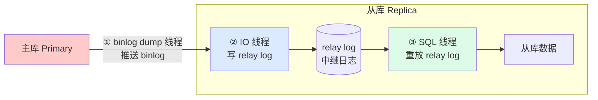

---
tags:
  - basic-knowledge
  - kb/database/mysql
  - kb/database/mysql/replication
  - replication
  - master-slave
  - binlog
  - gtid
---

# MySQL 主从复制

> 主从复制是 MySQL **读写分离、高可用、备份** 的基础。核心是 binlog + 三个线程。注意 **GTID（5.6+）** 是现代复制的主流。

## 相关笔记

- [mysql日志](mysql日志.md)：复制依赖 binlog
- [事务](事务.md)：复制保证主从一致性
- [分库分表与读写分离](../分布式&高并发/分库分表与读写分离.md)：复制的应用场景
- [Redis集群](../redis/Redis集群.md)：对比 Redis 主从

---

## 一、复制的作用

| 作用     | 说明                       |
| -------- | -------------------------- |
| 读写分离 | 主写从读，分担压力         |
| 数据分布 | 跨地域/机房数据同步        |
| 高可用   | 主挂可切从（配合哨兵/MHA） |
| 备份     | 从库备份不影响主库         |

> 复制**不能代替备份**（误操作也会被复制），也**不分担写负载**（写都在主）。

---

## 二、复制原理（三个线程）

1. 主库 **binlog dump 线程**：将 binlog 发给从库
2. 从库 **IO 线程**：接收并写入 **relay log（中继日志）**
3. 从库 **SQL 线程**：读取 relay log 重放，更新从库数据

> 复制本质：**主库把变更写 binlog → 从库拉取并重放**。是**异步**的，所以有延迟。

---

## 三、复制形式

| 形式                 | 机制                 | 特点                         |
| -------------------- | -------------------- | ---------------------------- |
| **异步复制（默认）** | 主不等从确认         | 性能高，主挂可能丢未同步数据 |
| **半同步复制**       | 主等至少一个从 ack   | 性能与安全的折中，生产常用   |
| **组复制（MGR）**    | Paxos 变体多节点一致 | 强一致、多主，但复杂         |

---

## 四、基于日志点 vs 基于 GTID

| 维度     | 基于日志点（传统）                     | 基于 GTID（5.6+）⭐       |
| -------- | -------------------------------------- | ------------------------- |
| 定位     | `binlog文件 + 偏移量`                  | 全局事务 ID               |
| 故障切换 | 难（要找新主的日志点）                 | **简单**（GTID 全局唯一） |
| 配置     | `CHANGE MASTER TO MASTER_LOG_FILE/POS` | `AUTO_POSITION=1`         |
| 推荐     | 旧系统                                 | **新系统首选**            |

> **GTID = server_uuid + 事务序号**，全局唯一，从库自动从主库未同步的 GTID 开始拉取，故障切换简单。

---

## 五、主从延迟（高频）

**延迟来源**：

| 环节        | 延迟原因                           | 优化                            |
| ----------- | ---------------------------------- | ------------------------------- |
| 主写 binlog | 大事务                             | 拆分大事务                      |
| 传输 binlog | 带宽、ROW 格式数据量大             | `binlog_row_image=MINIMAL`      |
| 从重放      | **SQL 线程单线程**重放（最大瓶颈） | **多线程复制**（5.7+ 逻辑时钟） |

> 从库 SQL 线程**单线程重放**主库的并发操作，是延迟主因。5.7+ 用**基于逻辑时钟的并行复制**（同一组提交的事务可并行重放）缓解。

---

## 六、常见问题

| 问题                  | 处理                              |
| --------------------- | --------------------------------- |
| 主/从宕机导致复制中断 | 跳过错误事件 / 注入空事务恢复链路 |
| binlog/relay log 损坏 | 用备份重建从库                    |
| 在从库写数据导致错误  | 从库设 `read_only=on`             |
| server_id 重复        | 确保全局唯一                      |

---

## 七、面试速答

> **Q：MySQL 主从复制原理？**
> A：三个线程——主库 binlog dump 线程推送 binlog，从库 IO 线程写 relay log，SQL 线程重放 relay log。本质是主写 binlog、从拉取重放，异步进行。

> **Q：主从延迟怎么解决？**
> A：根因是从库 SQL 线程单线程重放。优化：拆大事务、`binlog_row_image=MINIMAL`、开启多线程复制（5.7+ 逻辑时钟并行）。强一致读要走主库。

> **Q：异步、半同步、组复制区别？**
> A：异步主不等从（快、可能丢）；半同步主等至少一个从 ack（折中，生产常用）；组复制多节点强一致（复杂）。

> **Q：GTID 比传统复制好在哪？**
> A：全局事务 ID 定位，故障切换时从库自动从未同步点继续，比传统「日志文件+偏移量」简单可靠，是 5.6+ 推荐。

---

## 参考

- [MySQL 官方 · Replication](https://dev.mysql.com/doc/refman/8.0/en/replication.html)
- [MySQL 官方 · GTID](https://dev.mysql.com/doc/refman/8.0/en/replication-gtids.html)
- 丁奇《MySQL 实战 45 讲》第 24/25 讲（主从复制）
