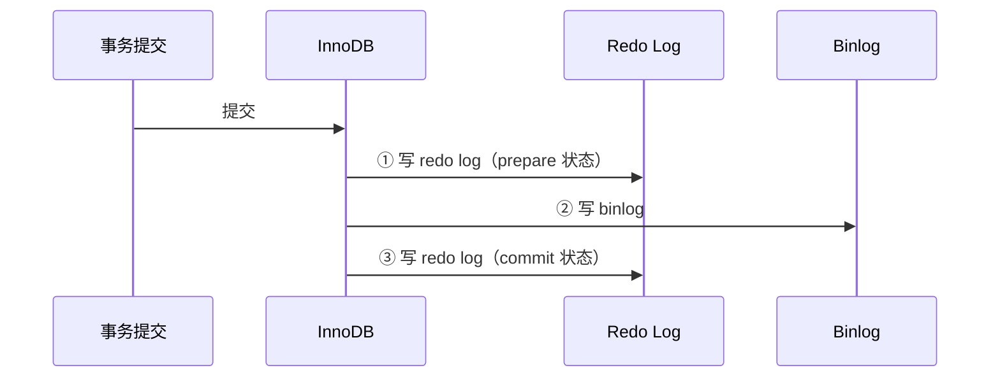

---
tags:
  - basic-knowledge
  - kb/database/mysql
  - kb/database/mysql/log
  - binlog
  - redo-log
  - undo-log
  - two-phase-commit
---

# MySQL 日志

> MySQL 的日志体系是理解**崩溃恢复、主从复制、事务回滚、MVCC** 的关键。核心是 **binlog / redo log / undo log** 三大日志 + **两阶段提交**保证一致。

## 相关笔记

- [事务](事务.md)：ACID 靠这些日志落地
- [MVCC（多版本并发控制）](MVCC（多版本并发控制）.md)：undo log 版本链
- [mysql复制](mysql复制.md)：主从复制靠 binlog
- [MySQL索引原理与优化](MySQL索引原理与优化.md)：更新 SQL 的两阶段提交

---

## 一、日志总览

| 日志         | 所属层    | 主要用途                      |
| ------------ | --------- | ----------------------------- |
| **binlog**   | Server 层 | 主从复制、数据恢复、审计      |
| **redo log** | InnoDB    | 崩溃恢复、保证**持久性（D）** |
| **undo log** | InnoDB    | 事务回滚、**MVCC** 版本链     |
| slow log     | Server 层 | 慢 SQL 定位                   |
| general log  | Server 层 | 全量请求排查（临时开）        |

记忆：**binlog 给别人看（复制/恢复）；redo log 崩了重做（持久性）；undo log 错了回滚（原子性 + MVCC）**。

---

## 二、binlog（二进制日志，Server 层）

记录所有**已提交**的、修改数据的操作。用途：主从复制、数据恢复、审计。

### 三种格式

| 格式          | 记录内容       | 优点                           | 缺点                                                         |
| ------------- | -------------- | ------------------------------ | ------------------------------------------------------------ |
| **STATEMENT** | SQL 语句       | 日志小                         | 非确定性函数（`NOW()`/`UUID()`）、触发器、UDF 可能主从不一致 |
| **ROW** ⭐    | 每行的实际变更 | **最安全**，主从一致，利于恢复 | 日志大、要求表结构一致                                       |
| **MIXED**     | 自动切换       | 折中                           | —                                                            |

> 生产推荐 **ROW**（MySQL 5.7+ 默认）。基于行的复制（RBR）一致性最好。

```sql
SHOW VARIABLES LIKE 'binlog_format';
SHOW BINARY LOGS;
-- 查看内容：mysqlbinlog <文件名>
```

---

## 三、redo log（重做日志，InnoDB）

保证事务**持久性**：已提交的事务，即使宕机重启也不丢。

### WAL（Write-Ahead Logging）机制

修改数据时，InnoDB **先写 redo log（顺序写，快），再改内存 Buffer Pool 的 page，最后异步刷盘到数据文件**。


- **先写日志再改数据**（WAL），把随机写变顺序写，性能大幅提升
- redo log 是**循环写**（固定大小，环形覆盖），靠 **checkpoint** 推进
- 宕机后重启，用 redo log 重做已提交但未落盘的修改 → **crash recovery**

---

## 四、undo log（回滚日志，InnoDB）

记录修改前的旧版本，保证事务**原子性**和 **MVCC**：

| 操作   | undo log 记录 |
| ------ | ------------- |
| INSERT | 对应的 DELETE |
| DELETE | 对应的 INSERT |
| UPDATE | 反向 UPDATE   |

- **事务回滚**：用 undo log 撤销未提交的修改
- **MVCC**：undo log 串成**版本链**，让快照读读到历史版本（详见 [MVCC](MVCC（多版本并发控制）.md)）

---

## 五、⭐ 两阶段提交（核心考点）

redo log（InnoDB）和 binlog（Server）是两个独立的日志。如何保证**主从数据一致**（即两者要么都写成功，要么都不生效）？靠**两阶段提交（2PC）**。



### 崩溃恢复规则（关键）

重启时扫描 redo log：

| redo log 状态 | binlog 是否完整          | 处理                       |
| ------------- | ------------------------ | -------------------------- |
| **prepare**   | binlog **已完整写入**    | **提交**（事务其实成功了） |
| **prepare**   | binlog **未写入/不完整** | **回滚**（事务实际没成功） |
| commit        | —                        | 已完成，正常               |

### 为什么必须两阶段？

若不用 2PC，可能出现「redo log 写了、binlog 没写」→ 主库恢复后认为提交了，但从库没收到 binlog → **主从不一致**。2PC 以 **binlog 是否完整**作为提交依据，保证主从一致。

---

## 六、binlog vs redo log（高频对比）

| 维度     | redo log             | binlog                        |
| -------- | -------------------- | ----------------------------- |
| 层级     | InnoDB 引擎          | Server 层（所有引擎）         |
| 作用     | 崩溃恢复（持久性）   | 复制、恢复                    |
| 内容     | 物理日志（页的修改） | 逻辑/物理日志（SQL 或行变更） |
| 写入方式 | **循环写**（覆盖）   | **追加写**（永久）            |
| 由谁写   | InnoDB               | Server                        |

---

## 七、slow log / general log

- **slow log**：记录超过 `long_query_time` 的 SQL，是慢查询优化入口，配合 [EXPLAIN](EXPLAIN.md)。**建议生产开启**。
- **general log**：记录所有客户端请求，开销大，**仅临时排查开启**。

---

## 八、面试速答

> **Q：MySQL 有哪些日志？分别什么用？**
> A：binlog（复制/恢复）、redo log（崩溃恢复，持久性）、undo log（回滚/MVCC，原子性）、slow log（慢SQL）、general log（排查）。

> **Q：redo log 和 binlog 区别？**
> A：redo log 是 InnoDB 物理日志、循环写、用于崩溃恢复；binlog 是 Server 逻辑日志、追加写、用于复制和恢复。

> **Q：什么是两阶段提交？为什么需要？**
> A：事务提交时先写 redo log（prepare）→ 写 binlog → 写 redo log（commit）。崩溃恢复时，若 redo 是 prepare 且 binlog 已完整则提交，否则回滚。**保证 redo log 与 binlog 一致，避免主从数据不一致**。

> **Q：WAL 是什么？**
> A：Write-Ahead Logging，先写日志（redo log）再改数据。把随机写变顺序写，提升性能，且保证崩溃可恢复。

---

## 参考

- [MySQL 官方 · The Binary Log](https://dev.mysql.com/doc/refman/8.0/en/binary-log.html)
- [MySQL 官方 · Redo Log](https://dev.mysql.com/doc/refman/8.0/en/innodb-redo-log.html)
- 丁奇《MySQL 实战 45 讲》第 15 讲（redo log）、第 23 讲（两阶段提交）
- 《高性能 MySQL》第 1 章
