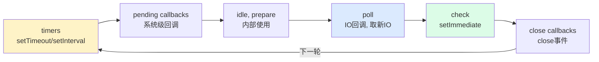
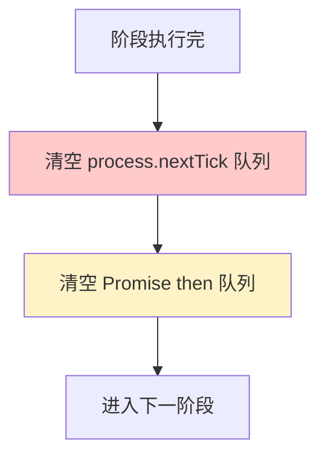

---
tags:
  - basic-knowledge
  - kb/programming/nodejs
  - kb/programming/nodejs/event-loop
  - event-loop
  - libuv
  - nexttick
---

# Node 事件循环（Event Loop）

> **Node 面试最高频**。Node 的事件循环和浏览器不同（6 阶段），`process.nextTick`/`setImmediate`/`setTimeout` 的执行顺序是经典考点。

## 相关笔记

- [Node基础与架构](Node基础与架构.md)：libuv 是事件循环的实现
- [Node异步编程](Node异步编程.md)：Promise（microtask）
- [select、poll、epoll](../计算机原理/select、poll、epoll.md)：事件循环底层

---

## 一、Node 事件循环的 6 个阶段



每一轮（tick）按顺序经过：

| 阶段                  | 处理                                     |
| --------------------- | ---------------------------------------- |
| **timers**            | 到期的 `setTimeout` / `setInterval` 回调 |
| **pending callbacks** | 系统级回调（如 TCP errno）               |
| **idle, prepare**     | 内部使用                                 |
| **poll**              | **IO 回调**，获取新 IO 事件              |
| **check**             | `setImmediate` 回调                      |
| **close callbacks**   | `close` 事件（如 socket.close）          |

> 每个**阶段之间**会清空 **microtask 队列**（Promise、`process.nextTick`）。

---

## 二、Microtask：nextTick vs Promise

阶段切换间，先清空 microtask，且 **`process.nextTick` 优先级高于 Promise**：



> `process.nextTick` 是 Node 特有，优先级**最高**（比 Promise 还高）。滥用会饿死 IO（事件循环进不了下一阶段）。

---

## 三、经典执行顺序题（必考）

```javascript
console.log("1")
setTimeout(() => console.log("2"), 0) // timers
setImmediate(() => console.log("3")) // check
Promise.resolve().then(() => console.log("4")) // microtask
process.nextTick(() => console.log("5")) // microtask 最高
console.log("6")
```

输出顺序：`1 6 5 4 2/3`

- `1 6`：同步代码
- `5`：nextTick 优先
- `4`：Promise
- `2 3`：setTimeout 和 setImmediate 顺序不确定（取决于进入事件循环时定时器是否到期，主模块里通常不确定；但在 IO 回调里 setImmediate 必先于 setTimeout）

### setImmediate vs setTimeout

- **主模块**：顺序不确定（看启动耗时）
- **IO 回调里**：**setImmediate 必先于 setTimeout**（poll 后直接进 check）

---

## 四、Node 11+ 的变化

Node 11 起，**每个 setTimeout 回调执行后立即清空 microtask**（向浏览器对齐），而非等整个 timers 阶段结束。但宏流程仍是 6 阶段。

---

## 五、阻塞事件循环的陷阱

单线程事件循环被**同步阻塞**会让整个 Node 假死：

```javascript
// ❌ 灾难：CPU 密集同步计算
while(true) { ... }            // 卡死所有请求
JSON.parse(hugeJson)           // 大 JSON 同步解析
fs.readFileSync(大文件)         // 同步读文件
```

> 避免：用异步 API（`fs.readFile`）、CPU 密集用 worker_threads、拆分大任务（用 setImmediate 让出）。

---

## 六、面试速答

> **Q：Node 事件循环有几个阶段？**
> A：6 个：timers → pending → idle/prepare → **poll（IO）** → **check（setImmediate）** → close。阶段间清空 microtask。

> **Q：process.nextTick 和 Promise.then 谁先？**
> A：nextTick 先。nextTick 优先级最高，高于 Promise。两者都是 microtask，在每阶段间清空。

> **Q：setTimeout(fn,0) 和 setImmediate 谁先？**
> A：主模块里不确定；但在 **IO 回调里 setImmediate 必先于 setTimeout**（poll 后直接进 check 阶段）。

> **Q：什么会阻塞事件循环？**
> A：同步 CPU 密集计算、同步 IO（readFileSync）、大 JSON 解析。要用异步 API，CPU 密集用 worker_threads。

---

## 参考

- [Node 官方 · Event Loop](https://nodejs.org/zh-cn/docs/guides/event-loop-timers-and-nexttick/)
- [libuv 事件循环设计](http://docs.libuv.org/en/v1.x/design.html)
- [Node.js 事件循环详解 - 掘金](https://juejin.cn/post/6844903764202094606)
