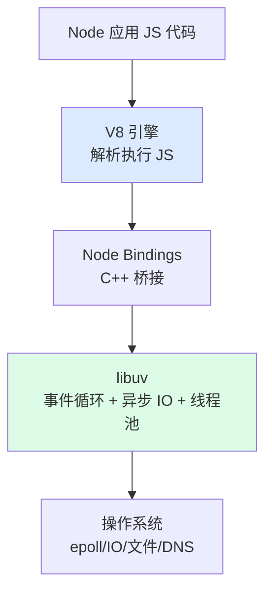
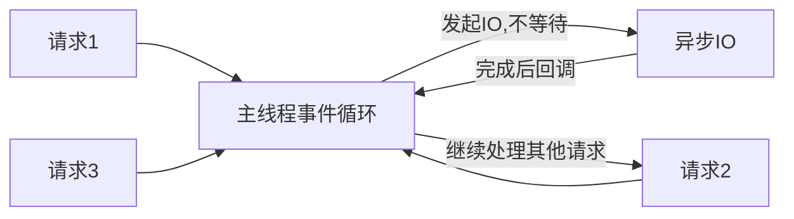

---
tags:
  - basic-knowledge
  - kb/programming/nodejs
  - basics
---

# Node.js 基础与架构

> Node.js = **V8 引擎（JS 运行时）+ libuv（事件循环/异步 IO）**。用 JS 写后端，单线程非阻塞 IO 擅长高并发 IO 场景。是 Python 之外最常用的后端语言之一。

## 相关笔记

- [Node事件循环](Node事件循环.md) ⭐ — Node 的核心，必考
- [Node异步编程](Node异步编程.md) — Promise / async-await
- [Node模块系统与Stream](Node模块系统与Stream.md) — CommonJS/ESM、Stream
- [Node多进程与内存管理](Node多进程与内存管理.md) — Cluster、V8 GC

---

## 一、Node 是什么

Node.js 是基于 **V8 引擎**的 JavaScript 运行时（让 JS 能脱离浏览器跑在服务端），核心组件：

- **V8**：Google 的 JS 引擎（Chrome 同款），负责解析执行 JS、JIT 编译
- **libuv**：C 语言库，提供**事件循环 + 异步 IO + 线程池**，是 Node 高并发的核心

---

## 二、单线程？其实是「主线程单线程 + 线程池」

> 常见误区：「Node 是单线程」。准确说：**JS 代码跑在单线程**（主线程），但底层 libuv 有**线程池**（默认 4 线程）处理磁盘 IO、DNS、加密等，不阻塞主线程。

| 部分                   | 线程模型                            |
| ---------------------- | ----------------------------------- |
| **JS 代码执行**        | 单线程（主线程/事件循环）           |
| **网络 IO**            | 异步非阻塞，由事件循环 + epoll 处理 |
| **磁盘/文件/DNS/加密** | 丢给 libuv **线程池**               |

---

## 三、为什么 Node 能高并发

- **非阻塞 IO**：发起 IO 后不等待，立即处理下一个请求
- **事件循环**：IO 完成后通过事件回调通知主线程
- 单线程扛万级连接（和 [Redis](../redis/Redis的底层原理.md)、[asyncio](../计算机原理/异步如何实现的.md) 思路一致）

---

## 四、适用场景

| ✅ 适合                                  | ❌ 不适合                        |
| ---------------------------------------- | -------------------------------- |
| IO 密集（Web API、中间层 BFF、实时通信） | CPU 密集（图像处理、大数据计算） |
| 实时应用（聊天、推送、WebSocket）        | 长时间同步计算会阻塞事件循环     |
| 微服务、SSR、CLI 工具                    |                                  |

> CPU 密集任务会阻塞单线程事件循环，导致整个 Node 卡死。需用 worker_threads 或拆分。

---

## 五、Node vs 浏览器 JS

| 维度     | Node                            | 浏览器                |
| -------- | ------------------------------- | --------------------- |
| 运行环境 | 服务端                          | 客户端                |
| 全局对象 | `global` / `process` / `Buffer` | `window` / `document` |
| 模块     | CommonJS / ESM                  | ESM（ESM 是趋势）     |
| DOM      | ❌ 无                           | ✅ 有                 |
| 事件循环 | **6 阶段（和浏览器不同）**      | 浏览器规范            |

---

## 六、面试速答

> **Q：Node 是单线程吗？为什么能高并发？**
> A：JS 代码单线程执行，但底层 libuv 有线程池处理磁盘/DNS 等。高并发靠**非阻塞 IO + 事件循环**：发起 IO 不等待，立即处理下个请求，IO 完成回调通知。单线程扛万级连接。

> **Q：Node 由什么组成？**
> A：V8 引擎（执行 JS）+ libuv（事件循环、异步 IO、线程池）+ Node Bindings（C++ 桥接）。

> **Q：Node 不适合什么场景？**
> A：CPU 密集型。单线程事件循环会被同步计算阻塞，导致整个服务卡死。CPU 密集用 worker_threads 或换语言。

---

## 参考

- [Node.js 官方](https://nodejs.org/zh-cn/docs/)
- [libuv 设计文档](http://docs.libuv.org/)
- [Node.js 事件循环官方](https://nodejs.org/zh-cn/docs/guides/event-loop-timers-and-nexttick/)
