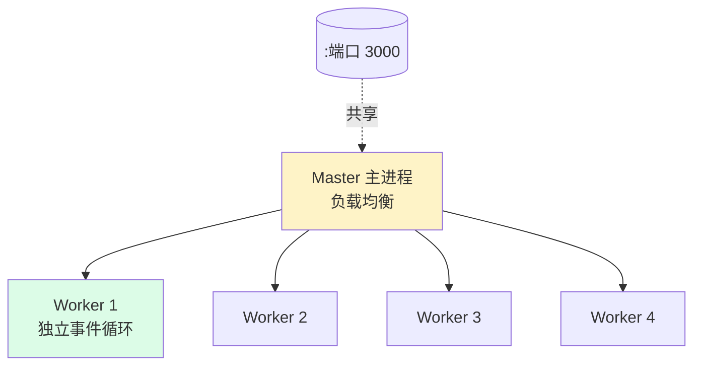

---
tags:
  - basic-knowledge
  - kb/programming/nodejs
  - kb/programming/nodejs/process
  - cluster
  - worker-threads
  - v8-gc
---

# Node 多进程与内存管理

> Node 主线程单线程，**如何用多核？CPU 密集怎么办？内存怎么管？** 这篇讲 Cluster、worker_threads 和 V8 GC。

## 相关笔记

- [Node基础与架构](Node基础与架构.md)：单线程模型
- [python垃圾回收](../python/python垃圾回收.md)：对比 Python GC
- [进程、线程、协程](../计算机原理/进程、线程、协程.md)

---

## 一、单线程怎么用多核：Cluster ⭐

Node 主进程 fork 出多个**子进程（worker）**，共享同一端口，由主进程负载均衡：



```javascript
const cluster = require("cluster")
const os = require("os")

if (cluster.isPrimary) {
  for (let i = 0; i < os.cpus().length; i++) cluster.fork()
  cluster.on("exit", (w) => cluster.fork()) // worker 挂了自动重启
} else {
  require("./app") // 每个 worker 跑一份应用
}
```

- 每个 worker 是**独立进程**（独立 V8/事件循环/内存）
- 主进程用**轮询（round-robin）**分发连接
- worker 挂了主进程可重启（高可用）

> 生产一般不手写 Cluster，用 **PM2**（自动多进程 + 负载均衡 + 重启 + 监控）。

---

## 二、三种多任务方式对比

| 方式               | 模型                   | 适用                       | 共享内存             |
| ------------------ | ---------------------- | -------------------------- | -------------------- |
| **Cluster**        | 多**进程**             | Web 服务横向用多核         | ❌（各自内存）       |
| **child_process**  | spawn/exec/fork 子进程 | 调用外部命令、脚本         | ❌                   |
| **worker_threads** | 多**线程**（共享内存） | **CPU 密集**（图像、计算） | ✅ SharedArrayBuffer |

### worker_threads（CPU 密集救星）

```javascript
const { Worker } = require("worker_threads")
const worker = new Worker("./heavy.js", { workerData: input })
worker.on("message", (result) => console.log(result))
```

> CPU 密集用 worker_threads（共享内存，通信快），别阻塞主事件循环。

---

## 三、PM2（生产进程管理）

| 功能           | 说明                                                  |
| -------------- | ----------------------------------------------------- |
| **集群模式**   | `pm2 start app.js -i max` 自动 Cluster（按 CPU 核数） |
| **负载均衡**   | 内置                                                  |
| **自动重启**   | 崩溃/文件变化自动重启                                 |
| **零停机重启** | `pm2 reload` 滚动重启                                 |
| **日志/监控**  | `pm2 logs` / `pm2 monit`                              |

---

## 四、V8 内存与 GC

Node 用 V8 引擎，GC 是 **V8 的分代回收**：


| 代         | 算法                      | 特点               |
| ---------- | ------------------------- | ------------------ |
| **新生代** | Scavenge（复制/Cheney）   | 短命对象，频繁回收 |
| **老生代** | **标记-清除 + 标记-整理** | 长命对象，回收较慢 |

> 思路和 [Python 分代 GC](../python/python垃圾回收.md) 类似（分代 + 标记清除），但 V8 新生代用 Scavenge 复制算法。

### 内存限制

V8 默认限制老生代堆大小（64 位约 **1.4GB**，Node 可调到 ~4GB），超出报 OOM：

```bash
node --max-old-space-size=4096 app.js   # 调到 4GB
```

> 限制源于 V8 为浏览器设计（单页内存不需要太大），服务端大内存场景需手动调。

---

## 五、内存泄漏排查

| 手段                          | 说明                                                         |
| ----------------------------- | ------------------------------------------------------------ |
| `process.memoryUsage()`       | 看 heapUsed 趋势                                             |
| `--inspect` + Chrome DevTools | 实时看堆、抓 heap snapshot                                   |
| `heapdump`                    | 代码里定时 dump 快照对比                                     |
| 常见泄漏                      | 全局变量/缓存无限增长、未清理的定时器/监听器、闭包持有大对象 |

---

## 六、面试速答

> **Q：Node 单线程怎么用多核？**
> A：用 **Cluster**——主进程 fork 多个 worker 子进程共享端口，轮询负载均衡。或用 **PM2**（`-i max`）自动管理。CPU 密集用 **worker_threads**（多线程共享内存）。

> **Q：Cluster 和 worker_threads 区别？**
> A：Cluster 是多**进程**（独立内存/事件循环），适合 Web 服务横向扩展；worker_threads 是多**线程**（共享内存），适合 CPU 密集计算。各自内存 vs 共享内存。

> **Q：Node 的 GC 机制？**
> A：V8 分代回收。新生代用 Scavenge（复制算法），老生代用标记-清除+标记-整理。和 Python 类似都是分代+标记清除，但 V8 新生代用复制算法。

> **Q：Node 内存有限制吗？**
> A：有。V8 默认老生代约 1.4GB（64位），服务端大内存用 `--max-old-space-size` 调大。

---

## 参考

- [Node 官方 · Cluster](https://nodejs.org/api/cluster.html)
- [Node 官方 · Worker Threads](https://nodejs.org/api/worker_threads.html)
- [V8 垃圾回收](https://v8.dev/blog/trash-talk)
- [PM2 官方](https://pm2.keymetrics.io/)
