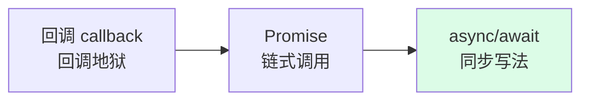

---
tags:
  - basic-knowledge
  - kb/programming/nodejs
  - kb/programming/nodejs/async
  - promise
  - async-await
---

# Node 异步编程

> callback → Promise → **async/await** 的演进。async/await 是现代 Node 异步的标准写法。

## 相关笔记

- [Node事件循环](Node事件循环.md)：Promise 是 microtask
- [Node基础与架构](Node基础与架构.md)：为什么异步
- [Node异步](../python/Httpx与Asyncio.md)：对比 Python asyncio

---

## 一、演进：从回调地狱到 async/await



### 1. 回调（地狱）

```javascript
getData(id, (err, data) => {
  getMore(data.x, (err, more) => {
    getFinal(more.y, (err, result) => {
      /* 嵌套层层 */
    })
  })
})
```

❌ 嵌套深、错误处理难、不能 return/throw。

### 2. Promise

```javascript
getData(id)
  .then((data) => getMore(data.x))
  .then((more) => getFinal(more.y))
  .then((result) => console.log(result))
  .catch((err) => console.error(err))
```

✅ 链式、统一错误处理。

### 3. async/await（推荐）⭐

```javascript
async function run() {
  try {
    const data = await getData(id)
    const more = await getMore(data.x)
    const result = await getFinal(more.y)
    console.log(result)
  } catch (err) {
    console.error(err) // 像同步一样 try/catch
  }
}
```

✅ 同步写法、可读性最好、能 try/catch。**本质是 Promise 的语法糖**。

---

## 二、并发控制（高频）

### Promise.all / allSettled / race

| 方法                   | 行为                                 |
| ---------------------- | ------------------------------------ |
| `Promise.all([p1,p2])` | 全成功才成功，**任一失败即失败**     |
| `Promise.allSettled`   | 等全部结束（无论成败），返回每个结果 |
| `Promise.race`         | 第一个完成（成功或失败）即返回       |
| `Promise.any`          | 第一个**成功**的返回                 |

```javascript
// 并发请求，全完成
const [a, b, c] = await Promise.all([fetchA(), fetchB(), fetchC()])
```

### 限制并发（批量）

Promise.all 会**同时**发起所有，数量大时压垮下游/触发限流。需限流：

```javascript
// 简单分批：每批 N 个
async function batch(tasks, n = 5) {
  const results = []
  for (let i = 0; i < tasks.length; i += n) {
    results.push(...(await Promise.all(tasks.slice(i, i + n).map((t) => t()))))
  }
  return results
}
// 或用 p-limit 等库精确控制并发数
```

---

## 三、常见坑

| 坑                             | 说明                                                                 |
| ------------------------------ | -------------------------------------------------------------------- |
| **忘了 await**                 | 返回 Promise 对象而非值，后续逻辑错乱                                |
| **循环中 await 串行**          | `for...of` + await 是串行，要并发用 `Promise.all`                    |
| **async 函数返回值**           | 总是返回 Promise（即使 return 普通值）                               |
| **未捕获的 Promise rejection** | 可能导致进程崩溃（Node 会 warning/exit），务必 `.catch` 或 try/catch |
| **forEach 里 await 无效**      | `forEach` 不等 await，用 `for...of` 或 `Promise.all(arr.map)`        |

```javascript
// ❌ forEach 不等 await
arr.forEach(async (item) => await save(item)) // 不会等
// ✅ 用 for...of（串行）或 Promise.all（并发）
for (const item of arr) await save(item)
await Promise.all(arr.map((item) => save(item)))
```

---

## 四、错误处理

- async/await 用 `try/catch`
- Promise 链用 `.catch`
- 全局兜底：`process.on('unhandledRejection', ...)`

---

## 五、面试速答

> **Q：async/await 本质是什么？**
> A：Promise 的语法糖。async 函数返回 Promise，await 等待 Promise resolve。让异步代码用同步写法，能用 try/catch。

> **Q：Promise.all 和 allSettled 区别？**
> A：all 全成才成、任一失败即失败；allSettled 等全部结束（无论成败），返回每个的状态和值。

> **Q：forEach 里 await 为什么不行？**
> A：forEach 不等待 async 回调，会立即继续。要等用 `for...of`（串行）或 `Promise.all(arr.map(async...))`（并发）。

---

## 参考

- [MDN · async/await](https://developer.mozilla.org/zh-CN/docs/Learn/JavaScript/Asynchronous/Async_await)
- [MDN · Promise](https://developer.mozilla.org/zh-CN/docs/Web/JavaScript/Reference/Global_Objects/Promise)
- [Node 异步错误处理](https://nodejs.org/zh-cn/docs/guides/event-loop-timers-and-nexttick/)
