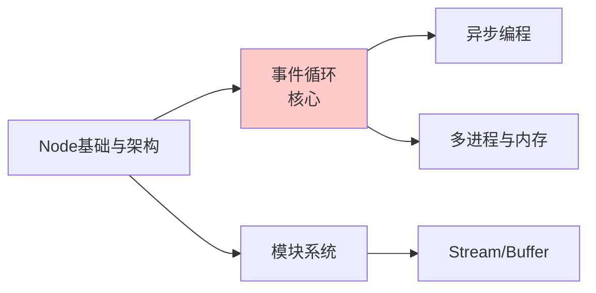

---
tags:
  - basic-knowledge
  - kb/programming/nodejs
  - kb/meta
---

# 🟢 Node.js 知识索引

> 本目录是 Node.js 基础与面试知识库，与 [Python 领域](../python/Python基础.md) 并列的第二个后端语言体系。核心：**事件循环、异步、Stream、多进程**。

## 基础与架构

- [Node基础与架构](Node基础与架构.md) ⭐ — V8 + libuv、单线程、为什么高并发
- [Node事件循环](Node事件循环.md) ⭐⭐ — **最高频**：6 阶段、nextTick、setImmediate
- [Node异步编程](Node异步编程.md) — Promise / async-await / 并发控制

## 核心能力

- [Node模块系统与Stream](Node模块系统与Stream.md) ⭐ — CommonJS/ESM、Stream、Buffer
- [Node多进程与内存管理](Node多进程与内存管理.md) ⭐ — Cluster、worker_threads、V8 GC、PM2

---

## 学习路径

1. 先理解 [Node基础与架构](Node基础与架构.md)（V8+libuv）
2. **死磕 [事件循环](Node事件循环.md)**（面试最高频，6 阶段 + nextTick）
3. 掌握 [异步编程](Node异步编程.md)（async/await）和 [Stream](Node模块系统与Stream.md)
4. 进阶 [多进程与内存](Node多进程与内存管理.md)（Cluster、V8 GC）
