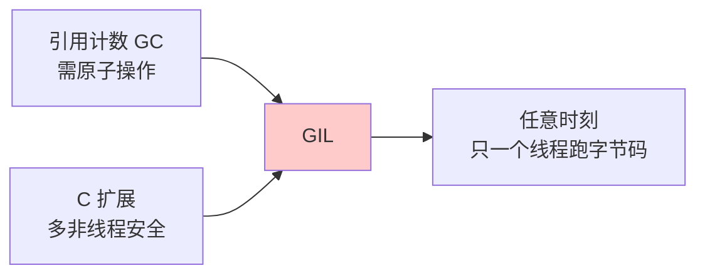
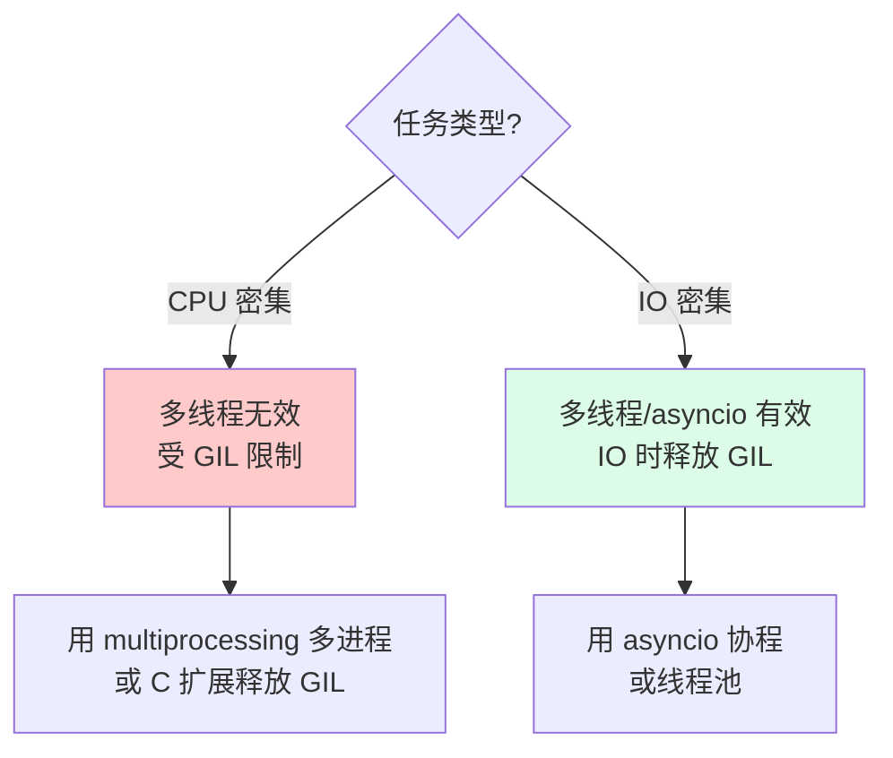

---
tags:
  - basic-knowledge
  - kb/programming/python
  - kb/programming/python/concurrency
  - gil
  - thread
---

# GIL（全局解释器锁）

> GIL 是 Python 并发**必考**的核心。注意：**Python 3.13（2024.10）已引入实验性 No-GIL（PEP 703）**，老资料里"GIL 无法移除"的说法已过时。

## 相关笔记

- [python垃圾回收](python垃圾回收.md)：引用计数是 GIL 存在的根因
- [进程、线程、协程](../计算机原理/进程、线程、协程.md)：并发模型基础
- [异步如何实现的](../计算机原理/异步如何实现的.md)：IO 密集型为何用 asyncio

---

## 一、什么是 GIL

**GIL（Global Interpreter Lock）** 是 CPython 解释器里的一把全局互斥锁：**任意时刻只允许一个线程执行 Python 字节码**。

> ⚠️ GIL 是 **CPython 的实现细节**，不是 Python 语言规范。Jython、IronPython 没有 GIL；PyPy 也有 GIL。

---

## 二、为什么有 GIL（根因）

1. **引用计数内存管理**：CPython 用引用计数做 GC，多线程同时改 `refcount` 会产生数据竞争。GIL 让引用计数操作天然原子。
2. **C 扩展的线程安全**：大量历史 C 扩展非线程安全，GIL 让它们在多线程下也能安全运行。
3. **简化实现、单线程优先**：早年单核为主，GIL 牺牲多核并行换取实现简单和单线程效率。

---

## 三、GIL 何时释放（工作机制）

GIL **不是全程持有**，CPython 会在以下时机释放，让其他线程运行：

| 释放时机           | 说明                                                |
| ------------------ | --------------------------------------------------- |
| **IO 操作前**      | 文件/网络 read、recv 等，释放 GIL 等待 IO           |
| **时间片到期**     | Python 3.2 起改为固定时间片（约 5ms），到期强制让出 |
| **C 扩展主动释放** | NumPy 等计算库在重计算时释放 GIL                    |

> 这就是 **IO 密集型任务用多线程/协程有效**的原因——IO 时 GIL 释放，其他线程能跑。

---

## 四、GIL 的影响：CPU 密集 vs IO 密集

| 任务类型     | 多线程效果                | 原因                         | 推荐方案                     |
| ------------ | ------------------------- | ---------------------------- | ---------------------------- |
| **CPU 密集** | ❌ 无法利用多核，甚至更慢 | GIL 让线程串行，还有切换开销 | **多进程** / C 扩展 / no-GIL |
| **IO 密集**  | ✅ 有效                   | IO 时释放 GIL，可并发等待    | **多线程 / asyncio**         |

---

## 五、绕过 / 缓解 GIL 的方案

1. **多进程 `multiprocessing`**：每个进程独立解释器和 GIL，真正并行。代价是进程间通信/内存开销。
2. **C 扩展释放 GIL**：用 C/Cython/NumPy 等写计算密集部分，计算时释放 GIL。
3. **`asyncio` 协程**：IO 密集型首选，单线程内并发，无 GIL 竞争。
4. **分布式计算**：Celery / Dask / Ray 跨进程跨机器并行。

---

## 六、⭐ Python 3.13 No-GIL（PEP 703）—— 最大变化

2024 年 10 月发布的 **Python 3.13** 引入**实验性自由线程（free-threading / No-GIL）构建**：

| 阶段               | 状态                                                    |
| ------------------ | ------------------------------------------------------- |
| **3.13**           | 实验性，需单独编译（`--disable-gil`），默认**仍带 GIL** |
| **3.14+**          | 持续优化性能与生态适配                                  |
| **目标（~3.15+）** | 计划成为默认                                            |

### 技术要点

- 用 **BiGC（biased reference counting）+ 延迟引用计数**替代「GIL 保护引用计数」，实现线程安全。
- 多线程 CPU 密集型任务可**真正多核并行**。
- 当前 no-GIL 版本**单线程性能仍弱于带 GIL 版本**（优化进行中）。
- **C 扩展需改造为线程安全**才能在 no-GIL 下运行，生态迁移是最大挑战。

> **面试要点**：GIL 没有被「删掉」，而是 Python 官方已**正式承诺移除**（PEP 703 被接受），3.13 起进入分阶段实施。这是 GIL 话题的最新答案。

---

## 七、面试速答

> **Q：GIL 是什么？为什么存在？**
> A：CPython 的全局解释器锁，任意时刻只允许一个线程执行字节码。根因是引用计数 GC 需要原子操作 + 历史 C 扩展非线程安全。注意它是 CPython 实现细节，非语言规范。

> **Q：Python 多线程能不能加速 CPU 密集任务？**
> A：不能。GIL 让多线程串行执行字节码，反而有切换开销。CPU 密集用多进程或 C 扩展释放 GIL。

> **Q：那为什么 IO 密集型用多线程/asyncio 有效？**
> A：IO 操作（网络/文件）前会释放 GIL，线程在等待 IO 时让出锁，其他线程可执行，实现并发等待。

> **Q：GIL 会被移除吗？**
> A：会。PEP 703 已被接受，Python 3.13（2024.10）引入实验性 No-GIL 构建，分阶段推进，目标未来版本默认无 GIL。C 扩展需适配线程安全。

---

## 参考

- [PEP 703 · Making the GIL Optional](https://peps.python.org/pep-0703/)
- [Python 3.13 Release Notes · Free-threaded CPython](https://docs.python.org/3.13/whatsnew/3.13.html#free-threaded-cpython)
- [Real Python · What Is the Python GIL](https://realpython.com/python-gil/)
- [Python 内存管理 · 引用计数](https://docs.python.org/3/c-api/intro.html)
