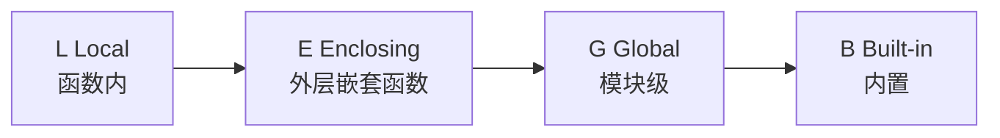

---
tags:
  - basic-knowledge
  - kb/programming/python
  - basics
---

# Python 基础

> 本篇是 Python 领域入口，只讲**语言核心基础**（解释器、数据类型与可变性、作用域、类型注解），深入主题在各专题页。Python 面试汇总见 [Python面试题集](Python面试题集.md)。

## 专题导航

| 主题       | 笔记                                                                                                                                                                                                                |
| ---------- | ------------------------------------------------------------------------------------------------------------------------------------------------------------------------------------------------------------------- |
| 内存与回收 | [python垃圾回收](python垃圾回收.md)、[GIL](GIL.md)                                                                                                                                                                  |
| 面向对象   | [面向对象编程](面向对象编程.md)、[类Class常用的问题](类Class常用的问题.md)、[__init__和__new__的区别](__init__和__new__的区别.md)、[多类继承规则](多类继承规则.md)、[属性property的优缺点](属性property的优缺点.md) |
| 函数式     | [闭包](闭包.md)、[迭代器](迭代器.md)、[生成器](生成器.md)                                                                                                                                                           |
| 异步       | [Httpx与Asyncio](Httpx与Asyncio.md)、[异步如何实现的](../计算机原理/异步如何实现的.md)                                                                                                                              |
| 调试       | [pdb调试](../计算机原理/pdb调试.md)、[内建属性&函数](内建属性&函数.md)                                                                                                                                              |
| 进阶合集   | [python核心编程](python核心编程.md)（元类/装饰器/拷贝/位运算）                                                                                                                                                      |

---

## 一、解释器

| 解释器      | 说明                                         |
| ----------- | -------------------------------------------- |
| **CPython** | 官方实现（C 语言），最主流，**有 GIL**       |
| **PyPy**    | JIT 编译，**执行更快**（适合纯 Python 计算） |
| Jython      | 跑在 JVM，可调用 Java                        |
| IronPython  | 跑在 .NET                                    |

> 默认 `python` 即 CPython。GIL、引用计数 GC 都是 CPython 的实现细节（见 [GIL](GIL.md)、[python垃圾回收](python垃圾回收.md)）。

---

## 二、数据类型与可变性（高频考点）

| 不可变                                         | 可变                |
| ---------------------------------------------- | ------------------- |
| `int` `float` `bool` `str` `tuple` `frozenset` | `list` `dict` `set` |

**可变性是面试高频**，直接影响：

- 函数默认参数陷阱：`def f(x=[])` 的 `[]` 只创建一次，多次调用共享！应用 `None` 兜底
- 拷贝深浅：`copy.copy`（浅，只复制第一层）vs `copy.deepcopy`（深，递归复制）。详见 [python核心编程](python核心编程.md) 的深浅拷贝
- 字典/集合的 key 必须可哈希（即不可变）

```python
def add(item, lst=None):   # ✅ 正确
    lst = lst or []
    lst.append(item)
    return lst
```

---

## 三、作用域：LEGB

查找变量的顺序：



- 闭包正是利用 **Enclosing** 作用域（见 [闭包](闭包.md)）
- `global` / `nonlocal` 声明修改外层变量

---

## 四、类型注解（Type Hints，3.5+）

现代 Python 几乎都用类型注解，配合 `mypy` 静态检查：

```python
from typing import Optional

def greet(name: str, times: int = 1) -> list[str]:
    return [f"hello {name}"] * times

def find(uid: int) -> Optional[dict]:   # 可能返回 None
    ...
```

> 3.9+ 可直接用 `list[str]`、`dict[str, int]`（无需 `typing.List`）。3.10+ 有 `int | str` 联合类型语法。

---

## 五、常用魔法方法速查

| 方法                                   | 触发                                                               |
| -------------------------------------- | ------------------------------------------------------------------ |
| `__init__` / `__new__`                 | 实例化（见 [__init__和__new__的区别](__init__和__new__的区别.md)） |
| `__str__` / `__repr__`                 | 打印/调试表示                                                      |
| `__len__` / `__getitem__` / `__iter__` | 容器协议、迭代（见 [迭代器](迭代器.md)）                           |
| `__enter__` / `__exit__`               | 上下文管理器（`with`）                                             |
| `__call__`                             | 对象可像函数一样调用                                               |

---

## 参考

- [Python 官方文档](https://docs.python.org/3/)
- [PEP 484 · Type Hints](https://peps.python.org/pep-0484/)
- [Real Python](https://realpython.com/)
