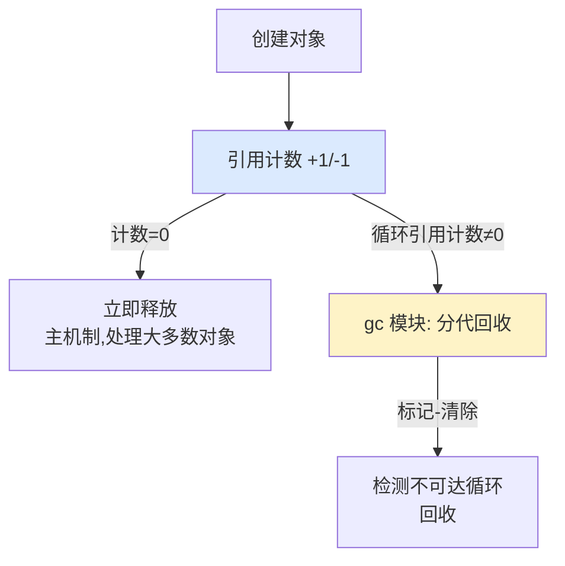

---
tags:
  - basic-knowledge
  - kb/programming/python
  - kb/programming/python/gc
  - garbage-collection
  - reference-counting
  - generational-gc
---

# Python 垃圾回收（GC）

> Python GC 不是单一机制，而是**引用计数（主）+ 标记-清除（解循环引用）+ 分代回收（提效）**三件套。引用计数也是 [GIL](GIL.md) 存在的根因。

## 相关笔记

- [GIL](GIL.md)：引用计数需要 GIL 保证原子性
- [python核心编程](python核心编程.md)：深浅拷贝与对象生命周期

---

## 一、三机制总览



---

## 二、引用计数（主机制）

每个对象有 `ob_refcnt`，表示指向它的引用数：

- 新增引用 +1（赋值、传参、加入容器）
- 引用消失 -1（离开作用域、`del`、容器移除）
- **归 0 立即释放**

| 优点               | 缺点                 |
| ------------------ | -------------------- |
| 实现简单、回收即时 | 维护计数有开销       |
| 成本分摊到运行期   | **无法处理循环引用** |

> 引用计数的 +1/-1 需要线程安全，这正是 [GIL](GIL.md) 存在的核心原因之一。

---

## 三、循环引用 + 标记-清除

循环引用：对象互相引用，引用计数永不为 0：

```python
a = A(); b = A()
a.ref = b; b.ref = a   # 互相引用，即使外部不再用 a/b，refcnt 也不归 0
```

**标记-清除（Mark-Sweep）** 解决它：周期性从「GC Roots」（全局、栈、寄存器等可达对象）出发遍历，**不可达**的对象即为垃圾。注意 Python 只对**容器对象**（list/dict/实例等）做循环引用检测（int/str 等不可变对象不会构成循环）。

---

## 四、分代回收（提效）

基于「**多数对象朝生夕死**」的假设，把对象分三代：

| 代       | 对象           | 回收频率 |
| -------- | -------------- | -------- |
| **0 代** | 新对象         | 最高     |
| **1 代** | 0 代存活下来的 | 中       |
| **2 代** | 长期存活       | 最低     |

每代有计数器阈值，0 代满触发 0 代回收；0 代回收若干次后触发 1 代，以此类推。这样**避免每次全量扫描**，提升效率。

---

## 五、`__del__` 与 PEP 442（修正过时认知）

> **过时说法**：「循环引用里有 `__del__` 的对象无法被回收」——这在 **Python 3.4 之前**成立。

**PEP 442（Python 3.4+）** 后：循环引用中的对象也能**安全调用 `__del__`**，且析构顺序确定。所以现代 Python 循环引用 + `__del__` 基本能正常回收。

但仍建议：**不要把关键资源释放完全依赖 `__del__`**（调用时机不确定、异常难处理），优先用：

- 上下文管理器 `with`（`__enter__`/`__exit__`）
- 显式 `close()` / `try-finally`

---

## 六、Python 3.12+ 的 GC 改进 ⭐

| 改进                                     | 说明                                                                                                               |
| ---------------------------------------- | ------------------------------------------------------------------------------------------------------------------ |
| **增量式 GC**                            | 3.12 起把一次完整回收**拆成多步增量执行**，减少长停顿（STW），对延迟敏感场景更友好                                 |
| **PEP 683 永生对象（Immortal Objects）** | 3.12 引入，某些对象（如 None/小整数/模块级对象）引用计数固定不再增减，降低多解释器下的计数竞争开销，为 no-GIL 铺路 |
| **No-GIL 适配**                          | 3.13 free-threading 下，引用计数改为 biased reference counting（PEP 683/703），GC 机制相应调整                     |

---

## 七、调优与调试

```python
import gc

gc.get_threshold()   # 默认 (700, 10, 10)
gc.set_threshold(10000, 50, 50)  # 调大阈值→回收更懒（适合对象多、循环引用少的场景）
gc.collect()         # 手动触发全代回收
gc.disable()         # 关闭分代回收（仅靠引用计数，适合短命脚本提性能）
gc.get_stats()       # 各代统计
```

- **调大阈值**：减少回收频率，适合分配密集但循环引用少的场景（如数值计算）。
- **`__slots__`**：定义类时用 `__slots__` 替代 `__dict__`，省内存也减少 GC 压力（非 GC 本身，但相关）。
- **`tracemalloc`**：定位内存泄漏的具体分配点。

---

## 八、弱引用（不增加引用计数）

弱引用（`weakref`）不增加 `refcnt`，不阻止对象被回收。适合**缓存**——想复用对象但不想缓存阻止其释放：

```python
import weakref
ref = weakref.ref(obj)
ref()       # 对象存活时返回它
del obj
ref()       # None，对象已被回收
```

---

## 九、面试速答

> **Q：Python 的 GC 机制？**
> A：三件套——引用计数（主，即时释放）+ 标记-清除（解决循环引用）+ 分代回收（按代分频率提效）。

> **Q：引用计数有什么问题？**
> A：① 无法处理循环引用（靠标记-清除补）；② 频繁增减有开销；③ 多线程下需保证原子性（这也是 GIL 存在原因之一）。

> **Q：循环引用里有 `__del__` 会被回收吗？**
> A：Python 3.4+（PEP 442）后可以安全回收并调用 `__del__`，析构顺序确定。3.4 前才无法回收。但生产中仍不建议依赖 `__del__` 释放关键资源。

> **Q：Python 3.12 GC 有什么改进？**
> A：增量式 GC 减少停顿；PEP 683 永生对象降低共享对象计数开销，为 no-GIL 铺路。

---

## 参考

- [Python 官方 · gc 模块](https://docs.python.org/3/library/gc.html)
- [PEP 442 · Safe object finalization](https://peps.python.org/pep-0442/)
- [PEP 683 · Immortal Objects](https://peps.python.org/pep-0683/)
- [Garbage Collector Design · Python devguide](https://devguide.python.org/internals/garbage-collector/)
- [Real Python · Python Garbage Collection](https://realpython.com/python-memory-management/)
