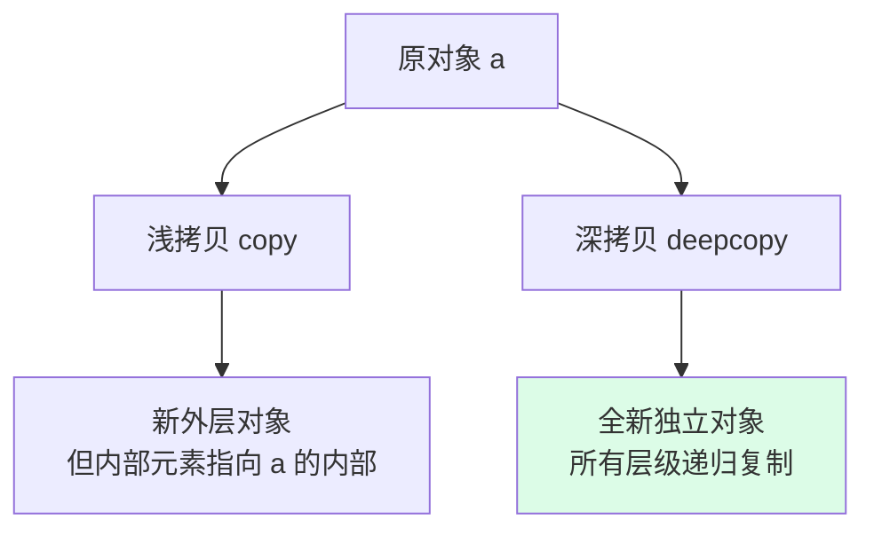

---
tags:
  - basic-knowledge
  - kb/programming/python
  - kb/programming/python/basics
  - deep-copy
  - shallow-copy
  - mutable
---

# 深拷贝与浅拷贝

> 可变对象 + 嵌套结构下，拷贝的「深浅」决定了副本与原件是否独立。是 Python 高频考点，也常埋 bug。

## 相关笔记

- [Python基础](Python基础.md)：可变/不可变类型
- [python核心编程](python核心编程.md)：进阶合集

---

## 一、可变性回顾（基础）

| 不可变                    | 可变            |
| ------------------------- | --------------- |
| `int/str/tuple/frozenset` | `list/dict/set` |

- 不可变对象「修改」其实是**创建新对象**（如 `s += 'b'`）
- 可变对象「修改」是**原地改**（如 `lst.append(1)`）

---

## 二、四种「拷贝」层次

```python
import copy
a = [[1, 2], [3, 4]]
```

| 方式       | 代码                                              | 效果                           |
| ---------- | ------------------------------------------------- | ------------------------------ |
| **赋值**   | `b = a`                                           | 同一对象，完全共享（`b is a`） |
| **浅拷贝** | `b = copy.copy(a)` 或 `a.copy()`/`a[:]`/`list(a)` | 外层新对象，**内层元素仍共享** |
| **深拷贝** | `b = copy.deepcopy(a)`                            | 完全独立，递归复制所有层级     |



### 浅拷贝的危险

```python
a = [[1,2],[3,4]]
b = copy.copy(a)
b[0][0] = 99
print(a)   # [[99,2],[3,4]]  ← a 也被改了！内层是同一个 list
```

浅拷贝只复制了**第一层**（外层 list 是新的），但内部 `[1,2]`、`[3,4]` 这些**子对象仍是共享引用**，改 b 的子元素会影响 a。

---

## 三、不可变对象的浅拷贝特殊行为

对**不可变对象**，`copy.copy` 可能直接返回原对象（因为不可变，无需复制）：

```python
s = "abc"
s2 = copy.copy(s)
s is s2   # True，字符串不可变，copy 直接返回原对象
```

---

## 四、常见坑

| 坑                             | 说明                                                              |
| ------------------------------ | ----------------------------------------------------------------- |
| **函数默认参数 `def f(x=[])`** | `[]` 只创建一次，多次调用共享（相当于浅拷贝问题）。用 `None` 兜底 |
| **嵌套 list 的 copy**          | `b = a[:]` 只浅拷贝，内层共享                                     |
| **循环引用**                   | `deepcopy` 能处理循环引用（用 memo 记录已复制对象）               |
| **自定义类**                   | 实现 `__copy__` / `__deepcopy__` 控制拷贝行为                     |

---

## 五、面试速答

> **Q：浅拷贝和深拷贝区别？**
> A：浅拷贝（`copy.copy`）只复制第一层，内部嵌套对象仍是共享引用；深拷贝（`copy.deepcopy`）递归复制所有层级，副本与原对象完全独立。

> **Q：`b = a`、`b = a[:]`、`b = copy.deepcopy(a)` 区别？**
> A：`b=a` 是赋值（同一对象）；`b=a[:]` 是浅拷贝（外层新、内层共享）；`b=deepcopy(a)` 是深拷贝（完全独立）。

> **Q：为什么 `def f(x=[])` 有坑？**
> A：默认参数 `[]` 在函数定义时只创建一次，多次调用共享同一个 list。应改用 `def f(x=None): x = x or []`。

---

## 参考

- [Python 官方 · copy 模块](https://docs.python.org/3/library/copy.html)
- [Real Python · Shallow vs Deep Copy](https://realpython.com/copying-python-objects/)
