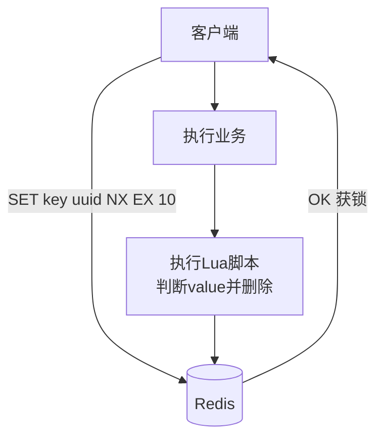
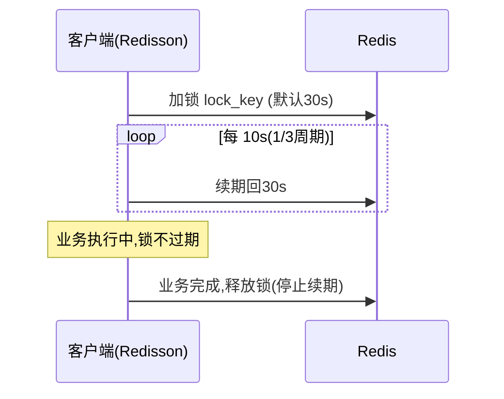
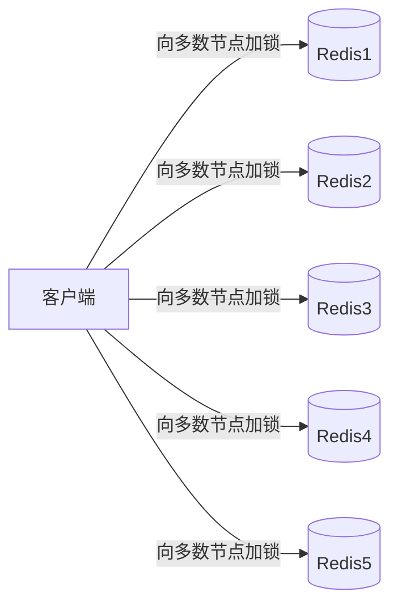

---
tags:
  - basic-knowledge
  - kb/database/redis
  - kb/database/redis/distributed-lock
  - distributed-lock
  - redlock
  - redisson
---

# Redis 分布式锁

> **高频面试题**：「用 Redis 怎么实现分布式锁？有什么问题？」涉及并发、网络分区、锁过期等核心难点，是中高级后端必考。

## 相关笔记

- [缓存与数据库一致性](缓存与数据库一致性.md)：分布式锁也用于保证缓存一致性
- [Redis的底层原理](Redis的底层原理.md)：单线程模型保证命令原子性
- [Redis集群](Redis集群.md)：集群下的锁问题引出 Redlock

---

## 一、为什么需要分布式锁

单机锁（如 Python `threading.Lock`）只在单进程内有效。**多机器/多进程**环境下，要互斥访问共享资源（库存扣减、防重复提交、定时任务防并发），就需要分布式锁。

分布式锁的必备条件：

1. **互斥性**：任意时刻只有一个客户端持有锁
2. **避免死锁**：持有锁的客户端崩溃，锁最终要能释放（超时过期）
3. **解铃还须系铃人**：只能由加锁的客户端解锁（不能误删别人的锁）

---

## 二、实现演进

### 1. SETNX（最初级，有问题）

```bash
SETNX lock_key 1   # 成功返回1(获锁)，失败返回0
# 业务...
DEL lock_key
```

**问题**：若业务代码崩溃，`DEL` 不执行 → **死锁**。

### 2. SETNX + EXPIRE（仍不原子）

```bash
SETNX lock_key 1
EXPIRE lock_key 10  # 10秒过期
```

**问题**：两条命令**非原子**。若 SETNX 成功后、EXPIRE 前崩溃 → 仍死锁。

### 3. SET NX EX（原子，基本可用）⭐

```bash
SET lock_key <unique_value> NX EX 10
```

`NX`（not exists）+ `EX`（expire）原子执行。`unique_value` 用客户端唯一标识（如 UUID），用于安全解锁。

**解锁必须用 Lua 脚本**（保证「判断 + 删除」原子）：

```lua
-- 只有 value 匹配才删除，避免误删别人的锁
if redis.call("get", KEYS[1]) == ARGV[1] then
    return redis.call("del", KEYS[1])
else
    return 0
end
```



**仍存在的问题**：

| 问题                   | 说明                                                |
| ---------------------- | --------------------------------------------------- |
| **锁过期但业务未完成** | 业务执行超过 10s，锁自动释放，别的客户端获锁 → 并发 |
| **不可重入**           | 同一客户端不能多次加锁                              |
| **集群 failover 丢锁** | 主节点宕机，从节点尚未同步锁 → 新主上锁丢失         |

---

## 三、Redisson 看门狗（解决锁过期）

**Redisson**（Java/Python 都有客户端）是生产级 Redis 锁方案，核心机制：

### 看门狗（Watchdog）自动续期



- 获锁后启动后台线程，**每隔 1/3 锁周期（默认 10s）续期到 30s**。
- 客户端崩溃 → 续期停止 → 锁自然过期。**既不死锁，也不会因业务慢而过期**。
- 支持**可重入**：用 Hash 结构记录「客户端 + 重入次数」。

---

## 四、Redlock 算法（解决集群 failover）

单点 Redis 主从切换会丢锁。**Redlock**（作者 Antirez 提出）在**多个独立 Redis 节点**上加锁：



**步骤**：

1. 向 N（通常 5）个**独立** Redis 节点依次 `SET lock NX EX` 加锁
2. 若**超过半数（≥3）**节点加锁成功，且总耗时 < 锁过期时间 → **加锁成功**
3. 否则向所有节点释放锁

> **争议**：Martin Kleppmann 指出 Redlock 在时钟漂移、GC pause 下仍不严格安全。**对正确性要求极高（如金融）应基于 ZooKeeper/etcd（ZAB/Raft）**；对一般业务，单点 Redis + Redisson 已够。

---

## 五、方案选型

| 场景                           | 方案                                 |
| ------------------------------ | ------------------------------------ |
| 一般业务（容忍极小概率不一致） | 单 Redis + Redisson（看门狗+可重入） |
| 多 Redis 集群、无强一致要求    | Redlock                              |
| 强一致（金融、库存核心）       | ZooKeeper / etcd 临时顺序节点        |

---

## 六、面试速答

> **Q：Redis 怎么实现分布式锁？**
> A：基础是 `SET key value NX EX` 原子加锁，解锁用 Lua 脚本判断 value 后删除（防误删）。生产用 **Redisson**：看门狗自动续期（解决业务超时锁过期）、Hash 结构支持可重入。集群 failover 会丢锁，多节点用 **Redlock**，但严格强一致应选 ZooKeeper/etcd。
>
> **Q：锁过期业务没执行完怎么办？**
> A：看门狗定时续期；或业务侧自己埋检查点。

---

## 参考

- [Redis 官方文档 · Distributed Locks](https://redis.io/docs/manual/patterns/distributed-locks/)
- [Redlock 算法说明（Antirez）](https://redis.io/docs/manual/patterns/distributed-locks/)
- [Martin Kleppmann · How to do distributed locking](https://martin.kleppmann.com/2016/02/08/how-to-do-distributed-locking.html)
- [Redisson 官方文档](https://github.com/redisson/redisson/wiki)
