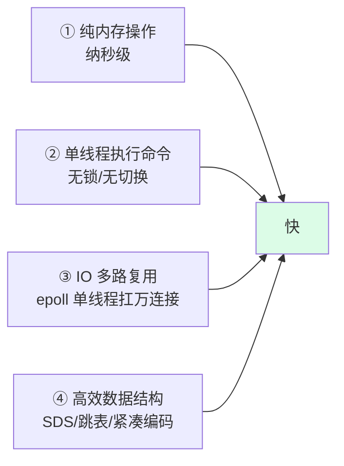
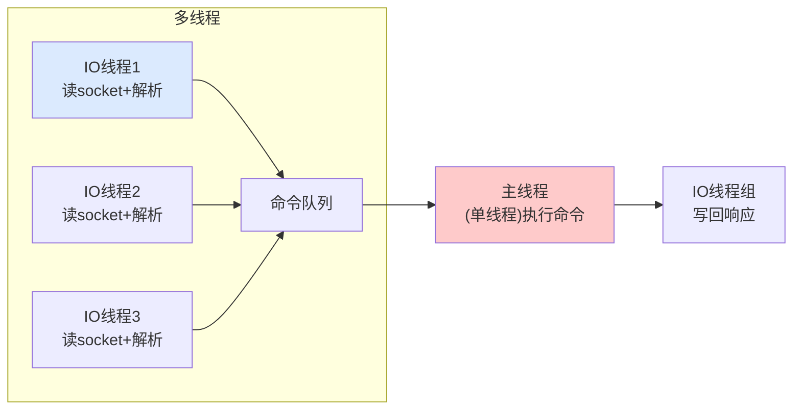
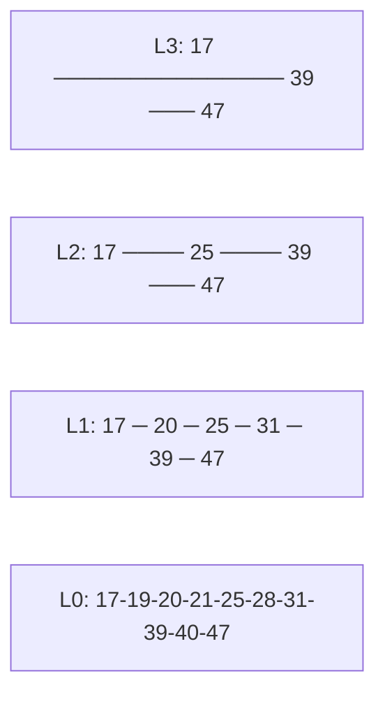

---
tags:
  - basic-knowledge
  - kb/database/redis
  - kb/database/redis/internals
  - single-thread
  - multi-thread-io
  - event-driven
  - listpack
---

# Redis 底层原理

> 为什么 Redis 这么快？单线程为何能扛高并发？注意：**Redis 6.0 已引入多线程 IO**、**7.0 用 listpack 替代了 ziplist**，老资料「纯单线程」的说法已过时。

## 相关笔记

- [持久化RDB，AOF](持久化RDB，AOF.md)：RDB/AOF/混合持久化
- [SDS](SDS.md)：Redis 字符串底层
- [Redis集群](Redis集群.md)：主从/哨兵/Cluster
- [缓存雪崩](缓存雪崩.md)·[缓存击穿](缓存击穿.md)·[缓存穿透](缓存穿透.md)

---

## 一、为什么 Redis 这么快（核心问题）



四要素缺一不可。其中「单线程」不是为了快本身，而是**避免锁竞争和上下文切换**，让命令执行无干扰。

---

## 二、单线程模型 + 6.0 多线程 IO（重要修正）

### 命令执行始终单线程

Redis 的**命令执行（command execution）永远是单线程**的——这是核心设计，带来：

- 无锁、无竞态，操作天然原子
- 无线程切换开销
- 实现简单、易维护

### Redis 6.0 多线程 IO ⭐

瓶颈分析：Redis 慢不在 CPU（命令执行），而在**网络 IO**（读写 socket、协议解析/序列化）。6.0 起：



- **网络读写和协议解析可多线程**（`io-threads`）
- **命令执行仍单线程**（保证原子、无锁）
- 默认关闭，需手动开启（`io-threads-do-reads yes`）

> **面试要点**：Redis 不是「纯单线程」。**命令执行单线程**，但 6.0+ 网络层是多线程；此外还有**后台线程**做 bgsave、AOF 重写、异步删除（`UNLINK`/lazyfree）。

### 为什么不全多线程执行命令？

命令执行单线程已经足够快（瓶颈在网络/内存不在 CPU），全多线程会引入锁复杂度，破坏 Redis 简单可靠的设计哲学。

---

## 三、事件驱动 + IO 多路复用

主线程跑一个**事件循环**，用 **epoll/kqueue** 同时监听所有连接的 fd：哪个连接有数据可读就处理哪个，单线程实现「并发」处理成千上万的客户端。本质与 [select、poll、epoll](../计算机原理/select、poll、epoll.md) 一致。

---

## 四、数据结构与编码（7.0 listpack 替代 ziplist）

Redis 的「类型」有多个底层「编码」，会根据数据量自动切换（小数据用紧凑编码省内存，大数据用高效结构）：

| 类型       | 底层编码                                       |
| ---------- | ---------------------------------------------- |
| **String** | [SDS](SDS.md)（int/embstr/raw 三种）           |
| **List**   | quicklist（双向链表，节点是 listpack）         |
| **Hash**   | listpack（小）/ hashtable（大）                |
| **Set**    | intset / hashtable / listpack                  |
| **ZSet**   | listpack（小）/ **skiplist + hashtable**（大） |

> ⭐ **Redis 7.0 用 listpack 全面替代 ziplist**。ziplist 在某些场景会触发**连锁更新**（一个节点扩张导致后续全部重排，最坏 O(n²)），listpack 解决了这个问题。

### 跳表（Skip List）—— ZSet 的核心



- 多级索引链表，查找/插入/删除平均 **O(log n)**
- 比平衡树**实现简单**，且**范围查询友好**（ZRANGE）
- 新节点层数随机生成

---

## 五、事务（重要：Redis 不支持回滚）

```
MULTI        # 开启事务，后续命令入队
SET k1 v1
INCR k2
EXEC         # 顺序执行队列中的命令
```

| 特性               | 说明                                                                               |
| ------------------ | ---------------------------------------------------------------------------------- |
| **顺序执行不中断** | EXEC 后，队列命令**顺序执行，期间不被其他客户端打断**                              |
| **⚠️ 不支持回滚**  | 某命令运行时出错（如对字符串 INCR）**不会回滚**已执行的命令。与 MySQL 事务完全不同 |
| **语法错误**       | 入队时就报错（如命令名拼错），整个事务不执行                                       |
| **WATCH 乐观锁**   | `WATCH key` 后若 key 被修改，`EXEC` 失败（CAS 语义）                               |

> Redis 作者认为：命令出错通常是编程 bug，不应靠运行时回滚兜底；去掉回滚让 Redis 内部更简单。**需要原子性复杂操作用 Lua 脚本**（`EVAL`）。

---

## 六、内存淘汰（maxmemory）

当内存达上限，按策略淘汰：

| 策略                                 | 说明                                   |
| ------------------------------------ | -------------------------------------- |
| `noeviction`                         | 不淘汰，写入报错（默认）               |
| `allkeys-lru` / `volatile-lru`       | 近似 LRU（所有key / 仅设过期的key）    |
| `allkeys-lfu` / `volatile-lfu`       | LFU（4.0+，按访问频率，比 LRU 更准）⭐ |
| `allkeys-random` / `volatile-random` | 随机                                   |

> Redis 的 LRU 是**近似 LRU**（抽样而非全局），LFU（4.0+）用频率计数，对热点数据更友好。

---

## 七、面试速答

> **Q：Redis 为什么快？**
> A：① 纯内存；② 单线程执行命令，无锁无切换；③ IO 多路复用；④ 高效数据结构（SDS/跳表/紧凑编码）。

> **Q：Redis 是单线程吗？**
> A：**命令执行是单线程**，但 6.0+ 网络 IO（读写 socket、协议解析）可多线程；还有后台线程做持久化、异步删除。所以说「Redis 纯单线程」已过时。

> **Q：Redis 7.0 数据结构有什么变化？**
> A：用 **listpack 替代 ziplist**，解决了 ziplist 的连锁更新问题。

> **Q：Redis 事务和 MySQL 事务区别？**
> A：Redis 事务（MULTI/EXEC）只保证**命令顺序执行不中断**，**不支持回滚**；MySQL 事务有 ACID，支持回滚。Redis 需要原子复杂操作用 Lua 脚本。

---

## 参考

- [Redis 官方 · Redis is single threaded](https://redis.io/docs/latest/operate/oss_and_stack/management/optimization/cpu/)
- [Redis 6.0 多线程 IO](https://redis.io/docs/latest/operate/oss_and_stack/management/optimization/cpu/)
- [Redis 数据类型与编码](https://redis.io/docs/latest/develop/data-types/)
- [listpack 与 ziplist](https://github.com/redis/redis/blob/unstable/src/listpack.c)
- 《Redis 设计与实现》黄健宏
