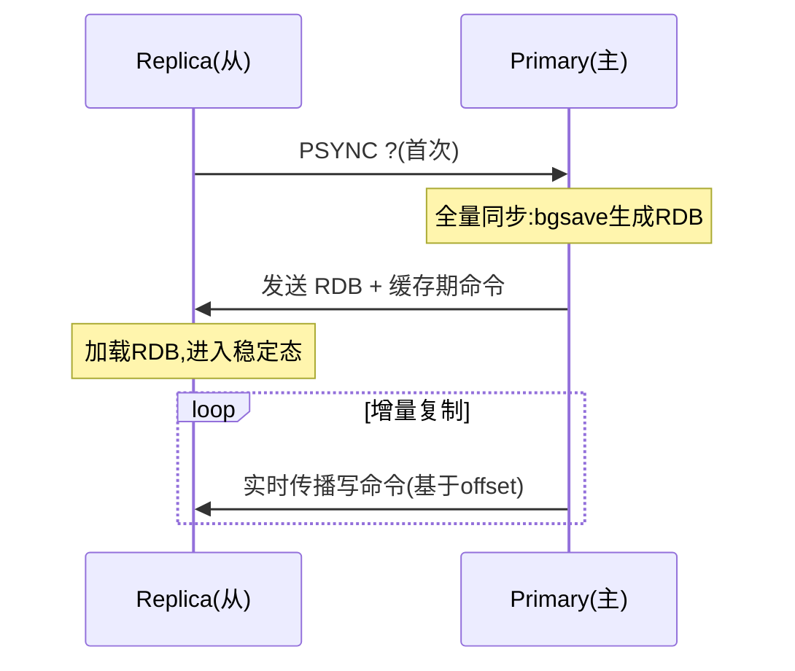
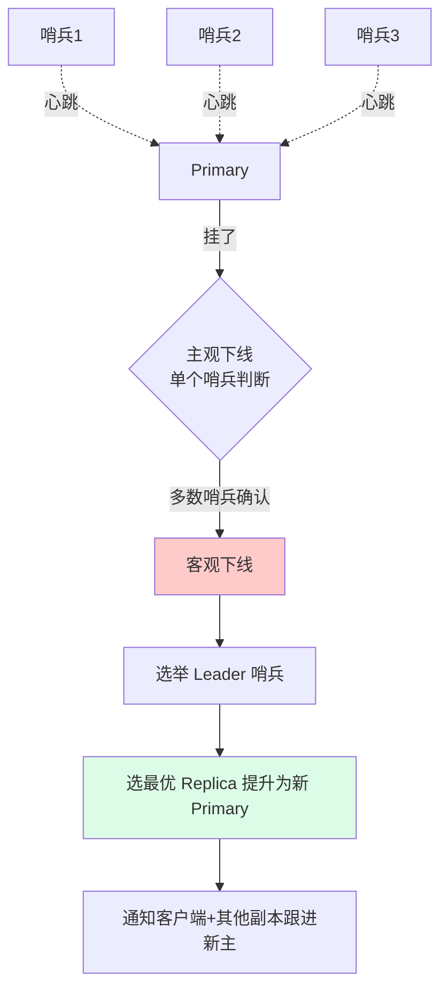
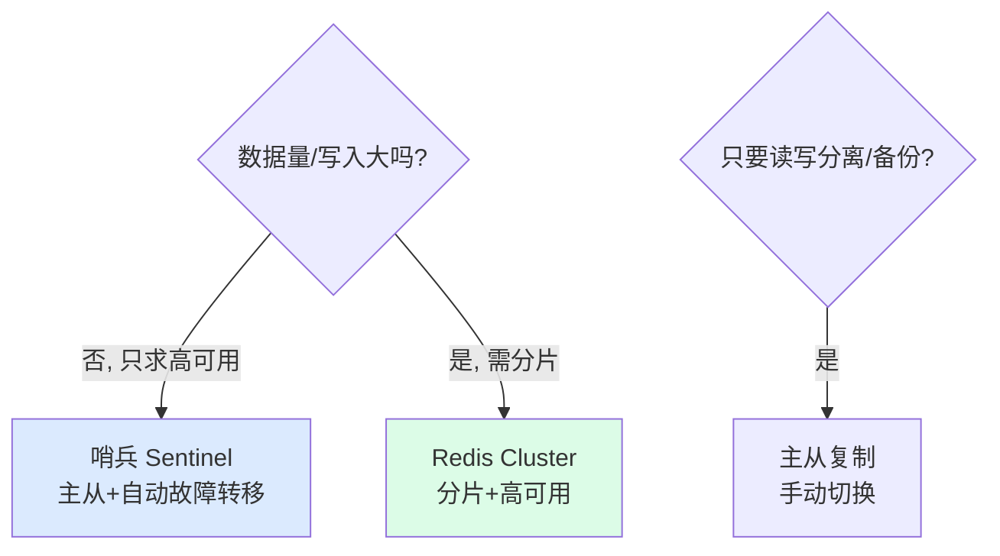

---
tags:
  - basic-knowledge
  - kb/database/redis
  - kb/database/redis/cluster
  - cluster
  - sentinel
  - redis-cluster
  - replication
---

# Redis 集群与高可用

> 主从复制 / 哨兵 / Cluster 三种方案递进。注意：Redis 官方已用 **Primary-Replica**（主-副本）替代旧的 Master-Slave 术语。

## 相关笔记

- [持久化RDB，AOF](持久化RDB，AOF.md)：主从全量同步依赖 RDB
- [Redis的底层原理](Redis的底层原理.md)：fork、后台线程
- [mysql复制](../mysql/mysql复制.md)：对比 MySQL 主从
- [Redis分布式锁](Redis分布式锁.md)：集群下的锁问题

---

## 一、三种方案对比

| 方案              | 数据分片      | 高可用/故障转移        | 适用                       |
| ----------------- | ------------- | ---------------------- | -------------------------- |
| **主从复制**      | ❌ 全量副本   | ❌ 需手动切换          | 读写分离、备份             |
| **哨兵 Sentinel** | ❌ 全量副本   | ✅ 自动故障转移        | 高可用（单主写入）         |
| **Cluster**       | ✅ 哈希槽分片 | ✅ 分片内自动 failover | 大数据量 + 高可用 + 高吞吐 |

> 演进逻辑：主从解决备份/读分流 → 哨兵在主从上加自动故障转移 → Cluster 再加分片解决单主容量/写入瓶颈。

---

## 二、主从复制（Primary-Replica）

一个主节点（Primary）可挂多个副本（Replica），副本异步复制主节点数据。

### 同步流程

- **全量同步**：首次连接/复制积压缓冲区不足时，主节点 `bgsave` 生成 RDB 发给副本，期间新命令缓存于复制缓冲区，发完 RDB 再补发
- **增量同步（PSYNC，2.8+）**：断线重连时，用 `replid` + `offset` 从**复制积压缓冲区**续传，避免昂贵全量同步
- **读写分离**：主写从读，分担读压力。注意**复制是异步的**，从节点有延迟，强一致读要走主

> 命令变化：5.0+ 用 `REPLICAOF host port`（替代旧的 `SLAVEOF`）。

---

## 三、哨兵 Sentinel（高可用）

哨兵是**独立进程**，监控主从集群，主节点宕机时**自动故障转移**。

### 故障转移流程

1. **主观下线（SDOWN）**：单个哨兵发现主节点无响应
2. **客观下线（ODOWN）**：≥ `quorum` 个哨兵都判定下线（防误判）
3. **选举 Leader 哨兵**：哨兵间 Raft 选主
4. **提升新主**：Leader 选优先级最高/offset 最新的副本为新 Primary
5. **通知**：客户端感知新主，其他副本改为复制新主

> **至少部署 3 个哨兵**（奇数，跨节点），避免单点 + 防脑裂。哨兵自身也要高可用。

---

## 四、Redis Cluster（分片 + 高可用）

去中心化集群，**数据分片 + 每分片高可用**一体。

### 哈希槽（Hash Slot）

- 共 **16384 个哈希槽**，分布在所有主节点上
- 定位：`slot = CRC16(key) % 16384` → 槽属于哪个节点
- 客户端可直连任意节点，节点返回数据或**重定向**

> **为什么是 16384 而不是 65536？** 作者澄清：Gossip 消息里每个节点用**bitmap 表示自己负责的槽**，16384 槽 = 2KB bitmap；若 65536 则 8KB，Gossip 消息过大。且集群节点数远小于 16384，够用。

### Gossip 协议

节点间周期性 Gossip 通信，传播集群状态（谁在线、负责哪些槽），最终一致。用于故障检测、槽迁移协调。

### 客户端重定向

| 响应      | 含义                                           |
| --------- | ---------------------------------------------- |
| **MOVED** | 槽已**永久**迁移到新节点，客户端更新本地槽映射 |
| **ASK**   | 槽**临时**迁移中，本次去新节点问（不更新映射） |

### Cluster 的限制

- **跨槽操作受限**：`MGET`/`MULTI`/`Lua` 跨槽会报错
- **Hash Tag**：用 `{tag}` 让相关 key 落同槽（如 `user:{1000}:name`、`user:{1000}:age` 都在 `{user:{1000}}` 对应的槽），从而支持跨 key 操作
- 每个分片**一主多从**，主挂分片内自动 failover（不依赖哨兵）

---

## 五、选型决策

| 场景                           | 方案                   |
| ------------------------------ | ---------------------- |
| 缓存、读多写少、数据量小       | **哨兵**（够用、简单） |
| 数据量大 / 写入高 / 要水平扩展 | **Cluster**            |
| 仅备份/读分流、可接受手动切换  | 主从复制               |

---

## 六、面试速答

> **Q：哨兵和 Cluster 区别？**
> A：哨兵 = 主从 + 自动故障转移，但**不分片**（单主写入瓶颈）；Cluster = **分片（哈希槽）+ 每分片高可用**，去中心化。数据量大选 Cluster，否则哨兵更简单。

> **Q：Cluster 怎么分片？**
> A：16384 个哈希槽分布在主节点上，`CRC16(key) % 16384` 定槽定节点。节点返回 MOVED/ASK 重定向。为什么 16384：Gossip bitmap 2KB，消息小且够用。

> **Q：主从复制是全量还是增量？**
> A：首次/断线过久走**全量**（bgsave RDB + 缓存命令）；短断线重连走**增量**（PSYNC，基于 replid + offset 从复制积压缓冲区续传）。复制是异步的，有延迟。

> **Q：哨兵怎么判断主节点挂了？**
> A：主观下线（单个哨兵心跳失败）→ 客观下线（≥quorum 个哨兵确认）→ 选举 leader 哨兵 → 提升最优副本为新主。

---

## 参考

- [Redis 官方 · Replication](https://redis.io/docs/latest/operate/oss_and_stack/management/replication/)
- [Redis 官方 · Sentinel](https://redis.io/docs/latest/operate/oss_and_stack/management/sentinel/)
- [Redis 官方 · Cluster](https://redis.io/docs/latest/operate/oss_and_stack/management/scaling/)
- [为什么是 16384 个槽（作者回答）](https://github.com/redis/redis/issues/2576)
- 《Redis 设计与实现》黄健宏
