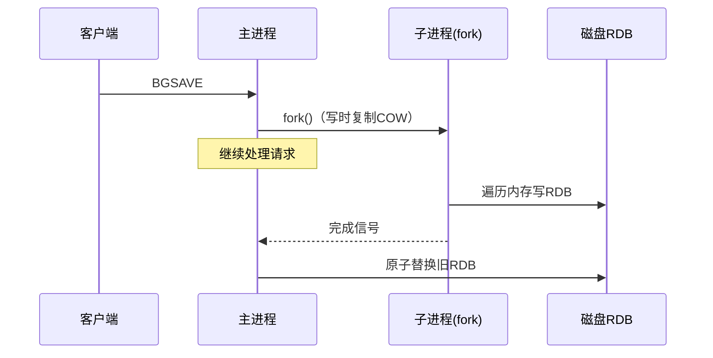
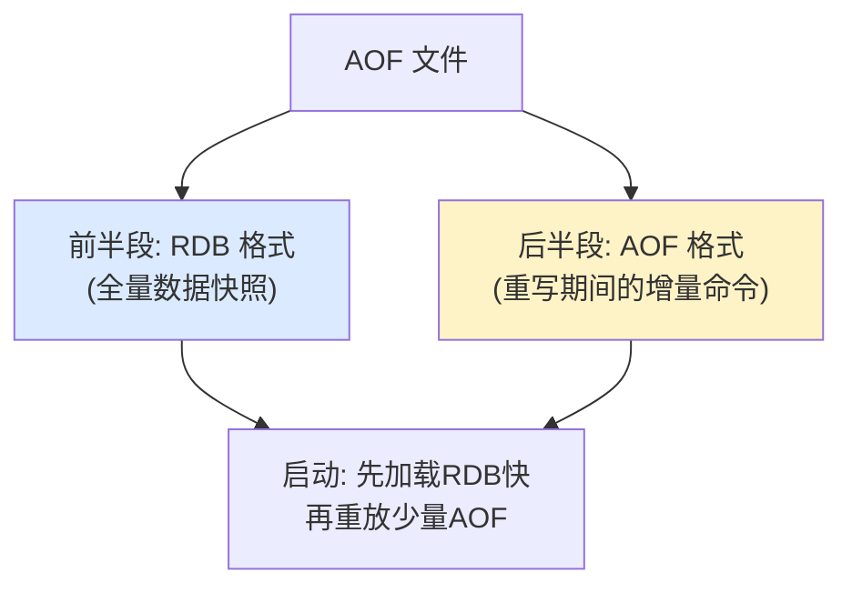

---
tags:
  - basic-knowledge
  - kb/database/redis
  - kb/database/redis/persistence
  - rdb
  - aof
  - hybrid-persistence
---

# Redis 持久化：RDB / AOF / 混合持久化

> Redis 是内存数据库，宕机即丢数据。持久化把数据落盘。注意：**Redis 4.0 起默认推荐「混合持久化」**（RDB + AOF），老资料只讲 RDB/AOF 二选一已过时。

## 相关笔记

- [Redis的底层原理](Redis的底层原理.md)：fork、后台线程
- [Redis集群](Redis集群.md)：主从复制的持久化依赖

---

## 一、三种持久化方式对比

| 方式                | 原理                | 体积             | 恢复速度       | 数据安全                   |
| ------------------- | ------------------- | ---------------- | -------------- | -------------------------- |
| **RDB**             | 周期性全量快照      | 小（二进制压缩） | **快**         | 可能丢最后一次快照后的数据 |
| **AOF**             | 追加每条写命令      | 大               | 慢（重放命令） | 可做到丢 1s 甚至不丢       |
| **混合（4.0+）** ⭐ | RDB 全量 + AOF 增量 | 中               | 快             | 兼顾速度与安全             |

---

## 二、RDB（快照）

### 触发方式

- 配置 `save <秒> <改动数>`：如 `save 3600 1`（3600s 内 ≥1 次改动）
- 手动 `SAVE`（阻塞，禁用）/ `BGSAVE`（后台，推荐）
- 主从复制、`SHUTDOWN`、`FLUSHALL` 时触发

### BGSAVE 原理（fork + COW）

- `fork()` 利用**写时复制（COW）**：子进程共享父进程内存页，父进程修改某页时才复制该页
- 子进程写的是 **fork 那一刻的数据快照**，期间的增量修改不在本次 RDB

### 优缺点

- ✅ 文件紧凑、恢复快、适合备份/灾难恢复
- ❌ 无法实时；宕机会丢最后一次快照后的数据；fork 大内存实例有停顿

---

## 三、AOF（追加日志）

记录每条写命令，重启时重放恢复。

### fsync 策略（`appendfsync`）

| 策略           | 说明                    | 适用                |
| -------------- | ----------------------- | ------------------- |
| `always`       | 每条命令都 fsync        | 最安全，性能差      |
| **`everysec`** | 每秒 fsync 一次（默认） | **兼顾，最多丢 1s** |
| `no`           | 交给 OS                 | 最快，不安全        |

### AOF 重写（解决文件膨胀）

AOF 不断追加会越来越大。**重写**：读取当前内存数据，用**最少的命令**重新生成 AOF（如对同一 key 的多次 SET 合并为最终值）。

- 重写由子进程 `fork` 后台执行，主进程继续服务
- 重写期间的新命令写入 `aof_rewrite_buf`，完成后追加到新文件
- 原子替换旧文件，故障不影响旧 AOF

---

## 四、⭐ 混合持久化（Redis 4.0+，默认推荐）

- 开启：`aof-use-rdb-preamble yes`（4.0 引入，5.0 起默认开启）
- AOF 重写时，**前半段写成 RDB 二进制格式**（全量快照），**后半段是 AOF 增量命令**
- **恢复时先加载 RDB（快），再重放少量 AOF（补增量）**
- 兼得 RDB 的恢复速度 + AOF 的数据安全

> **生产推荐**：开启 AOF + 混合持久化 + `everysec`，既快又安全。

---

## 五、Redis 7.0 AOF 多文件（Multi-Part AOF）

7.0 起 AOF 拆成多个文件，存在独立目录 `appendonlydir/`：

| 文件       | 作用                        |
| ---------- | --------------------------- |
| `manifest` | 清单，记录 base + incr 文件 |
| `base.rdb` | 基础全量（RDB 格式）        |
| `incr.aof` | 增量命令（可多个）          |

好处：重写不再需要「合并旧文件」，只需新建 base + 清空 incr，更高效可靠。

---

## 六、同时开启 RDB + AOF

可以同时开启。Redis 重启时**优先用 AOF** 恢复（数据更全）。但生产一般**开 AOF（混合）即可**，RDB 作为定期冷备。

---

## 七、选型建议

| 场景                   | 建议                               |
| ---------------------- | ---------------------------------- |
| 纯缓存，丢点数据无所谓 | 只 RDB，或都不开                   |
| 数据重要，要尽量不丢   | **AOF + 混合持久化 + everysec** ⭐ |
| 备份/灾难恢复          | RDB 定期快照（便于传输）           |

---

## 八、面试速答

> **Q：RDB 和 AOF 区别？怎么选？**
> A：RDB 是全量快照（小、恢复快，但可能丢数据）；AOF 追加命令（大、恢复慢，但数据全）。生产推荐 **AOF + 混合持久化 + everysec**，兼顾速度与安全。

> **Q：什么是混合持久化？**
> A：Redis 4.0 引入（5.0 默认）。AOF 重写时前半段写 RDB 全量快照、后半段写 AOF 增量。恢复时先加载 RDB 再重放少量 AOF，既快又安全。

> **Q：AOF 文件越来越大怎么办？**
> A：AOF 重写——fork 子进程读取当前内存数据，用最少的命令重新生成 AOF（合并对同一 key 的多次操作），完成后原子替换。

> **Q：BGSAVE 为什么不影响主进程？**
> A：fork 子进程 + 写时复制（COW）。子进程写 fork 时刻的快照，父进程继续服务；只有父进程修改某内存页时才复制该页。

---

## 参考

- [Redis 官方 · Persistence](https://redis.io/docs/latest/operate/oss_and_stack/management/persistence/)
- [Redis 混合持久化](https://redis.io/docs/latest/operate/oss_and_stack/management/persistence/)
- 《Redis 设计与实现》黄健宏
- [Redis 7.0 Multi-Part AOF](https://github.com/redis/redis/blob/7.0/00-RELEASENOTES)
