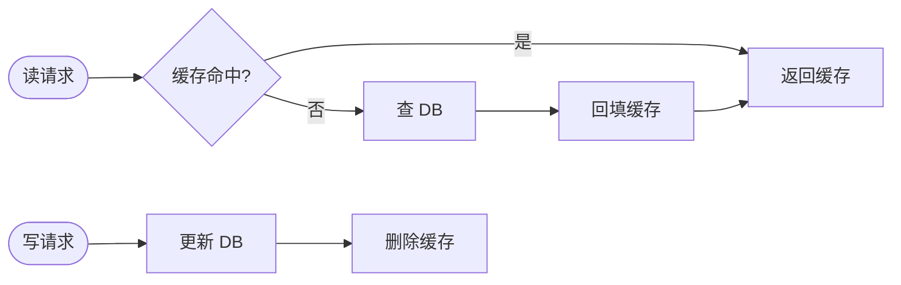
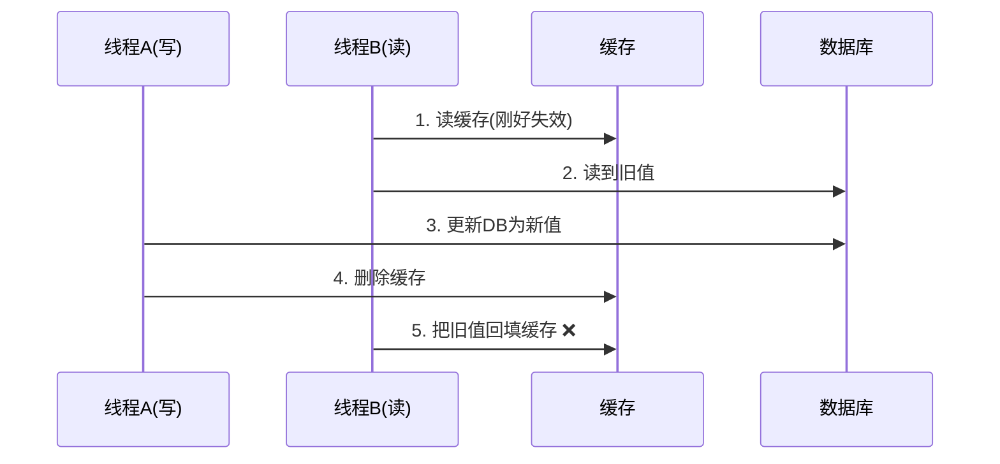
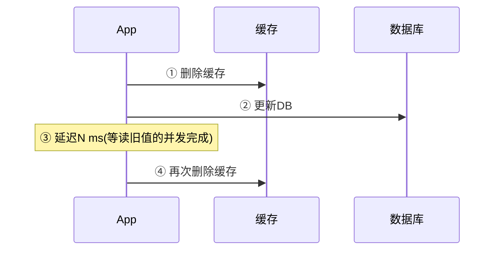
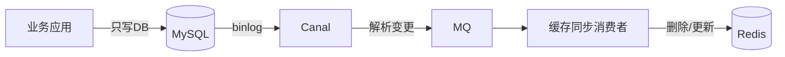

---
tags:
  - basic-knowledge
  - kb/database/redis
  - kb/database/redis/cache-pattern
  - cache-consistency
  - cache-aside
---

# 缓存与数据库一致性

> **高频面试题**：「缓存和数据库怎么保证一致？」几乎所有用 Redis 的项目都会被问。核心是：先更新 DB 还是先更新缓存？缓存删除还是更新？

## 相关笔记

- [缓存雪崩](缓存雪崩.md)、[缓存击穿](缓存击穿.md)、[缓存穿透](缓存穿透.md)：缓存三大经典问题
- [持久化RDB，AOF](持久化RDB，AOF.md)：缓存失效时的兜底
- [mysql日志](../mysql/mysql日志.md)：binlog 是保证一致性的关键

---

## 一、四种缓存读写策略

### 1. Cache Aside（旁路缓存）⭐ 最常用

应用层同时管理 DB 和缓存：**读先查缓存，miss 则查 DB 并回填；写先更新 DB，再删除缓存**。

**为什么是「删除」缓存而不是「更新」缓存？**

1. **避免并发写导致数据不一致**：两个写请求并发更新缓存，可能产生脏数据；删除是幂等的。
2. **节省资源**：有些缓存值计算昂贵（如聚合结果），频繁更新浪费；删除后按需回填（lazy）。
3. **避免脏缓存残留**：更新缓存若失败，缓存里是旧值；删除失败可重试，且下次读会回填最新值。

### 2. Read/Write Through（读/写穿透）

应用只操作缓存，**缓存组件同步**负责与 DB 的读写。对应用屏蔽 DB，实现简单但缓存组件复杂（需支持）。

### 3. Write Behind / Write Back（异步回写）

只写缓存即返回，**异步批量**刷盘到 DB。写性能极高，但一致性最弱、可能丢数据（缓存宕机）。

| 策略               | 一致性 | 性能 | 适用             |
| ------------------ | ------ | ---- | ---------------- |
| Cache Aside        | 较高   | 高   | 通用，**首选**   |
| Read/Write Through | 高     | 中   | 缓存组件支持     |
| Write Behind       | 低     | 最高 | 容忍丢数据的场景 |

---

## 二、Cache Aside 仍有的不一致问题

即使「先更 DB 再删缓存」，并发下仍可能不一致：

### 场景：写后读并发

> 这种情况发生概率极低：要求「读旧值」发生在「写DB+删缓存」之间，且读操作比写慢（读DB通常比写快）。工程上常被容忍。

### 场景：删缓存失败

写 DB 成功但删缓存失败 → 缓存一直是旧值，直到过期。**必须重试删除**。

---

## 三、保证强一致的方案

按一致性要求从低到高：

### 方案 1：缓存过期 + 延迟双删（最终一致）

- 第二次删除兜底并发读旧值回填的问题。
- 延迟时间 N 需大于一次读耗时（几百 ms）。
- 第二次删失败仍要重试（消息队列）。

### 方案 2：消息队列重试删除（可靠删除）

把「删除缓存」丢到 MQ，消费失败自动重试，保证最终删成功。

### 方案 3：订阅 binlog 异步同步（强可靠，推荐生产）

用 Canal 等工具**订阅 MySQL binlog**，DB 变更后由独立服务删除/更新缓存：

- 业务代码无侵入，解耦。
- 严格保证「DB 变更 → 缓存更新」的顺序。
- 缺点：架构复杂，有延迟。

### 方案 4：分布式锁 / 串行化（强一致，性能差）

读写同一 key 时加分布式锁，串行化。一致性最强，但牺牲并发性能，**一般不推荐**。

---

## 四、面试速答

> **Q：缓存和数据库如何保证一致性？**
> A：默认用 **Cache Aside**（先更 DB 再删缓存，删除而非更新）。对一致性要求高时，**订阅 binlog 异步更新缓存**（Canal+MQ），既解耦又可靠；或用**延迟双删 + MQ 重试**。强一致场景才考虑加分布式锁串行化，但牺牲性能。

---

## 参考

- [Cache Aside Pattern - Microsoft Azure](https://learn.microsoft.com/zh-cn/azure/architecture/best-practices/caching)
- [阿里开源 Canal](https://github.com/alibaba/canal)
- 《Redis 设计与实现》
- [Facebook 论文 · Scaling Memcache](https://www.usenix.org/system/files/conference/nsdi13/nsdi13-final170_update.pdf)
