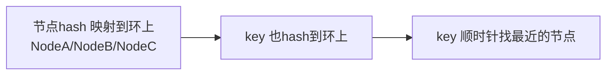
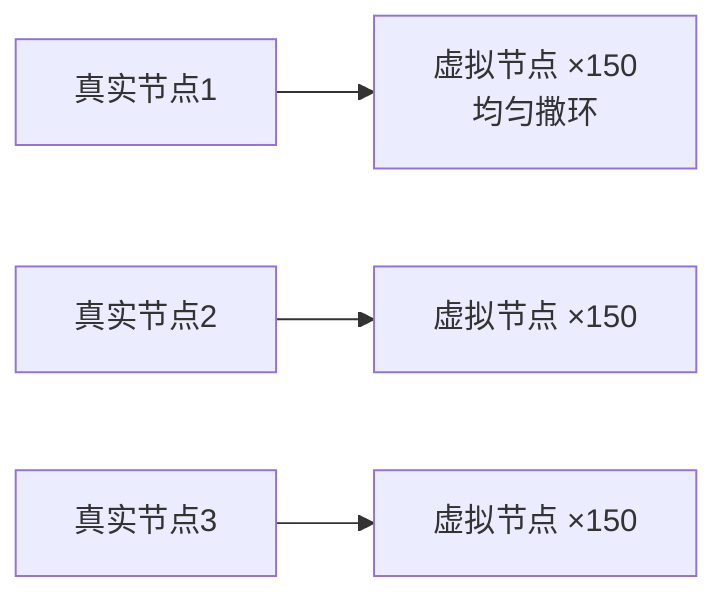

---
tags:
  - basic-knowledge
  - kb/distributed
  - kb/distributed/consistent-hashing
  - consistent-hashing
  - virtual-node
---

# 一致性哈希

> 分布式存储/缓存的**基础算法**。解决「节点增删时大量数据迁移」问题。Redis Cluster、分库分表、负载均衡都用到。面试高频。

## 相关笔记

- [负载均衡](负载均衡.md)：哈希负载均衡的升级
- [Redis集群](../redis/Redis集群.md)：Redis Cluster 的槽分配思想
- [分库分表与读写分离](分库分表与读写分离.md)：分片路由

---

## 一、普通哈希的问题

最简单的分片：`节点 = hash(key) % N`（N 为节点数）。

**致命问题**：节点增减（N 变化）时，**几乎所有 key 都要重新迁移**。例如 N=3→4，约 75% 的 key 要迁移，缓存集体失效（缓存雪崩）。

---

## 二、一致性哈希原理

把整个哈希空间想象成一个**环**（0 ~ 2³²-1）：

1. 把节点（IP/名称）hash 后**映射到环上**
2. 数据 key 也 hash 到环上，**顺时针方向**找到的第一个节点即归属

### 增删节点只影响相邻段

- **新增节点 D**：只把 D 到上一个节点之间的 key 迁移给 D（只迁移一小段）
- **删除节点 B**：只把 B 的 key 迁移给顺时针下一个节点

> 完美解决了普通 hash「牵一发动全身」的迁移问题。

---

## 三、数据倾斜 & 虚拟节点

**问题**：节点少时，环上分布不均，某节点负责的弧段太大（数据倾斜）。

**解决：虚拟节点（Virtual Node）**——每个真实节点对应**多个虚拟节点**（如 150 个），均匀撒在环上：

- 虚拟节点越多，分布越均匀
- 同时让**权重**可调（性能强的节点多设虚拟节点）

---

## 四、应用

| 场景              | 说明                                              |
| ----------------- | ------------------------------------------------- |
| **Redis Cluster** | 16384 槽位本质是一致性哈希的简化（用 CRC16 定槽） |
| **Memcached**     | 经典一致性哈希 + 虚拟节点                         |
| **分库分表**      | 数据分片路由                                      |
| **CDN/负载均衡**  | 请求路由到节点                                    |

---

## 五、面试速答

> **Q：什么是一致性哈希？解决什么问题？**
> A：把节点和数据都映射到哈希环上，数据顺时针找最近节点。解决普通 `hash%N` 在节点增减时几乎所有数据都要迁移的问题——一致性哈希只迁移相邻段。

> **Q：数据倾斜怎么办？**
> A：引入**虚拟节点**。每个真实节点映射多个虚拟节点均匀撒在环上，虚拟节点越多分布越均匀，还能通过虚拟节点数实现权重。

> **Q：一致性哈希和 Redis Cluster 的 16384 槽区别？**
> A：一致性哈希是环形 + 顺时针；Redis Cluster 用固定 16384 槽，`CRC16(key)%16384` 定槽再映射到节点，节点变更时迁移整个槽（粒度可控、便于管理），本质思想相通。

---

## 参考

- [一致性哈希论文（Karger）](https://www.akamai.com/site/en/documents/technical-publication/consistent-hashing-and-random-trees-distributed-caching-protocols-for-relieving-hot-spots-on-the-world-wide-web-technical-publication.pdf)
- 《数据密集型应用系统设计》（DDIA）第 6 章（分区）
- [图解一致性哈希](https://www.xiaolincoding.com/os/8_network_system/hash.html)
