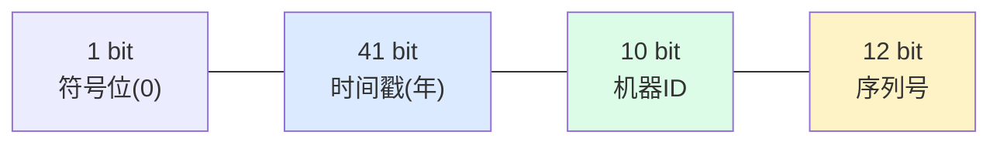

---
tags:
  - basic-knowledge
  - kb/distributed
  - kb/distributed/id-generation
  - distributed-id
  - snowflake
---

# 分布式 ID 生成（雪花算法）

> 分库分表后，自增主键失效，需要**全局唯一 ID**。雪花算法（Snowflake）是主流方案。场景题高频。

## 相关笔记

- [分库分表与读写分离](分库分表与读写分离.md)：分表后主键问题
- [CAP与BASE理论](CAP与BASE理论.md)

---

## 一、为什么需要分布式 ID

- 单库自增主键在**分库分表后失效**（多库各自自增会冲突）
- 业务需要全局唯一标识（订单号、流水号）
- 多机房/微服务需要唯一 ID

### ID 的要求

| 要求         | 说明                               |
| ------------ | ---------------------------------- |
| **全局唯一** | 基本要求                           |
| **趋势递增** | 利于 B+ 树索引写入（避免页分裂）   |
| **高性能**   | 生成快、不成为瓶颈                 |
| **高可用**   | ID 生成服务不能挂                  |
| 信息安全     | 不易被猜测（如不宜直接暴露订单量） |

---

## 二、常见方案对比

| 方案                      | 原理                        | 优缺点                                                    |
| ------------------------- | --------------------------- | --------------------------------------------------------- |
| **UUID**                  | 随机生成                    | ✅ 简单、去中心 ❌ 无序（索引差）、太长(36位)、无业务含义 |
| **数据库自增（步长）**    | 各库不同初始值+步长         | ✅ 简单 ❌ 扩容难、依赖DB                                 |
| **数据库号段**            | 批量取号（如 Leaf-Segment） | ✅ 高性能、趋势递增 ❌ 依赖DB                             |
| **雪花算法 Snowflake** ⭐ | 时间戳+机器ID+序列号        | ✅ 去中心、高性能、有序 ❌ 依赖时钟                       |
| **Redis INCR**            | 原子自增                    | ✅ 简单 ❌ 依赖Redis、持久化风险                          |

---

## 三、雪花算法（Snowflake）⭐

Twitter 提出，64 位 long 型 ID：

| 段          | 位数 | 含义                                  |
| ----------- | ---- | ------------------------------------- |
| 符号位      | 1    | 固定 0（正数）                        |
| **时间戳**  | 41   | 毫秒级，可用约 69 年                  |
| **机器 ID** | 10   | 支持 1024 个节点（可拆数据中心+机器） |
| **序列号**  | 12   | 同毫秒内自增，每毫秒 4096 个          |

> 单机每毫秒可生成 4096 个 ID，**理论单节点 400万+/秒**，且天然趋势递增。

### 核心问题：时钟回拨

机器时钟同步出错（回调到过去），会生成**重复或错乱 ID**。解决：

- 拒绝生成，等待时钟追平
- 拨回小范围用历史序列号兜底
- 百度 UidGenerator、美团 Leaf 各有优化

---

## 四、开源方案

| 方案                  | 特点                                      |
| --------------------- | ----------------------------------------- |
| **美团 Leaf**         | 号段模式 + Snowflake 双模式，解决时钟回拨 |
| **百度 UidGenerator** | Snowflake 改进，支持秒级、更大序列号      |
| **TiDB AutoRandom**   | 数据库层全局 ID                           |

---

## 五、面试速答

> **Q：分库分表后主键怎么生成？**
> A：单库自增失效，用分布式 ID。主流是**雪花算法**（时间戳+机器ID+序列号，64位），高性能、去中心、趋势递增。也可用数据库号段（如 Leaf-Segment）。

> **Q：雪花算法的时钟回拨问题？**
> A：机器时钟回拨会生成重复/错乱 ID。解决：回拨小时用历史序列号兜底，大时拒绝生成等待追平；美团 Leaf、百度 UidGenerator 有成熟方案。

> **Q：UUID 为什么不适合做主键？**
> A：① 无序，B+ 树插入频繁页分裂，写性能差；② 36 字符太长，索引/存储开销大；③ 无业务含义。适合做去重标识，不适合做数据库主键。

---

## 参考

- [Twitter Snowflake](https://github.com/twitter-archive/snowflake)
- [美团 Leaf](https://tech.meituan.com/2017/04/21/mt-leaf.html)
- [百度 UidGenerator](https://github.com/baidu/uid-generator)
