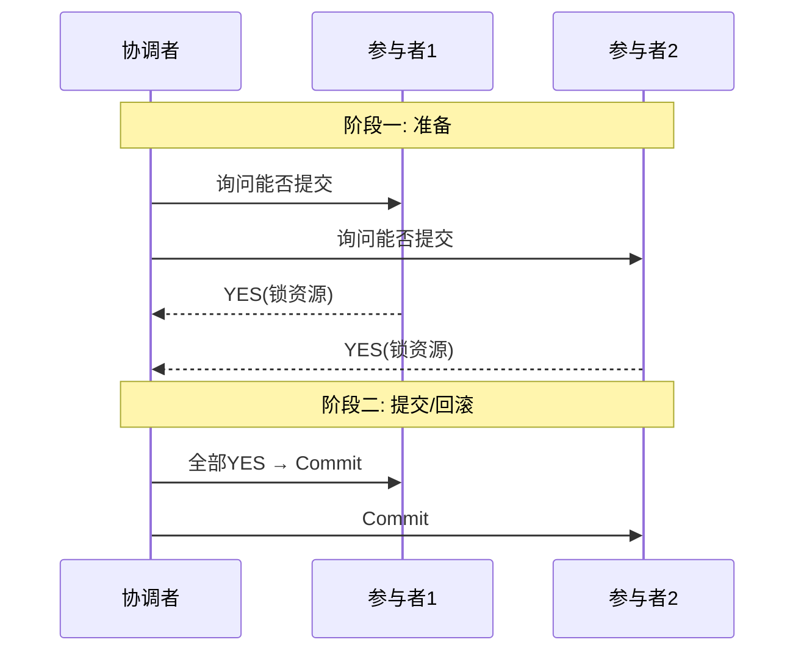
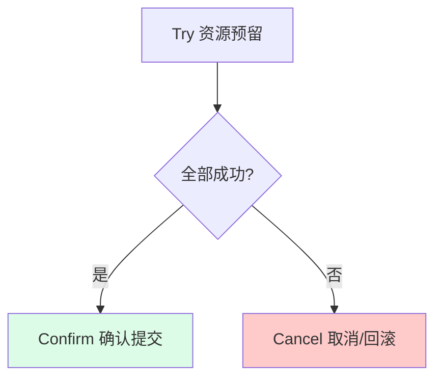
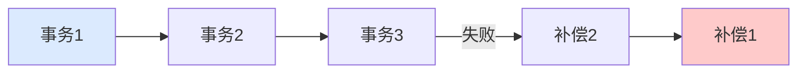

---
tags:
  - basic-knowledge
  - kb/distributed
  - kb/distributed/transaction
  - distributed-transaction
  - 2pc
  - tcc
  - saga
---

# 分布式事务

> 微服务/分库分表后，跨库/跨服务的事务怎么保证一致？这是分布式系统的核心难题。**强一致（2PC）性能差，柔性事务（TCC/Saga/消息）追求最终一致**是主流。

## 相关笔记

- [事务](../mysql/事务.md)：本地事务 ACID
- [CAP与BASE理论](CAP与BASE理论.md)：分布式事务的理论基础
- [消息队列核心问题](消息队列核心问题.md)：消息事务
- [分库分表与读写分离](分库分表与读写分离.md)：跨库事务的来源

---

## 一、为什么需要分布式事务

单体应用用本地事务即可。一旦**数据分散到多个库/服务**（微服务、分库分表），一个业务操作要跨多个数据源，本地事务管不了，就需要分布式事务。

例：下单 = 扣库存（库存服务）+ 创建订单（订单服务）+ 扣余额（账户服务），三者要么全成功要么全回滚。

---

## 二、理论基础：从强一致到最终一致

结合 [CAP理论](CAP与BASE理论.md)：分布式系统网络分区不可避免，**强一致（CP）性能差**，互联网大规模系统多用 **BASE（最终一致）**。分布式事务因此分两类：

| 类型                     | 代表                            | 一致性 | 性能       |
| ------------------------ | ------------------------------- | ------ | ---------- |
| **强一致（刚性事务）**   | 2PC、3PC、XA                    | 强     | 差（阻塞） |
| **最终一致（柔性事务）** | TCC、Saga、本地消息表、事务消息 | 最终   | 好         |

---

## 三、2PC / 3PC（强一致）

### 两阶段提交 2PC

**2PC 的问题**：

| 问题           | 说明                                    |
| -------------- | --------------------------------------- |
| **同步阻塞**   | 参与者锁资源等待，期间阻塞              |
| **单点故障**   | 协调者挂了，参与者一直阻塞              |
| **数据不一致** | 阶段二部分参与者收到 commit、部分没收到 |
| **太保守**     | 任一节点失败整个事务回滚                |

> 3PC 在 2PC 基础上加超时和 CanCommit 阶段，缓解阻塞，但仍有不一致风险，实际少用。XA 是 2PC 的数据库实现（如 MySQL XA），性能差，互联网少用。

---

## 四、TCC（Try-Confirm-Cancel）

业务层面的两阶段补偿，**最终一致**：

| 阶段        | 动作                        |
| ----------- | --------------------------- |
| **Try**     | 资源预留/检查（如冻结余额） |
| **Confirm** | 确认提交（扣减冻结余额）    |
| **Cancel**  | 出错时取消（解冻）          |

- ✅ 性能好（不长期锁资源）、最终一致
- ❌ **侵入业务**（每个操作要写 Try/Confirm/Cancel 三套），开发量大
- ❌ 需保证 Confirm/Cancel **幂等**

---

## 五、Saga（长事务，补偿序列）

把长事务拆成一串**本地事务**，每步配一个**补偿操作**，失败时反向执行补偿：

- 适合**长流程**业务（如旅行预订：订机票→订酒店→租车）
- 没有隔离性（中间状态可见），需业务处理脏读
- 有 Choreography（事件驱动）和 Orchestration（中央协调）两种实现

---

## 六、本地消息表（最终一致，最实用）

- 业务执行 + 写消息表放**同一个本地事务**，保证一致
- 后台定时扫描未完成消息，重试发送到 MQ
- 下游消费，需**幂等**
- 实现简单，最终一致，**生产最常用**

---

## 七、事务消息（RocketMQ）

利用 RocketMQ 的**半消息**机制：

1. 发送**半消息**（对消费者不可见）→ 执行本地事务
2. 本地事务成功 → commit（消息可见）；失败 → rollback
3. 超时未确认 → Broker **反查**发送方事务状态

> 等价于把「本地消息表」内置到 MQ 里，无需自己建消息表。

### 最大努力通知

柔性事务的一种思想：尽力通知，不保证一定成功，适合**对时效不敏感**的场景（如短信通知），失败多次后人工处理或放弃。

---

## 八、方案对比与选型

| 方案              | 一致性 | 性能 | 复杂度        | 适用               |
| ----------------- | ------ | ---- | ------------- | ------------------ |
| 2PC/XA            | 强     | 差   | 中            | 传统、强一致要求高 |
| TCC               | 最终   | 好   | 高（3套接口） | 金融核心           |
| Saga              | 最终   | 好   | 中            | 长流程业务         |
| **本地消息表** ⭐ | 最终   | 好   | **低**        | 互联网通用         |
| 事务消息          | 最终   | 好   | 低            | 用 RocketMQ 的场景 |

> **选型原则**：先看能否用「本地消息表/事务消息」做最终一致（最简单）；强一致要求才考虑 TCC；长流程用 Saga；2PC/XA 尽量不用。

### Seata

阿里开源分布式事务框架，支持 **AT（自动补偿，最常用）**、TCC、Saga、XA 四种模式，屏蔽底层细节。

---

## 九、面试速答

> **Q：分布式事务有哪些方案？**
> A：强一致有 2PC/XA（性能差）；最终一致有 TCC、Saga、本地消息表、事务消息（RocketMQ）。互联网多用最终一致方案，**本地消息表/事务消息**最简单常用。

> **Q：2PC 有什么问题？**
> A：同步阻塞、协调者单点故障、阶段二可能数据不一致、容错差。所以互联网少用，改用柔性事务。

> **Q：TCC 和 Saga 区别？**
> A：TCC 是 Try-Confirm-Cancel 三阶段补偿，侵入大、适合短事务；Saga 是拆成一串本地事务 + 补偿序列，适合长流程，但无隔离性。

> **Q：本地消息表怎么保证最终一致？**
> A：业务和写消息表放同一本地事务保证一致；后台定时扫描未完成消息重试发 MQ；下游幂等消费。简单可靠，最常用。

---

## 参考

- 《数据密集型应用系统设计》（DDIA）第 7 章（事务）、第 9 章（一致性与共识）
- [Seata 官方](https://seata.io/zh-cn/docs/overview/what-is-seata)
- [RocketMQ 事务消息](https://rocketmq.apache.org/zh/docs/featureBehavior/04transactionmessage)
- [Saga 模式](https://microservices.io/patterns/data/saga.html)
