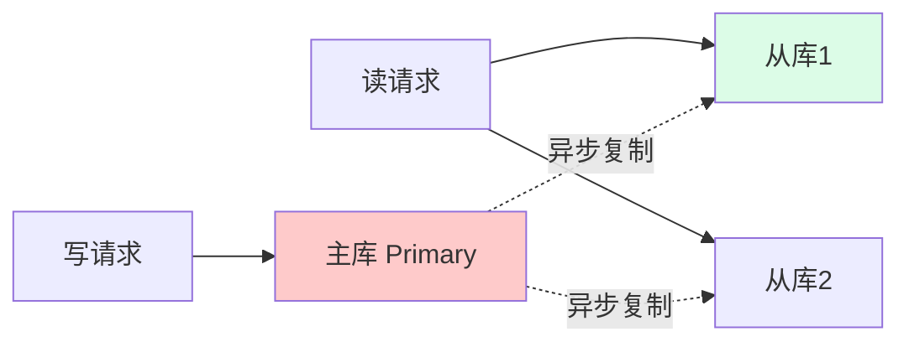
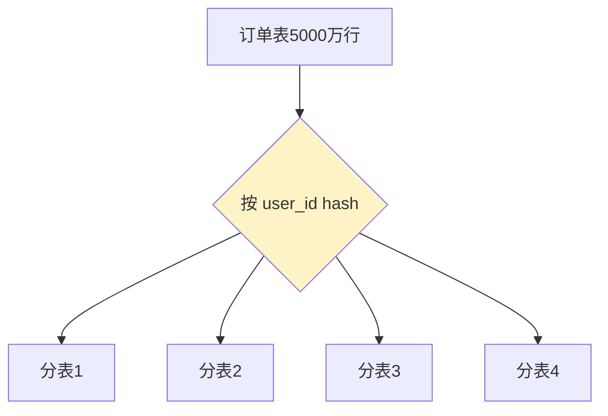

---
tags:
  - basic-knowledge
  - kb/distributed
  - kb/distributed/sharding
  - sharding
  - read-write-split
  - mysql
---

# 分库分表与读写分离

> 单库扛不住时怎么扩展？**读写分离 + 分库分表**是数据库扩展的核心方案。数据库中高级面试高频。

## 相关笔记

- [MySQL索引原理与优化](../mysql/MySQL索引原理与优化.md)
- [mysql复制](../mysql/mysql复制.md)：读写分离的基础
- [分布式ID生成](分布式ID生成.md)：分表后主键方案
- [一致性哈希](一致性哈希.md)：分片路由

---

## 一、什么时候要分库分表

| 瓶颈信号                  | 说明                 |
| ------------------------- | -------------------- |
| 单表数据量过大（千万级+） | 查询变慢、索引维护贵 |
| 单库 QPS/CPU 打满         | 写入/连接数到上限    |
| 单机磁盘/内存不足         | 数据量超单机容量     |

> 经验：单表 MySQL 建议 **500万~1000万行** 或 **10G** 以内优化，超过考虑分表。

---

## 二、读写分离

- 主库负责写，从库负责读（读写比例通常读多）
- 依赖[主从复制](../mysql/mysql复制.md)
- **注意主从延迟**：写后立即读可能读从库拿不到 → 强一致读走主库

---

## 三、分库分表（垂直 vs 水平）

### 垂直拆分

| 类型         | 拆分维度       | 例子                            |
| ------------ | -------------- | ------------------------------- |
| **垂直分库** | 按业务拆库     | 用户库、订单库、商品库分开      |
| **垂直分表** | 按字段冷热拆表 | user_base（热）+ user_ext（冷） |

### 水平拆分（Sharding）⭐ 核心

把同一张表的数据**按规则分散到多个表/库**：

| 分片策略       | 说明            | 例子                                                |
| -------------- | --------------- | --------------------------------------------------- |
| **按范围**     | id 0-1000万一张 | 易扩容，但易热点                                    |
| **按哈希**     | `hash(id) % N`  | 均匀，但扩容难迁移（见[一致性哈希](一致性哈希.md)） |
| **按业务路由** | 按用户ID/地区   | 利于查询，需精心设计                                |

---

## 四、分库分表带来的问题（面试重点）

| 问题          | 解决                                               |
| ------------- | -------------------------------------------------- |
| **跨库 JOIN** | 避免跨库 join；或应用层组装、冗余字段、绑定关系    |
| **跨库事务**  | [分布式事务](分布式事务.md)：XA / TCC / 本地消息表 |
| **分布式 ID** | [雪花算法](分布式ID生成.md)                        |
| **分页/聚合** | 跨库分页难，需各库取回再合并（或用 ES 宽表）       |
| **路由**      | 分片键决定数据去向，非分片键查询要扫所有库         |
| **扩容迁移**  | 一致性哈希 / 预分片（如 1024 表一开始就分好）      |

> **关键原则**：尽量让查询带**分片键**，避免广播查询。

---

## 五、中间件

| 中间件                                      | 类型                 |
| ------------------------------------------- | -------------------- |
| **ShardingSphere**（Sharding-JDBC / Proxy） | Apache 顶级，主流 ⭐ |
| **MyCat**                                   | 早期 Proxy 模式      |
| **Vitess**                                  | YouTube 开源，云原生 |

---

## 六、选型建议

- 先**优化 SQL + 索引 + 缓存**（见 [MySQL性能优化](../mysql/MySQL性能优化.md)）
- 再**读写分离**（成本低）
- 最后才**分库分表**（侵入大，引入复杂度）
- 或上 **TiDB/CockroachDB**（原生分布式数据库，免分库分表）

> 分库分表是「最后手段」，能不分尽量不分，复杂度很高。

---

## 七、面试速答

> **Q：分库分表和读写分离区别？**
> A：读写分离是主写从读（解决读压力、高可用）；分库分表是把数据拆散到多库多表（解决单库容量和写入瓶颈）。

> **Q：分库分表有哪些分片策略？**
> A：垂直（按业务/字段）和水平（按范围/哈希/业务路由）。水平哈希分片常用，但扩容难，用一致性哈希或预分片缓解。

> **Q：分库分表后有哪些问题？**
> A：跨库 JOIN、跨库事务（用分布式事务）、分布式 ID（雪花算法）、分页聚合难、路由需带分片键、扩容迁移。

> **Q：什么时候该分库分表？**
> A：单表千万级+ 或单库到瓶颈时。但先尝试优化 SQL/索引/缓存/读写分离，分库分表是最后手段，或直接用 TiDB 等原生分布式库。

---

## 参考

- [ShardingSphere 官方](https://shardingsphere.apache.org/)
- 《数据密集型应用系统设计》（DDIA）第 6 章（分区）、第 7 章（事务）
- [美团 分库分表实践](https://tech.meituan.com/)
