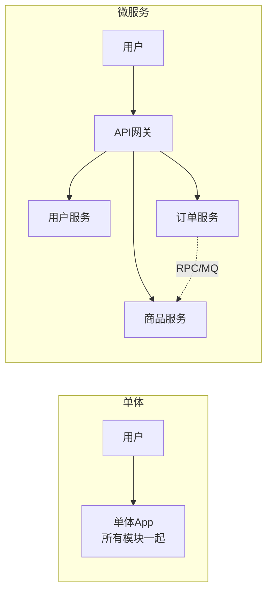
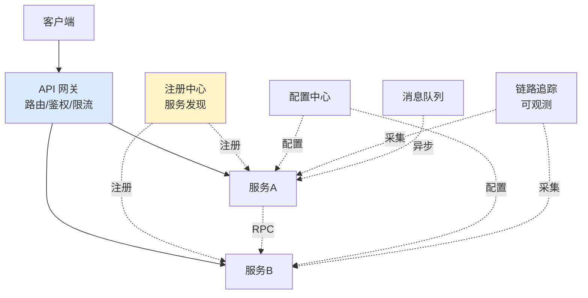
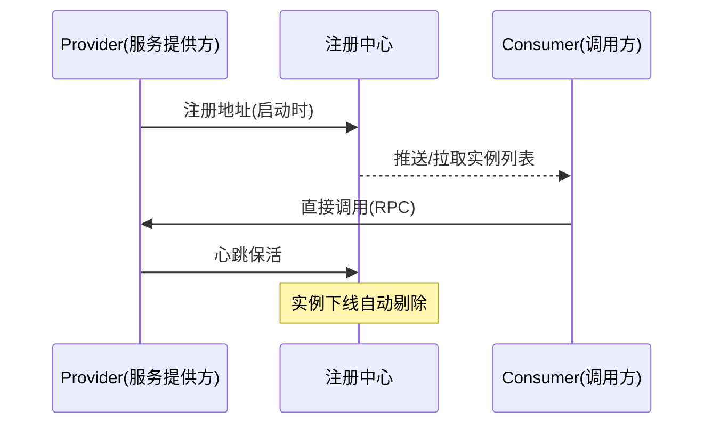
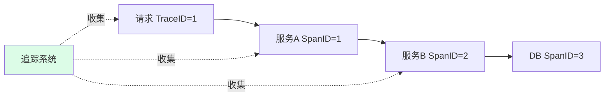

---
tags:
  - basic-knowledge
  - kb/distributed
  - kb/distributed/microservice
  - microservice
  - service-discovery
  - api-gateway
  - tracing
---

# 微服务架构

> 单体 → 微服务是后端架构主流演进。核心组件（注册发现/配置/网关/熔断限流/链路追踪）是中高级面试必问。

## 相关笔记

- [限流熔断降级](限流熔断降级.md)：微服务的稳定性保障
- [CAP与BASE理论](CAP与BASE理论.md)：注册中心的 CP/AP 选型
- [kafka](kafka.md) / [消息队列核心问题](消息队列核心问题.md)：服务间异步通信
- [分布式事务](分布式事务.md)：跨服务一致性

---

## 一、单体 vs 微服务

| 维度   | 单体架构     | 微服务架构         |
| ------ | ------------ | ------------------ |
| 部署   | 一个大应用   | 多个独立服务       |
| 技术栈 | 统一         | 可异构（按服务选） |
| 扩展   | 整体扩展     | 按服务独立扩展     |
| 复杂度 | 低（前期）   | 高（运维/通信）    |
| 适用   | 小项目、早期 | 大型复杂系统       |

> 微服务不是银弹：带来灵活性，也带来分布式复杂度（网络、一致性、运维）。团队/规模不到不要盲目上。

---

## 二、微服务核心组件（必背全景）

| 组件             | 作用                                             | 代表                                                   |
| ---------------- | ------------------------------------------------ | ------------------------------------------------------ |
| **服务注册发现** | 服务上下线自动感知，调用方动态获取地址           | **Nacos** / Eureka(AP) / Consul / ZK(CP)               |
| **API 网关**     | 统一入口：路由、鉴权、限流、日志                 | Spring Cloud Gateway / Kong / Zuul                     |
| **配置中心**     | 集中管理各服务配置，动态生效                     | **Nacos** / Apollo / Consul                            |
| **服务通信**     | 服务间调用                                       | RPC（Dubbo/gRPC）/ HTTP（Feign）                       |
| **熔断限流降级** | 稳定性保障（见 [限流熔断降级](限流熔断降级.md)） | **Sentinel** / Hystrix                                 |
| **链路追踪**     | 一次请求跨服务的全链路可视化                     | SkyWalking / Zipkin / Jaeger                           |
| **消息队列**     | 异步解耦、削峰                                   | Kafka / RocketMQ（见 [消息队列](消息队列核心问题.md)） |

---

## 三、服务注册发现（高频）

服务启动时把自己的地址注册到注册中心，调用方从注册中心获取可用实例列表。

### CP vs AP（注册中心选型）

结合 [CAP理论](CAP与BASE理论.md)：

| 注册中心      | CAP          | 特点                                             |
| ------------- | ------------ | ------------------------------------------------ |
| **Eureka**    | AP           | 节点对等，任一可服务，允许短暂不一致（主流推荐） |
| **ZooKeeper** | CP           | 强一致，leader 选举期间不可用                    |
| **Nacos**     | AP/CP 可切换 | 阿里，主流，集注册+配置 ⭐                       |
| **Consul**    | CP           | 还能健康检查                                     |

> **服务发现优先 AP**（可用性比强一致重要，实例列表短暂不一致可接受）。

---

## 四、链路追踪（可观测性）

微服务一次请求可能跨 N 个服务，出问题难定位。链路追踪用 **TraceID + SpanID** 串联全链路：

- **TraceID**：一次请求全局唯一
- **SpanID**：每个服务调用是一个 span
- 可观测三件套：**Metrics**（指标）+ **Logging**（日志）+ **Tracing**（追踪）

---

## 五、微服务面试速答

> **Q：单体和微服务优缺点？**
> A：单体简单易部署、技术统一，但代码臃肿、扩展受限；微服务独立部署/扩展/技术异构，但引入分布式复杂度（网络、一致性、运维、调试）。团队规模够大才适合。

> **Q：微服务核心组件有哪些？**
> A：注册发现（Nacos）、API网关（Gateway）、配置中心（Nacos/Apollo）、服务通信（RPC）、熔断限流（Sentinel）、链路追踪（SkyWalking）、消息队列。

> **Q：注册中心选 CP 还是 AP？**
> A：优先 AP。服务发现场景，可用性比强一致重要（实例列表短暂不一致可接受，但不能因强一致导致注册不可用）。所以 Eureka/Nacos 默认 AP，ZK(CP) 渐少用于注册。

> **Q：链路追踪原理？**
> A：给请求分配全局 TraceID，每个服务调用生成 SpanID，通过日志/上下文传递，采集到追踪系统（SkyWalking）串联可视化，定位慢调用和故障点。

---

## 参考

- [Spring Cloud 官方](https://spring.io/projects/spring-cloud)
- [Nacos 官方](https://nacos.io/)
- Martin Fowler · [Microservices](https://martinfowler.com/articles/microservices.html)
- 《微服务架构设计模式》Chris Richardson
