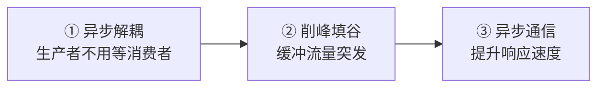
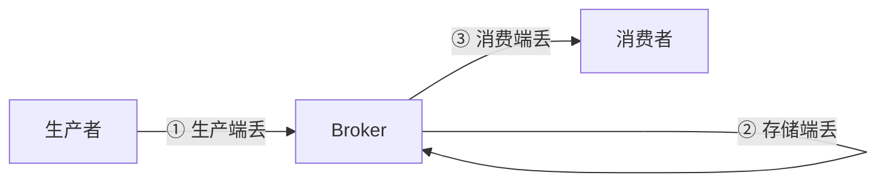
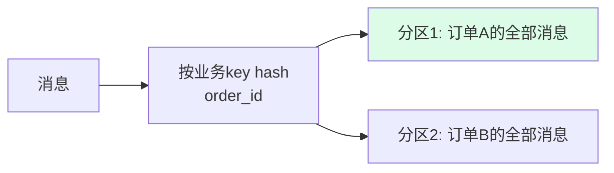

---
tags:
  - basic-knowledge
  - kb/distributed
  - kb/distributed/mq
  - message-queue
  - kafka
  - reliability
---

# 消息队列核心问题：丢失 / 重复 / 顺序 / 积压

> 用了 MQ 就要回答这四个问题——**消息怎么不丢、不重、有序、不积压**。是 MQ 面试的核心，比死记 Kafka 参数重要得多。

## 相关笔记

- [kafka](kafka.md)：Kafka 具体实现
- [分布式事务](分布式事务.md)：MQ 实现最终一致（本地消息表）
- [缓存与数据库一致性](../redis/缓存与数据库一致性.md)：最终一致的另一种实践

---

## 一、为什么用 MQ（三大作用）

---

## 二、消息丢失（三个环节都要防）

消息从生产到消费经过三段，**任一段都可能丢**：

| 环节              | 丢失原因                           | 解决方案                                                     |
| ----------------- | ---------------------------------- | ------------------------------------------------------------ |
| **① 生产端**      | 网络抖动，消息没到 Broker          | **确认机制**（acks=all）+ **重试**；本地消息表兜底           |
| **② Broker 存储** | Broker 宕机，内存消息丢失          | **持久化**（落盘）+ **副本/主从同步**（min.insync.replicas） |
| **③ 消费端**      | 消费者拿到消息处理前崩溃，但已 ack | **手动 ack**：处理完业务再确认（而非自动 ack）               |

> Kafka 对应：`acks=all` + `min.insync.replicas=2` + 副本；消费端关闭自动提交，手动提交 offset。

---

## 三、消息重复（At-Least-Once + 幂等）

网络问题下，MQ 通常保证 **At-Least-Once（至少一次）**，即可能重复投递。**重复必须靠消费端幂等解决**。

### 幂等方案

| 方案               | 说明                                                           |
| ------------------ | -------------------------------------------------------------- |
| **唯一键/去重表**  | 消息带业务唯一 ID，消费前查去重表，已处理则跳过                |
| **数据库唯一约束** | 利用 `UNIQUE` 约束，重复插入直接失败                           |
| **状态机**         | 业务有状态流转（如订单 待支付→已支付），重复消息因状态不符被拒 |
| **Redis 标记**     | 用 Redis 记录已处理 ID（注意 TTL）                             |

> Kafka 生产端可开启**幂等producer**（`enable.idempotence=true`）+ **事务**，保证 Exactly-Once（但消费端仍建议幂等兜底）。

---

## 四、消息顺序（分区内有序）

全局有序代价极大（单分区单线程），通常只需**业务维度有序**（如同一订单的消息有序）。

- **同一 key（如同一订单ID）的消息路由到同一分区**，分区内单线程消费 → 该业务有序
- Kafka：`producer` 按 key 分区；RocketMQ：MessageQueueSelector

> 全局有序只用于极少数场景（如 binlog 同步），代价是单分区无并行。

---

## 五、消息积压（消费者跟不上）

**现象**：堆积告警，消费滞后。**排查 + 应急**：

| 阶段         | 措施                                                           |
| ------------ | -------------------------------------------------------------- |
| **应急扩容** | 临时增加消费者（注意分区数限制：Kafka 消费者数 ≤ 分区数）      |
| **快速消费** | 若消费逻辑慢，先转发到更多分区的新 topic，用 N 倍消费者消化    |
| **根治**     | 优化消费逻辑（批量、异步、减少 DB/外部调用）、扩分区、监控告警 |

---

## 六、主流 MQ 对比（选型）

| MQ           | 吞吐 | 延迟 | 顺序   | 可靠性           | 适用                   |
| ------------ | ---- | ---- | ------ | ---------------- | ---------------------- |
| **Kafka**    | 极高 | 低   | 分区内 | 高（副本）       | 日志、大数据、流处理   |
| **RocketMQ** | 高   | 低   | 严格   | 高（金融级）     | 电商、金融、事务消息   |
| **RabbitMQ** | 中   | 极低 | 单队列 | 高（ACK+持久化） | 业务消息、路由复杂场景 |
| **Pulsar**   | 高   | 低   | 分区   | 高（存算分离）   | 新趋势                 |

---

## 七、面试速答

> **Q：如何保证消息不丢？**
> A：三段保证——生产端用 acks=all + 重试 + 本地消息表；Broker 持久化 + 副本同步（min.insync.replicas）；消费端手动 ack（处理完再确认）。

> **Q：如何保证消息不重复？**
> A：MQ 一般是 At-Least-Once，重复靠**消费端幂等**解决：唯一键去重表、DB 唯一约束、状态机、Redis 标记。

> **Q：如何保证消息顺序？**
> A：按业务 key（如同一订单ID）hash 到同一分区，分区内单线程消费 → 该业务有序。全局有序代价大，很少用。

> **Q：消息积压怎么办？**
> A：应急——加消费者（≤分区数）或转发到更多分区的新 topic 用 N 倍消费者；根治——优化消费逻辑（批量/异步/减外部依赖）、扩分区。

---

## 参考

- [Kafka 官方 · Reliability](https://kafka.apache.org/documentation/#semantics)
- 《Kafka 权威指南》
- 丁奇《MySQL 实战 45 讲》相关 MQ 篇
- [RocketMQ 官方](https://rocketmq.apache.org/docs/)
