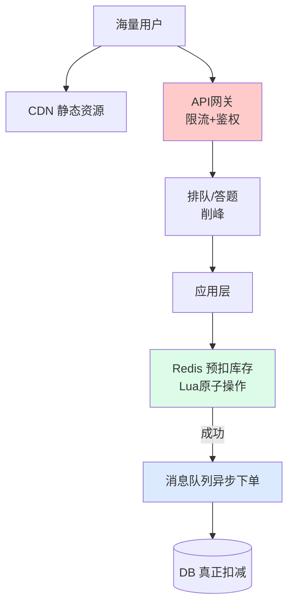
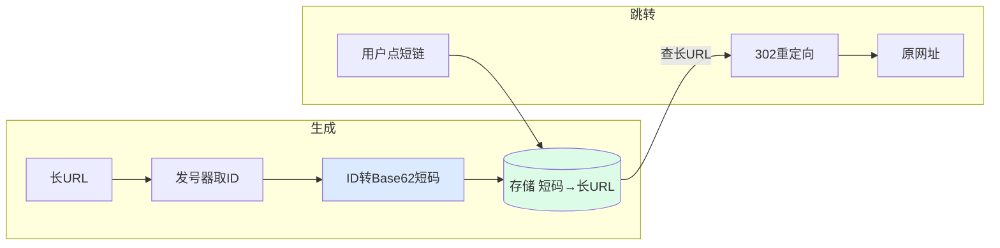

---
tags:
  - basic-knowledge
  - kb/distributed
  - kb/distributed/system-design
  - system-design
  - seckill
  - short-url
---

# 系统设计：秒杀系统与短链系统

> 系统设计题是中高级面试分水岭。本文讲两个经典案例：**秒杀**（高并发 + 防超卖）和**短链**（发号 + 存储 + 跳转）。

## 相关笔记

- [限流熔断降级](限流熔断降级.md)：秒杀的核心保护
- [分布式ID生成](分布式ID生成.md)：短链发号器
- [一致性哈希](一致性哈希.md)：分片
- [Redis分布式锁](../redis/Redis分布式锁.md)：库存原子扣减

---

## 一、秒杀系统设计

### 核心挑战

| 挑战            | 难点                        |
| --------------- | --------------------------- |
| **瞬时高并发**  | 平时 1k QPS，秒杀瞬间百万级 |
| **防超卖**      | 库存不能扣成负数            |
| **防黄牛/防刷** | 机器刷单                    |
| **保证高可用**  | 不能被秒杀拖垮整个系统      |

### 整体架构



### 关键设计

| 层           | 手段                                                                                                         |
| ------------ | ------------------------------------------------------------------------------------------------------------ |
| **前端**     | 按钮置灰防重复提交、CDN 缓存静态页、答题验证码削峰                                                           |
| **网关**     | **限流**（令牌桶）+ 黑名单 + 鉴权                                                                            |
| **库存预扣** | **Redis 用 Lua 脚本原子扣减**，防超卖；库存预热到 Redis                                                      |
| **异步下单** | 扣减成功发 MQ，**异步落库**，DB 削峰                                                                         |
| **DB**       | 最终扣减，配合 [乐观锁](../mysql/MySQL并发控制--锁.md) 兜底（`update stock=stock-1 where id=? and stock>0`） |

### 防超卖核心（Redis Lua）

```lua
-- 原子操作：检查库存 + 扣减
local stock = redis.call('get', KEYS[1])
if not stock or tonumber(stock) <= 0 then return 0 end
redis.call('decr', KEYS[1])
return 1
```

> 关键：**Redis 预扣（原子）→ MQ 异步 → DB 落库**，把 DB 压力挡在 Redis 层。

---

## 二、短链系统设计

### 需求

把长 URL（如 `https://xxx.com/very/long/url?with=many&params=...`）转成短链（如 `https://t.cn/abc123`），点击跳转原址。

### 核心问题

1. **短码怎么生成？**
2. **长短映射怎么存？**
3. **跳转怎么实现？**

### 短码生成

| 方案                   | 原理                                                       | 优缺点           |
| ---------------------- | ---------------------------------------------------------- | ---------------- |
| **Hash（MD5/Murmur）** | hash 后截取                                                | 可能冲突，需查重 |
| **发号器 + Base62** ⭐ | [分布式ID](分布式ID生成.md)（自增）转 62 进制（0-9a-zA-Z） | 不冲突、有序、短 |

> 主流用**发号器**：拿一个全局自增 ID，转成 6 位 Base62（6位可表示 626≈568亿），如 `id=12345 → "3d7`。

### 整体流程



### 存储与跳转

- **存储**：MySQL/Redis 存 `短码 → 长URL` 映射（Redis 缓存热点）
- **跳转**：用 **301（永久，浏览器缓存）** 或 **302（临时，每次回服务便于统计）**
- **高并发读**：短链跳转是读多写少，**Redis 缓存 + 多级缓存**
- **分库分表**：量极大时按短码 hash 分片

---

## 三、面试速答

> **Q：设计一个秒杀系统？**
> A：核心是「**层层削峰 + 防超卖**」。前端置灰+CDN+答题；网关限流；**Redis 用 Lua 原子预扣库存**防超卖；扣减成功发 MQ 异步下单落库，把 DB 压力挡在 Redis；DB 用乐观锁兜底。保证高可用靠限流熔断降级。

> **Q：怎么防止超卖？**
> A：库存预热到 Redis，**用 Lua 脚本原子地「检查+扣减」**（不依赖分布式锁，单线程+原子足够）；DB 层用 `where stock>0` 乐观锁兜底。

> **Q：短链怎么设计？**
> A：短码用**发号器（分布式自增 ID）转 Base62**，避免冲突；存「短码→长URL」映射（Redis 缓存热点）；跳转用 302 重定向（便于统计）；读多写少用多级缓存，量大按短码分片。

---

## 参考

- [系统设计入门](https://github.com/donnemartin/system-design-primer)
- 《数据密集型应用系统设计》（DDIA）
- [秒杀系统设计 - 美团技术团队](https://tech.meituan.com/)
- [短链系统设计](https://www.infoq.cn/article/short-url-system-design)
