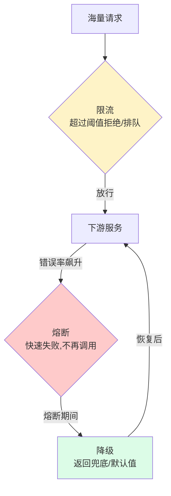
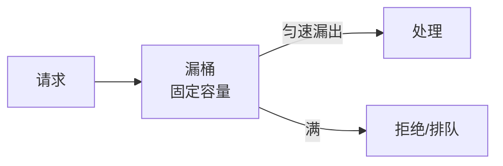
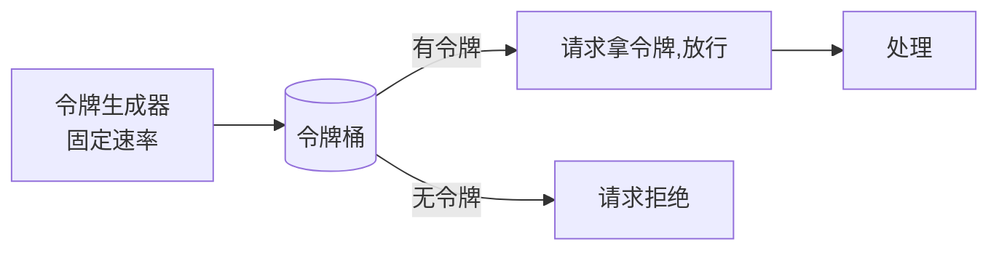
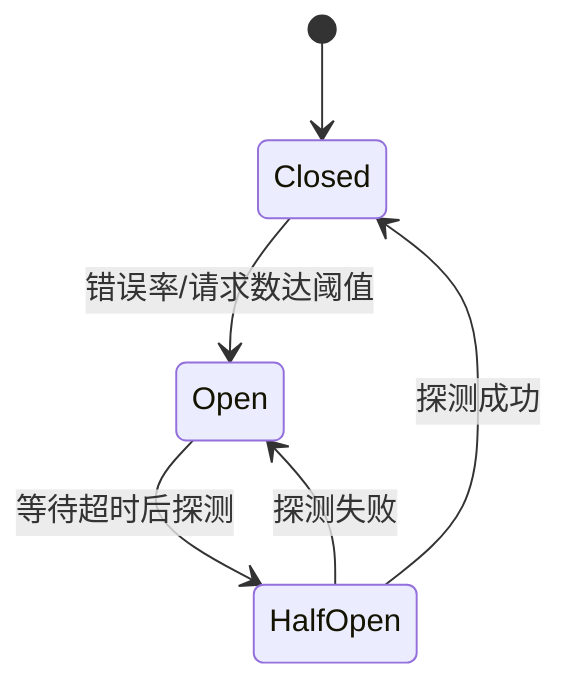

---
tags:
  - basic-knowledge
  - kb/distributed
  - kb/distributed/high-concurrency
  - rate-limiting
  - circuit-breaker
  - sentinel
---

# 限流、熔断与降级（高可用三件套）

> 高并发系统的「**保命三件套**」。限流防过载、熔断防级联失败、降级保核心。面试高频，尤其在中高级后端。

## 相关笔记

- [高并发框架选型](高并发框架选型.md)
- [缓存雪崩](../redis/缓存雪崩.md)：缓存层的保护
- [负载均衡](负载均衡.md)：流量分发

---

## 一、三者关系（为什么需要）

| 机制     | 解决什么                 | 时机                   |
| -------- | ------------------------ | ---------------------- |
| **限流** | 请求过多，防系统过载     | 入口处主动控制流量     |
| **熔断** | 下游故障，防级联雪崩     | 依赖服务异常时快速失败 |
| **降级** | 保证核心可用，牺牲非核心 | 故障/限流时返回兜底    |

---

## 二、限流算法（核心）

### 1. 计数器（固定窗口）

固定时间窗口内计数，超阈值拒绝。

- ❌ **临界问题**：窗口边界处两倍流量（如 0:59 和 1:01 各打满）

### 2. 滑动窗口

把窗口细分多格滑动，平滑临界问题。Sentinel 默认。

### 3. 漏桶（Leaky Bucket）⭐

- 请求入桶，**匀速流出**（固定速率处理）
- 桶满则拒绝/排队
- 特点：**平滑输出**，但无法应对突发（突发也匀速出）

### 4. 令牌桶（Token Bucket）⭐⭐ 最常用

- 以**固定速率往桶里放令牌**，桶满则丢弃多余令牌
- 请求来时拿令牌，有则放行，无则拒绝
- 特点：**允许一定突发**（桶里攒的令牌可瞬间消费）

### 漏桶 vs 令牌桶

| 维度     | 漏桶         | 令牌桶                 |
| -------- | ------------ | ---------------------- |
| 输出速率 | 严格匀速     | 可突发（受桶容量限制） |
| 突发流量 | 不允许       | 允许                   |
| 适用     | 严格控制速率 | 大多数限流场景 ⭐      |

> **Guava RateLimiter、Nginx limit_req、Sentinel** 都基于令牌桶。

---

## 三、熔断（Circuit Breaker）

防止**一个服务故障拖垮整条调用链**（级联雪崩）。断路器三态：

| 状态                  | 行为                                             |
| --------------------- | ------------------------------------------------ |
| **Closed（关闭）**    | 正常放行，统计失败率                             |
| **Open（打开）**      | **快速失败**，直接返回错误/降级，不再调用下游    |
| **Half-Open（半开）** | 放少量请求探测，成功则恢复 Closed，失败则回 Open |

> 代表：**Hystrix**（Netflix，已停止维护）、**Sentinel**（阿里，主流）、Resilience4j。

---

## 四、降级（Fallback）

故障/限流时**返回兜底响应**，保证核心可用：

- **读降级**：返回缓存/默认值/空（如推荐挂了返回热门列表）
- **写降级**：先记日志/消息队列异步处理，后续补偿
- **功能降级**：关闭非核心功能（如大促关评论、退款）

> 降级要**预先设计**，不能临时拍。结合 [CAP与BASE理论](CAP与BASE理论.md) 的「基本可用」。

---

## 五、限流粒度

| 粒度           | 说明                              |
| -------------- | --------------------------------- |
| **QPS 限流**   | 每秒请求数                        |
| **线程数限流** | 并发执行线程数（保护线程池）      |
| **单机限流**   | 本机内存计数（Guava RateLimiter） |
| **分布式限流** | Redis/网关统一计数（集群维度）    |

---

## 六、面试速答

> **Q：限流有哪些算法？令牌桶和漏桶区别？**
> A：计数器（有临界问题）、滑动窗口、漏桶（匀速输出，不允许突发）、令牌桶（固定速率发令牌，允许突发）。最常用令牌桶（Guava/Sentinel）。区别：漏桶严格匀速，令牌桶允许突发。

> **Q：熔断器有几种状态？**
> A：Closed（正常，统计失败）→ 失败率达阈值 → Open（快速失败不调下游）→ 超时后半开探测 → 成功回 Closed，失败回 Open。防止级联雪崩。

> **Q：限流、熔断、降级区别？**
> A：限流防过载（入口控流）、熔断防级联（下游故障快速失败）、降级保核心（返回兜底）。三者配合保高可用。

> **Q：怎么做分布式限流？**
> A：单机限流用本地计数（RateLimiter）；分布式限流用 Redis 计数（lua 保证原子）或网关层统一控制，限制集群总 QPS。

---

## 参考

- [Sentinel 官方](https://sentinelguard.io/zh-cn/docs/introduction.html)
- [Hystrix wiki](https://github.com/Netflix/Hystrix/wiki)
- [令牌桶 vs 漏桶](https://en.wikipedia.org/wiki/Token_bucket)
- 《数据密集型应用系统设计》（DDIA）
