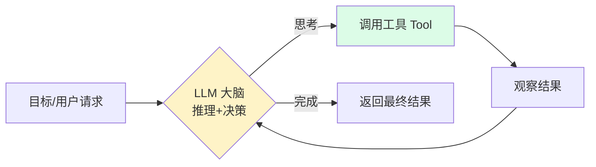
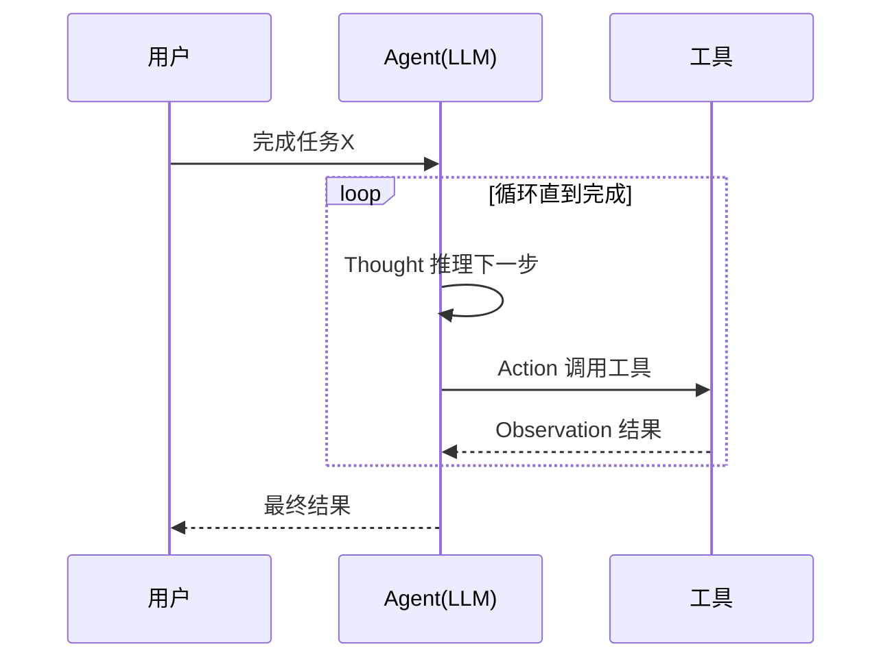

---
tags:
  - basic-knowledge
  - kb/llm
  - kb/llm/agent
  - agent
  - function-calling
  - react
---

# Agent 与 Function Calling 基础

> **Agent（智能体）** 是 LLM 从「对话」走向「行动」的关键。它能让模型调用工具、自主规划、多步完成任务。是模型应用开发的前沿方向。实战见仓库 `🤖Agent` 目录。

## 相关笔记

- [LLM基础原理](LLM基础原理.md)：Agent 的大脑
- [Prompt工程基础](Prompt工程基础.md)：ReAct 等基于 Prompt 的模式
- [RAG基础原理](RAG基础原理.md)：Agent 的「记忆/知识」组件
- 实战：`🤖AI应用/Agent/Agent框架/`、`🤖AI应用/Agent/客服类智能体落地/`
- 协议：`🤖AI应用/MCP与A2A/MCP与A2A.md`

---

## 一、什么是 Agent

普通 LLM 对话是**单轮输入→输出**。Agent 是**以 LLM 为大脑，能感知环境、自主决策、调用工具、循环执行直到完成目标**的系统。



核心区别：**Agent 有循环（观察-思考-行动）**，而非一次性回答。

---

## 二、Agent 的核心组件

| 组件                 | 作用                                    |
| -------------------- | --------------------------------------- |
| **大脑（LLM）**      | 推理、规划、决策                        |
| **工具（Tools）**    | 函数/API/数据库/搜索引擎/代码执行器     |
| **记忆（Memory）**   | 短期（对话历史）+ 长期（向量库/知识库） |
| **规划（Planning）** | 任务拆解、反思、自我纠错                |
| **行动（Action）**   | 执行工具，作用于环境                    |

---

## 三、ReAct：Agent 的经典范式

**ReAct = Reasoning + Acting**。模型在每一步交替输出「思考」和「行动」：

```
Thought: 我需要查今天的天气
Action: search_weather("上海")
Observation: 上海今天 28℃，晴
Thought: 天气适合户外，可以建议用户出行
Action: Finish("上海今天28℃晴朗，适合出行")
```



> ReAct 是 LangChain/LlamaIndex 等框架的基础循环。通过 Prompt 引导模型输出结构化的 Thought/Action/Observation。

---

## 四、Function Calling / Tool Use

Function Calling 是**让模型按约定格式输出「要调用哪个函数+参数」**的能力，由各大厂商原生支持（OpenAI、Anthropic、Gemini、Qwen 等），比纯 Prompt 解析更可靠。

### 工作流程

```mermaid
flowchart LR
    U[用户: 上海天气] --> L[LLM]
    L -->|函数名+参数<br/>get_weather(city=上海)| A[应用层]
    A -->|实际执行| F[get_weather API]
    F -->|结果 28℃晴| A
    A -->|把结果喂回| L
    L -->|基于结果回答| U
```

1. 应用把**可用函数的定义（名/描述/参数schema）**告诉模型
2. 模型判断是否需要调用，若需要则输出**结构化的函数调用**（非自然语言）
3. 应用**实际执行**该函数
4. 把结果**喂回模型**，模型生成最终回答

> **ReAct 与 Function Calling 正交，不是二选一**：ReAct 是推理范式（决定「何时思考、如何行动」），Function Calling 是工具调用机制（决定「怎么把行动表达出来」）。早期无 FC 时，ReAct 的 Action 靠 Prompt 输出文本再自行解析；有了原生 FC 后，**现代实践普遍用 Function Calling 实现 ReAct 循环里的 Action**（LangChain / LlamaIndex 等框架正是如此），既保留 ReAct 的推理能力，又获得 FC 的格式稳定性与并行调用能力。

---

## 五、Planning 与 Memory

### Planning（规划）

复杂任务需要**先拆解再执行**：

- **Task Decomposition**：把大目标拆成子任务链
- **Reflection / Self-Correction**：执行后反思，发现错误回退重试
- 代表：Plan-and-Execute、Tree of Thoughts、Reflexion

### Memory（记忆）

| 类型         | 实现                                         |
| ------------ | -------------------------------------------- |
| **短期记忆** | 对话上下文窗口（受 token 限制）              |
| **长期记忆** | 向量数据库存历史交互，按需检索（本质是 RAG） |

> Agent 的长期记忆通常就是 **RAG over 历史会话**。所以 Agent 和 RAG 是组合关系，不是替代。

---

## 六、多智能体（Multi-Agent）

多个 Agent 分工协作：如「规划Agent + 编码Agent + 测试Agent + 评审Agent」。代表框架：AutoGen、CrewAI、MetaGPT、CAMEL。

适用：复杂软件工程、研究型任务。代价：成本高、调试难、可能死循环。

---

## 七、主流框架选型

| 框架                                   | 特点                                       |
| -------------------------------------- | ------------------------------------------ |
| **LangChain / LangGraph**              | 生态最大，LangGraph 适合有状态的复杂 Agent |
| **LlamaIndex**                         | RAG 起家，Data Agent 强                    |
| **OpenAI Agents SDK / Assistants API** | 官方，集成简单                             |
| **AutoGen / CrewAI**                   | 多智能体协作                               |
| **Dify / Coze（扣子）/ FastGPT**       | 低代码 Agent 平台，快速搭建                |

> 你仓库 `🤖AI应用/Agent/Agent框架/` 已有 Agno、CAMEL-AI 等的调研，本文提供选型的原理基础。

---

## 八、常见坑与对策

| 坑                  | 对策                                         |
| ------------------- | -------------------------------------------- |
| **死循环/无限调用** | 设最大步数上限；要求模型明确「完成」信号     |
| **幻觉工具/参数**   | 用 Function Calling 而非纯 Prompt；校验参数  |
| **成本失控**        | 限制循环次数；小模型做规划，大模型做关键决策 |
| **工具结果没喂回**  | 确保把 Observation 放回上下文                |
| **错误难调试**      | 打印每步 Thought/Action/Observation 全链路   |

---

## 九、面试速答

> **Q：Agent 和普通 LLM 对话的区别？**
> A：Agent 有「观察-思考-行动」的**循环**，能调用工具、多步达成目标；普通对话是单轮输入输出。

> **Q：ReAct 和 Function Calling 是什么关系？**
> A：二者**正交，常组合使用**，不是二选一。ReAct 是推理范式（Thought→Action→Observation 循环，解决「怎么思考决策」）；Function Calling 是工具调用机制（结构化输出函数名+参数，解决「怎么表达调用」）。现代实践**用 FC 实现 ReAct 里的 Action**，既保留推理又让工具调用可靠。真正该对比的是「纯文本解析工具调用」vs「原生 FC」——后者格式稳定、参数准确，**生产优先用 FC 实现 Action**。

> **Q：Agent 怎么记住历史？**
> A：短期靠上下文窗口，长期靠向量库检索历史（本质 RAG）。

---

## 参考

- [ReAct 论文](https://arxiv.org/abs/2210.03629)
- [OpenAI · Function Calling](https://platform.openai.com/docs/guides/function-calling)
- [Anthropic · Tool Use](https://docs.anthropic.com/en/docs/build-with-claude/tool-use)
- [LangGraph 文档](https://langchain-ai.github.io/langgraph/)
- [Lilian Weng · LLM Powered Autonomous Agents](https://lilianweng.github.io/posts/2023-06-23-agent/)
- 实战：`🤖AI应用/Agent/💆Copilot和Agent的区别.md`
