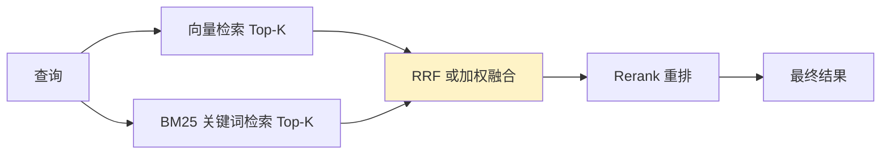

---
tags:
  - basic-knowledge
  - kb/llm
  - kb/llm/embedding
  - embedding
  - vector-search
  - hnsw
  - cosine-similarity
---

# Embedding 与向量检索

> Embedding 是把文本（图片/任何对象）变成向量，是 **RAG、语义搜索、推荐、聚类** 的共同地基。

## 相关笔记

- [RAG基础原理](RAG基础原理.md)：Embedding 是 RAG 检索的核心
- [LLM基础原理](LLM基础原理.md)：Embedding 层是 Transformer 的输入
- [大模型选型与对比](大模型选型与对比.md)：Embedding 模型选型

---

## 一、什么是 Embedding

**Embedding（嵌入）** 把离散对象（词、句、文档、图片）映射为**低维稠密实数向量**，让「语义相似」转化为「向量距离近」。

```
"猫"  → [0.21, -0.55, 0.83, ...]
"狗"  → [0.19, -0.50, 0.80, ...]   ← 与"猫"距离近（都是动物）
"汽车"→ [-0.71, 0.32, -0.15, ...]  ← 与"猫"距离远
```

> 直觉：Embedding 是把语义**几何化**——相似含义在向量空间里彼此靠近。

---

## 二、相似度计算

| 度量                     | 说明                 | 常用于             |
| ------------------------ | -------------------- | ------------------ |
| **余弦相似度（Cosine）** | 看方向夹角，忽略长度 | **文本检索最常用** |
| 点积（Dot Product）      | 余弦 × 模长          | 归一化后等价余弦   |
| 欧氏距离（L2）           | 直线距离             | 图像/聚类          |

文本 Embedding 通常**先归一化**，此时余弦相似度 = 点积。

---

## 三、向量数据库与 ANN 索引

百万级以上向量，暴力两两比对太慢。用**近似最近邻（ANN）索引**加速，牺牲一点点精度换巨大速度提升。

| 索引算法       | 特点                                               |
| -------------- | -------------------------------------------------- |
| **HNSW**       | 图结构，查询快、精度高，**主流首选**，但内存占用大 |
| IVF            | 聚类分桶，先查桶再查桶内，可调精度/速度            |
| PQ（乘积量化） | 压缩向量省内存，常与 IVF 组合（IVFPQ）             |
| FLAT           | 暴力精确，仅适合小数据集                           |

主流向量库：**Milvus、Qdrant、Weaviate、Chroma、pgvector（PostgreSQL 扩展）、Faiss（库）**。


---

## 四、Embedding 模型

| 类型              | 代表                                                              |
| ----------------- | ----------------------------------------------------------------- |
| 闭源 API          | OpenAI text-embedding-3、Cohere、Voyage                           |
| 开源（中英/多语） | **bge-m3**（多语言强）、Qwen3-Embedding、conan-embedding、e5、gte |

### 评估指标

检索质量看**召回率 Recall@K**（Top-K 里是否包含正确答案）。常用基准：MTEB、C-MTEB（中文）。

### 选型要点

- 语言匹配（中文优先 bge-m3 / Qwen3-Embedding）
- 维度（影响存储与速度，一般 768~1536）
- 最大输入长度（能否覆盖长 chunk）
- 是否支持**稀疏向量 / 多向量**（用于 Hybrid 检索）

---

## 五、混合检索（Hybrid）

单纯向量检索对**专有名词、精确数字、代码标识符**较弱，结合**关键词（BM25）**效果更好：



**RRF（Reciprocal Rank Fusion）**：按各路检索的排名倒数融合，无需归一化分数，简单有效。

---

## 六、常见坑

| 坑                              | 对策                             |
| ------------------------------- | -------------------------------- |
| 查询和文档用不同 Embedding 模型 | 必须同模型（或用专门的双塔模型） |
| 未归一化导致相似度异常          | 入库前归一化                     |
| 向量库选型只看速度不看精度      | 先评估 Recall@K                  |
| 纯向量检索漏掉关键词            | 上 Hybrid（向量+BM25）+ Rerank   |
| 维度太高存储爆                  | 适当降维或用量化                 |

---

## 七、面试速答

> **Q：Embedding 为什么能表示语义？**
> A：训练时让语义相近的样本在向量空间距离近（对比学习），向量几何位置就编码了语义。

> **Q：向量检索为什么用余弦相似度？**
> A：文本 Embedding 关注语义方向而非绝对大小，余弦只看夹角，对幅度不敏感，归一化后等于点积、计算高效。

> **Q：为什么需要 ANN 索引（如 HNSW）？**
> A：暴力比对是 O(N)，百万级数据无法实时。ANN 用图/聚类把查询降到近似 O(log N)，牺牲极小精度换巨大加速。

---

## 参考

- [MTEB 排行榜](https://huggingface.co/spaces/mteb/leaderboard)
- [BGE-M3 模型](https://huggingface.co/BAAI/bge-m3)
- [HNSW 论文](https://arxiv.org/abs/1603.09320)
- [Milvus 文档](https://milvus.io/docs)
- [Hybrid Search - Pinecone](https://www.pinecone.io/learn/hybrid-search-intro/)
