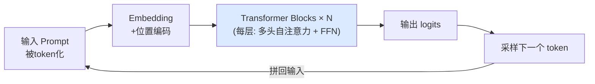
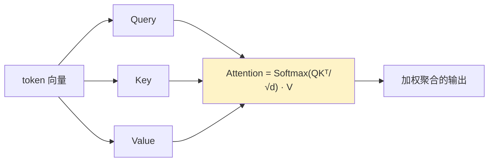
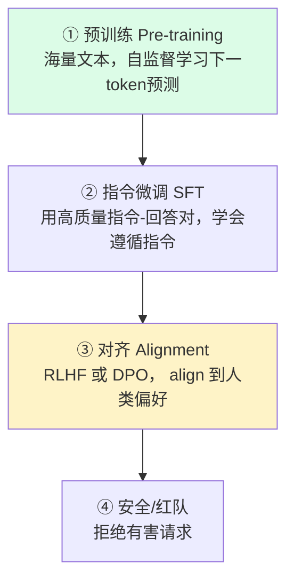

---
tags:
  - basic-knowledge
  - kb/llm
  - kb/llm/fundamentals
  - transformer
  - attention
  - llm
---

# LLM 基础原理：Transformer 与注意力机制

> 大语言模型（LLM）是所有模型应用开发的底层。理解 Transformer、注意力、Token、训练流程，才能做好 Prompt、RAG、Agent。本文是整个大模型领域的地基。

## 相关笔记

- [Token上下文窗口与采样参数](Token上下文窗口与采样参数.md)：温度、Top-p、上下文长度
- [Embedding与向量检索](Embedding与向量检索.md)：向量化是 RAG 的基础
- [大模型幻觉与评估](大模型幻觉与评估.md)：LLM 的核心局限
- 应用实践见仓库 `🤖Agent`、`📚RAG`、`🧚DeepSeek` 目录

---

## 一、什么是大语言模型

大语言模型（Large Language Model）本质是一个**超大规模的「下一个 token 预测」模型**：给定上文，预测最可能出现的下一个词。通过在海量文本上训练，它学会了语言规律、世界知识、推理能力。

$$P(\text{token}_t \mid \text{token}_1, \dots, \text{token}_{t-1})$$

「大」体现在参数量（数十亿到万亿）和训练数据量。当规模超过某个阈值，会涌现出小模型没有的能力（如上下文学习、思维链推理），称为**涌现能力（Emergent Abilities）**。

---

## 二、Transformer 架构

Transformer 是 2017 年 Google 论文《Attention Is All You Need》提出的架构，是所有现代 LLM 的基础。核心是用**注意力机制**替代 RNN 的循环结构，实现**并行计算**和**长距离依赖建模**。

### 三种变体

| 变体                | 结构                         | 代表模型                                   |
| ------------------- | ---------------------------- | ------------------------------------------ |
| **Encoder-only**    | 双向注意力，擅长理解         | BERT                                       |
| **Decoder-only**    | 单向（因果）注意力，擅长生成 | **GPT / Claude / Llama / Qwen / DeepSeek** |
| **Encoder-Decoder** | 编码+解码，擅长 seq2seq      | T5 / 原始 Transformer                      |

> 当前主流 LLM 几乎都是 **Decoder-only**（GPT 系），因为它在规模化后生成和理解能力都很强。

### Decoder-only 的工作方式

模型**自回归**地生成：每次预测一个 token，把它拼回输入，再预测下一个，直到结束符或长度上限。

---

## 三、自注意力机制（Self-Attention）

注意力是 Transformer 的灵魂。它让模型在处理每个 token 时，能**关注到序列中所有其他 token**，并按相关性加权聚合信息。

### Q / K / V 计算

每个 token 被投影为三个向量：

- **Q（Query）查询**：当前 token 想找什么
- **K（Key）键**：其他 token 能提供什么
- **V（Value）值**：其他 token 的实际信息

直观理解：**Q·K 点积 = 相关性分数**，Softmax 归一化成权重，再加权求和 V。`√d` 是缩放因子，防止点积过大导致梯度消失。

### 因果注意力（Causal Mask）

Decoder-only 模型用**因果掩码**：预测第 t 个 token 时，只能看到前 t-1 个 token，不能「偷看」未来。这就是为什么 GPT 是从左到右逐字生成的。

### 多头注意力（Multi-Head）

把 Q/K/V 分成多个「头」并行计算，每个头关注不同子空间（如语法、语义、共指等），再拼接。多头让模型从多角度理解关系。

---

## 四、Token 与分词

模型不直接处理字符，而是处理 **token**（比单词更小的单位）。分词常用 **BPE（Byte Pair Encoding）**：

- 英文：约 1 token ≈ 0.75 word（`hello` 可能是 1 个 token，`tokenization` 可能拆成多个）
- 中文：约 1 个汉字 ≈ 1-2 token（取决于分词器和模型）
- 代码、emoji：token 消耗更多

> **为什么重要**：计费（按 token）、上下文窗口限制、Embedding 维度，都基于 token。中文场景下同样字数比英文更费 token、更费钱。

---

## 五、训练流程：从预训练到对齐

1. **预训练（Pre-training）**：在万亿级 token 上做下一 token 预测，学到语言和知识。产出 **base 模型**（只会续写，不会对话）。
2. **监督微调（SFT, Supervised Fine-Tuning）**：用人工编写的「指令-回答」对，让模型学会按指令格式回答。产出 **chat 模型**。
3. **对齐（Alignment）**：
   - **RLHF**（Reinforcement Learning from Human Feedback）：训练奖励模型 + PPO 强化学习，让回答更符合人类偏好。
   - **DPO**（Direct Preference Optimization）：直接用偏好对优化，无需奖励模型，更简单稳定。
4. **安全训练**：拒绝有害、违法、不安全请求。

> **选模型时注意 base vs chat/instruct**：做应用几乎都用 chat/instruct 版本；base 版用于继续预训练或特定微调。

---

## 六、LLM 的核心能力与局限

### 能力

- **上下文学习（In-Context Learning）**：在 Prompt 里给几个示例（few-shot），模型就能模仿，无需训练。
- **思维链（Chain-of-Thought）**：引导模型逐步推理，显著提升数学/逻辑题表现。
- **工具使用（Tool Use / Function Calling）**：模型能调用外部函数/API。详见 [Agent与Function-Calling基础](Agent与Function-Calling基础.md)。

### 局限

- **幻觉（Hallucination）**：自信地编造事实。这是 LLM 应用最大痛点 → 用 RAG / 工具缓解。
- **知识截止**：训练数据有截止日期，不知道最新事件 → 联网搜索 / RAG。
- **上下文长度有限**：早期 4K-8K，现在主流 128K-2M，但仍有限且「中间遗忘」。
- **不可靠的精确计算/逻辑**：需要外部工具（代码执行）兜底。
- **成本与延迟**：大模型慢且贵，需权衡。

---

## 七、面试速答

> **Q：Transformer 为什么比 RNN 好？**
> A：① 并行计算（训练快）；② 注意力直接建模长距离依赖（RNN 有梯度消失/长程遗忘）。

> **Q：自注意力怎么计算的？**
> A：QKᵀ/√d 算相关性 → Softmax 归一化 → 加权求和 V。多头并行捕捉不同子空间。

> **Q：GPT 为什么用 Decoder-only？**
> A：生成任务天然适合自回归；规模化后理解能力也够强；训练/推理效率高。

> **Q：base 模型和 chat 模型区别？**
> A：base 只会续写文本；chat 经过 SFT+对齐，能遵循指令、对话、安全拒绝。应用都用 chat。

---

## 参考

- [Attention Is All You Need（原始论文）](https://arxiv.org/abs/1706.03762)
- [The Illustrated Transformer - Jay Alammar](https://jalammar.github.io/illustrated-transformer/)
- [OpenAI · Tokenizer（体验分词）](https://platform.openai.com/tokenizer)
- [Andrej Karpathy · Let's build GPT](https://www.youtube.com/watch?v=kCc8FmEb1nY)
- [RLHF 论文](https://arxiv.org/abs/2203.02155) / [DPO 论文](https://arxiv.org/abs/2305.18290)
