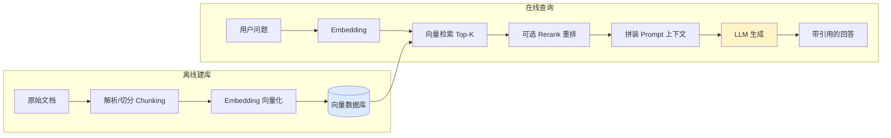

---
tags:
  - basic-knowledge
  - kb/llm
  - kb/llm/rag
  - rag
  - retrieval-augmented-generation
  - vector-search
---

# RAG 基础原理

> **RAG（检索增强生成）** 是解决 LLM「幻觉 + 知识截止 + 私域知识」的核心方案，也是企业落地最多的大模型应用形态。本文讲原理；实战见仓库 `📚RAG` 目录。

## 相关笔记

- [LLM基础原理](LLM基础原理.md)：RAG 增强的对象
- [Embedding与向量检索](Embedding与向量检索.md)：检索的底层
- [大模型幻觉与评估](大模型幻觉与评估.md)：RAG 主要用来缓解幻觉
- 实战重构见 `📚RAG/2025-0813 我的RAG系统重构笔记.md`、`📚RAG/2025-0919 RAG设计模式.md`

---

## 一、为什么需要 RAG

LLM 的三大痛点：

| 痛点           | 原因                      |
| -------------- | ------------------------- |
| **幻觉**       | 预测概率，可能编造        |
| **知识截止**   | 训练数据有截止日期        |
| **无私域知识** | 不懂你的企业内部文档/代码 |

RAG 的思路：**生成前先去知识库检索相关片段，把片段塞进 Prompt，让模型基于检索内容回答**。相当于给模型「开卷考试」。

---

## 二、RAG vs 微调

| 维度     | RAG                    | 微调                   |
| -------- | ---------------------- | ---------------------- |
| 解决问题 | 知识/事实/时效         | 风格/格式/特定领域行为 |
| 知识更新 | 改数据库即可，实时     | 需重新训练             |
| 成本     | 低（检索+Prompt）      | 高（训练算力）         |
| 可解释性 | 高（可溯源到检索片段） | 低                     |
| 幻觉控制 | 好（有据可查）         | 一般                   |

> **原则**：知识/事实/时效问题用 RAG；行为/风格/格式问题用微调。二者可叠加（RAG + 微调）。

---

## 三、RAG 基本流程

1. **文档处理**：解析（PDF/HTML/Word）→ 清洗 → **切分（Chunking）**
2. **向量化**：每个 chunk 用 Embedding 模型转向量，存入向量数据库
3. **检索**：用户问题同样向量化，在向量库做相似度检索（Top-K）
4. **重排（可选）**：用 Cross-Encoder 重排，提升相关性
5. **生成**：把检索到的 chunk 拼进 Prompt，让 LLM 基于它回答

---

## 四、关键环节详解

### 4.1 Chunking（切分）—— 最容易被忽视

切分质量直接决定检索质量：

| 策略               | 说明                                  |
| ------------------ | ------------------------------------- |
| 固定长度           | 简单但可能切断语义                    |
| 按结构             | 按标题/段落/Markdown 层级，保语义完整 |
| 重叠窗口           | chunk 间重叠一部分，避免边界丢上下文  |
| 语义切分           | 用模型判断语义边界                    |
| 父子/Late Chunking | 检索小块、返回大块，兼顾精度与上下文  |

> 经验：chunk 太小丢上下文，太大稀释相关性、费 token。通常 256-1024 token，配合重叠。

### 4.2 检索：向量 vs 关键词 vs 混合

| 方式                            | 擅长                   | 局限                       |
| ------------------------------- | ---------------------- | -------------------------- |
| **向量检索（稠密）**            | 语义相似、同义改写     | 精确关键词/专有名词/数字弱 |
| **关键词检索（稀疏，如 BM25）** | 精确匹配、专有名词     | 不懂同义                   |
| **混合检索（Hybrid）**          | 二者融合，**生产推荐** | 架构复杂                   |

> 实践常做 **Hybrid（向量 + BM25）+ RRF 融合**，再上 Rerank。

### 4.3 Rerank（重排）

向量检索召回的 Top-K 召回率高但精度一般，用 **Cross-Encoder 重排模型**（如 bge-reranker）对「问题-chunk」对精细打分重排，显著提升最终相关性。

### 4.4 Embedding 模型选型

- 中文：bge-m3、Qwen3-Embedding、conan-embedding
- 英文：text-embedding-3、voyage、cohere
- 评估指标：检索召回率（Recall@K）

---

## 五、高级 RAG 模式（演进）

朴素 RAG 只检索一次，遇到复杂问题易失效。演进方向：

| 模式                              | 思路                                                      |
| --------------------------------- | --------------------------------------------------------- |
| **Multi-Query / Query Rewriting** | 把用户问题改写/拆成多个子问题分别检索                     |
| **HyDE**                          | 先让 LLM 假设答案，用假设答案去检索（答案比问题更像答案） |
| **Step-back Prompting**           | 先问更抽象的上位问题                                      |
| **Self-RAG / Corrective RAG**     | 模型自我判断是否需要检索、检索结果是否相关、是否需重检    |
| **GraphRAG / KAG**                | 引入知识图谱，做关系推理，适合多跳问题                    |
| **Agentic RAG**                   | 用 Agent 决策检索策略，多轮检索                           |

> 你仓库 `📚RAG` 里已有这些模式的实战（反思型RAG、KAG流程图等），本文提供原理锚点。

---

## 六、常见问题与对策

| 问题                       | 对策                                        |
| -------------------------- | ------------------------------------------- |
| 检索不到相关内容（召回低） | 改 chunk 策略、换 Embedding、Hybrid 检索    |
| 检索到了但答非所问         | 加 Rerank、优化 Prompt 强调「基于给定内容」 |
| 仍然幻觉                   | Prompt 限制「无依据则说不知道」+ 引用溯源   |
| 知识更新                   | 增量索引/定期重建，文档变更触发 reindex     |
| 多语言                     | 用多语言 Embedding（bge-m3）                |

---

## 七、面试速答

> **Q：RAG 和微调怎么选？**
> A：知识/时效/事实用 RAG（可溯源、实时更新）；风格/格式/领域行为用微调。可叠加。

> **Q：RAG 检索效果差怎么排查？**
> A：分层定位：① 检索阶段（召回率）——chunk 策略、Embedding、Hybrid+Rerank；② 生成阶段——Prompt 是否强约束基于上下文。先看召回，再看生成。

> **Q：为什么要 Rerank？**
> A：向量检索（双塔）召回快但粗，Cross-Encoder 重排精度高但慢，所以「先粗召回 Top-K，再精排 Top-N」兼顾速度与质量。

---

## 参考

- [OpenAI · Building and evaluating RAG apps](https://docs.llamaindex.ai/)
- [LlamaIndex 文档](https://docs.llamaindex.ai/) / [LangChain RAG](https://python.langchain.com/docs/use_cases/question_answering/)
- 论文：[RAG（Lewis et al.）](https://arxiv.org/abs/2005.11401)、[Self-RAG](https://arxiv.org/abs/2310.11511)
- [Chunking 策略 - Pinecone](https://www.pinecone.io/learn/chunking-strategies/)
- 实战：`📚RAG/2025-0105 RAG技术进化路线.md`
