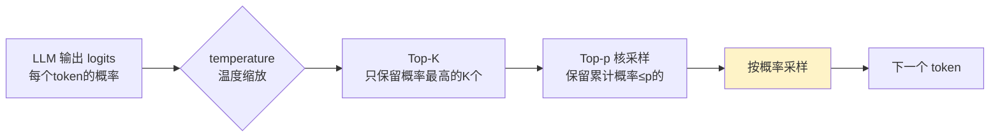

---
tags:
  - basic-knowledge
  - kb/llm
  - kb/llm/fundamentals
  - token
  - context-window
  - sampling
  - temperature
---

# Token、上下文窗口与采样参数

> 调用任何大模型 API 都绕不开这三个概念。理解它们才能控制**成本、效果、稳定性**。

## 相关笔记

- [LLM基础原理](LLM基础原理.md)：Token 与上下文的底层来源
- [Prompt工程基础](Prompt工程基础.md)：采样参数影响 Prompt 效果
- [大模型选型与对比](大模型选型与对比.md)：上下文长度是选型关键维度

---

## 一、Token

模型处理的最小单位（介于字符与词之间），用 BPE 等算法分词。粗略换算：

| 语言       | 约 1 token ≈           |
| ---------- | ---------------------- |
| 英文       | 0.75 个单词            |
| 中文       | 1 个汉字 ≈ 1.5~2 token |
| 代码/emoji | 更多                   |

> **影响**：① 计费（按 input/output token 收费）；② 上下文窗口上限；③ 中文场景「同字数更贵更费 token」。

---

## 二、上下文窗口（Context Window）

模型一次能处理的**最大 token 数**（输入 + 输出）。

| 量级           | 代表                           |
| -------------- | ------------------------------ |
| 早期 4K-8K     | GPT-3.5                        |
| 主流 128K-200K | GPT-4o、Claude 3.5、Gemini 1.5 |
| 长文本 1M-2M   | Gemini 1.5 Pro、部分国产模型   |

### 上下文越长越好吗？

- ✅ 能塞更多文档/历史，RAG/长文档场景受益
- ❌ **更贵更慢**；存在「中间遗忘（Lost in the Middle）」——开头和结尾记得牢，中间易忽略
- ❌ 超长上下文不代表无限精准，关键信息仍要放显眼位置

### 上下文工程（Context Engineering）

> 现代应用的核心：不是塞满上下文，而是**精准编排上下文**——什么该进、什么该压缩、什么该丢弃。比 Prompt 工程更上层。

---

## 三、采样参数

LLM 每步输出的是「下一个 token 的概率分布」，采样参数决定如何从分布中挑选。

### temperature（温度）⭐ 最常用

控制分布的「陡峭度」：

| temperature | 效果                         | 适用                     |
| ----------- | ---------------------------- | ------------------------ |
| 0 ~ 0.3     | 确定性高、保守、可复现       | 代码、抽取、分类、JSON   |
| 0.7 ~ 1.0   | 平衡                         | 通用对话（默认多为 1.0） |
| > 1.0       | 发散、随机、有创意（易跑偏） | 头脑风暴、创意写作       |

> 公式上是对 logits 除以 temperature 再 softmax：温度低→概率集中的项更突出→更确定。

### Top-p（核采样 Nucleus Sampling）

只从**累计概率达到 p** 的最小 token 集合中采样，过滤长尾离谱选项。常与 temperature 搭配，p=0.9 常用。

### Top-K

只保留概率最高的 K 个候选。K 越小越保守。

### frequency_penalty / presence_penalty

- **frequency_penalty**：惩罚已出现多次的 token → 减少重复
- **presence_penalty**：惩罚已出现过的 token → 鼓励新话题

### max_tokens

限制输出最大长度。注意留够输出空间（上下文 = 输入 + 输出）。

---

## 四、参数调优速查

| 场景                       | temperature | Top-p       | 其他                   |
| -------------------------- | ----------- | ----------- | ---------------------- |
| 代码生成 / JSON / 信息抽取 | 0 ~ 0.2     | 1.0（关闭） | 严格、可复现           |
| 客服 / 问答                | 0.3 ~ 0.5   | 0.9         | 准确为主               |
| 通用对话                   | 0.7         | 0.9         | 平衡                   |
| 创意写作 / 起名            | 0.9 ~ 1.2   | 0.95        | 发散                   |
| 输出重复啰嗦               | —           | —           | 调高 frequency_penalty |

---

## 五、面试速答

> **Q：temperature 越高越好还是越低越好？**
> A：看任务。低温度确定可控（适合代码/抽取/JSON），高温度发散有创意（适合写作）。生产中精确任务用 0~0.3，对话用 0.7 左右。

> **Q：上下文窗口 128K 是不是就不需要 RAG 了？**
> A：不是。① 全塞进去贵且慢；② 长上下文有「中间遗忘」，精准度下降；③ 知识库远超 128K。RAG 仍是精准注入相关知识的主流方案。

> **Q：模型输出总重复怎么办？**
> A：调高 frequency_penalty；适当提高 temperature；检查 Prompt 是否过于模糊。

---

## 参考

- [OpenAI · API 参数说明](https://platform.openai.com/docs/api-reference/chat)
- [Hugging Face · How to generate text](https://huggingface.co/blog/how-to-generate)
- [Lost in the Middle 论文](https://arxiv.org/abs/2307.03172)
- [OpenAI Tokenizer](https://platform.openai.com/tokenizer)
