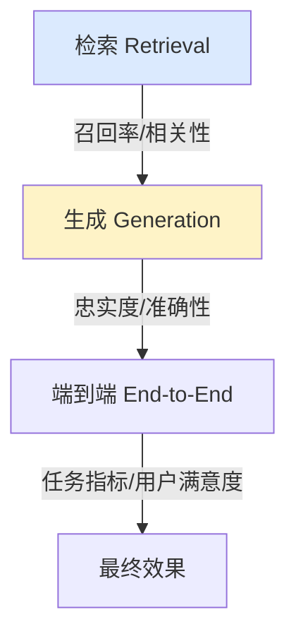

---
tags:
  - basic-knowledge
  - kb/llm
  - kb/llm/evaluation
  - hallucination
  - evaluation
  - ragas
  - llm-as-judge
---

# 大模型幻觉与评估

> **幻觉**是 LLM 应用落地的头号敌人；**评估**是让 LLM 应用可迭代、可上线的工程基础。二者紧密相关。

## 相关笔记

- [LL[LLM基础原理](LLM基础原理.md)M基础原理](LLM基础原理.md)：幻觉源于概率预测的本质
- [RAG基础原理](RAG基础原理.md)：RAG 缓解幻觉的主力
- [Prompt工程基础](Prompt工程基础.md)：Prompt 约束减少幻觉

---

## 一、幻觉（Hallucination）

LLM **生成看似合理但不符合事实/源文本的内容**。分两类：

| 类型           | 含义                    | 缓解                                  |
| -------------- | ----------------------- | ------------------------------------- |
| **事实性幻觉** | 与客观世界事实不符      | RAG / 联网 / 工具 / 引用溯源          |
| **忠实性幻觉** | 与给定上下文/源文档不符 | 强约束 Prompt「仅基于给定内容」+ 引用 |

### 幻觉成因

1. **训练目标**是「下一 token 概率」，本质是**流畅而非求真**。
2. 训练数据有错、有过时、有冲突。
3. 知识截止后不懂新事实。
4. 长上下文「中间遗忘」，漏掉关键约束。

### 缓解手段（按效果）

| 手段                        | 效果               |
| ------------------------- | ---------------- |
| **RAG / 联网检索**            | 给事实依据，最有效        |
| **Prompt 约束**             | 「无依据则答不知道」「引用来源」 |
| **CoT 让模型自检**             | 先推理再答，发现矛盾       |
| **Function Calling 查权威源** | 数字/实时信息交给工具      |
| **多路生成 + 投票/校验**          | Self-Consistency |
| **微调**                    | 减少特定场景幻觉（有限）     |
| **后处理校验**                 | 规则/小模型核对事实       |

> 没有银弹，**工程上是多层防御**：RAG + 强约束 Prompt + 引用溯源 + 关键字段校验 + 兜底话术。

---

## 二、为什么必须评估

LLM 输出是非确定性的（同输入不同输出），传统软件的「测试用例全过」不够。没有评估就无法：

- 判断换模型/Prompt 后是变好还是变坏
- 量化 RAG 改造的收益
- 设置上线门槛和监控告警

---

## 三、评估什么

### LLM 应用的三个层面

### RAG 评估（RAGAS 三件套）

| 指标                         | 含义                                         |
| ---------------------------- | -------------------------------------------- |
| **Faithfulness（忠实度）**   | 回答是否都能由检索上下文支持（防忠实性幻觉） |
| **Answer Relevancy**         | 回答是否切题                                 |
| **Context Precision/Recall** | 检索是否准、是否全                           |

### 生成评估

| 指标                   | 方法                    |
| ---------------------- | ----------------------- |
| 准确性                 | 人工标注 / 标准答案比对 |
| 忠实度                 | 答案 vs 源文档          |
| 相关性、完整性、有害性 | rubric 评分             |

### 端到端

- **任务指标**：抽取准确率、分类 F1、工具调用成功率、用户采纳率。
- **业务指标**：解决率、转人工率、CSAT。

---

## 四、评估方法

### 1. 人工评估

金标准，但慢、贵、难规模化。适合关键场景和建立基准。

### 2. LLM-as-a-Judge ⭐

用一个强模型（如 GPT-4/Claude）按 rubric 给被评估模型打分。**主流、可规模化**。注意：偏好同源模型、位置偏差、长度偏差。

### 3. 标准答案自动比对

有 ground truth 时，用 EM / F1 / BLEU / ROUGE。但 LLM 自由文本场景，**这些指标常不靠谱**，更推荐语义相似度或 LLM 判断。

### 4. 在线评估（A/B + 监控）

上线后持续采集真实反馈（点赞/点踩、采纳/转人工），做 A/B 测试和漂移监控。

---

## 五、建评估集的最佳实践

1. **从真实流量采样**，覆盖典型/边缘/对抗 case。
2. **标注 golden answer + rubric**（可接受的回答标准）。
3. **分层**：smoke test（快速回归）+ full set（深度评估）。
4. **迭代**：线上 bad case 持续补进评估集。
5. **自动化**：CI 里跑 smoke test，Prompt/模型变更自动评估对比。

### 工具

| 工具                                    | 用途                             |
| --------------------------------------- | -------------------------------- |
| **RAGAS**                               | RAG 评估（忠实度/相关性/上下文） |
| **DeepEval / Promptfoo / OpenAI Evals** | 通用 LLM 评估框架                |
| **LangSmith / Langfuse / Phoenix**      | 在线追踪 + 评估 + 监控           |

---

## 六、面试速答

> **Q：怎么减少 LLM 幻觉？**
> A：分层防御——① RAG/联网给事实依据；② Prompt 强约束「仅基于上下文，无依据就说不知道」+ 引用溯源；③ CoT 自检；④ 关键事实用工具核对；⑤ 后处理校验 + 兜底。

> **Q：怎么评估一个 RAG 系统？**
> A：检索层看 Recall@K、上下文相关性；生成层看 Faithfulness（忠实度，防幻觉）和 Answer Relevancy。用 RAGAS 框架 + LLM-as-Judge 规模化打分，再叠加端到端任务指标和线上反馈。

> **Q：LLM-as-Judge 有什么坑？**
> A：偏好同源模型、位置偏差、冗长回答得分虚高。需随机化顺序、控制长度、必要时人工校准。

---

## 参考

- [RAGAS 文档](https://docs.ragas.io/)
- [LLM-as-a-Judge 论文](https://arxiv.org/abs/2306.05685)
- [OpenAI Evals](https://github.com/openai/evals)
- [LangSmith](https://www.langchain.com/langsmith) / [Langfuse](https://langfuse.com/)
- [Hallucination 综述](https://arxiv.org/abs/2311.05232)
