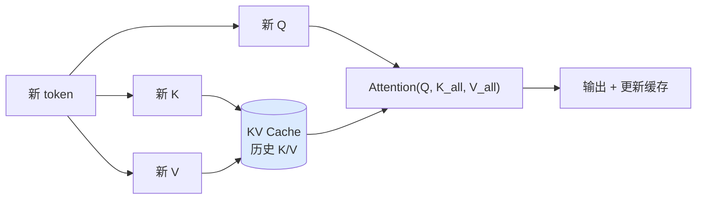
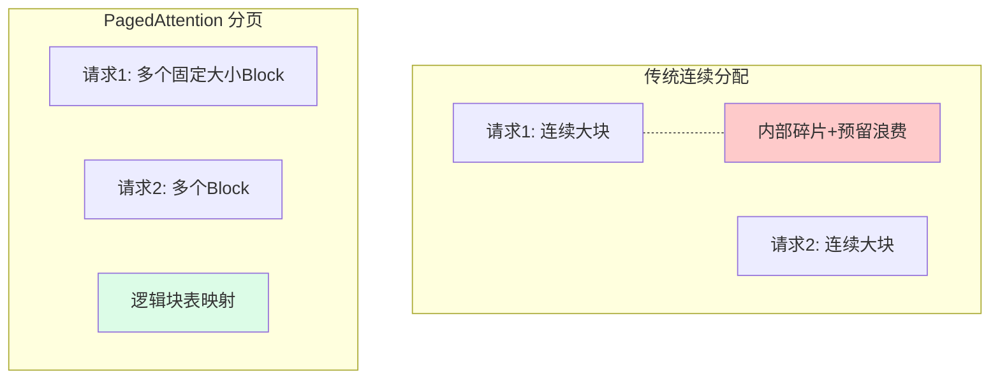
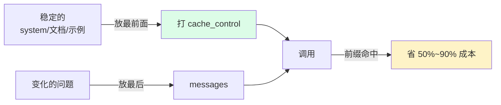

---
tags:
  - basic-knowledge
  - kb/llm
  - kb/llm/inference
  - kv-cache
  - prompt-caching
  - vllm
  - inference-optimization
---

# 大模型推理缓存：KV Cache 与 Prompt Caching

> 模型缓存（**不是应用层 Redis 缓存**）指 LLM 推理引擎/服务层的缓存机制。理解它能**降本、提速、扛长上下文**，是模型应用开发的高阶必修。

## 相关笔记

- [LLM基础原理](LLM基础原理.md)：自注意力是 KV Cache 的来源
- [Token上下文窗口与采样参数](Token上下文窗口与采样参数.md)：长上下文 = KV Cache 暴涨
- [RAG基础原理](RAG基础原理.md)：RAG 的长文档场景最受益于 Prompt Caching

---

## 一、缓存分三层（先理清概念）

| 层级                             | 缓存内容                 | 谁负责                    | 解决什么                              |
| -------------------------------- | ------------------------ | ------------------------- | ------------------------------------- |
| **① 推理引擎 KV Cache**          | 注意力的 Key/Value 张量  | 模型服务（vLLM/TGI/官方） | 避免每步重算历史 token                |
| **② Prompt / Prefix Caching**    | 相同前缀的 KV Cache 复用 | API 提供商 / 推理框架     | 相同 system prompt 重复调用时省钱省时 |
| **③ 语义缓存（Semantic Cache）** | 历史 Q→A（应用层）       | 你的应用                  | 相似问题直接返回，省调用              |

> 本文重点讲 ①②（模型缓存）。③ 属应用层优化，此处仅作区分。

---

## 二、KV Cache：为什么 LLM 推理能快

### 问题：自回归生成的重复计算

LLM 自回归生成：每生成一个新 token，注意力都要对**前面所有 token** 计算。若不缓存，第 t 步要把前 t-1 个 token 全重算一遍，复杂度 O(n²)，极慢。

### 解法：缓存历史 K/V

因果注意力下，**已生成 token 的 K、V 不会变**（它们只依赖自己及更早的输入）。所以把每层的历史 K/V 存起来，下一步只算**新 token** 的 Q/K/V，与缓存拼接送入注意力：



> 每步从 O(t) 的全量重算降到 O(1) 增量计算，**这是自回归 LLM 能实时生成的关键**。

### 代价：KV Cache 吃显存

KV Cache 大小随**上下文长度线性增长**：

$$\text{KV显存} \propto 2 \times n_{layers} \times n_{heads} \times d_{head} \times \text{seq\_len} \times \text{batch} \times \text{bytes}$$

- 长上下文（如 128K）下，**KV Cache 显存常远超模型权重本身**，成为显存瓶颈。
- 这就是为什么长上下文又慢又贵，以及 PagedAttention 等优化存在的意义。

---

## 三、PagedAttention（vLLM 的核心创新）

把 KV Cache 像**操作系统虚拟内存分页**一样管理：



- KV Cache 分成固定大小的 **block（块）**，按需分配，用**块表**映射逻辑→物理。
- 消除内部碎片，显存利用率从 ~20% 提升到 ~96%。
- 配合 **Continuous Batching（连续批处理）**，吞吐量比朴素实现高数十倍。

> 生产自建推理服务几乎都用 **vLLM**（或 TGI/SGLang），核心价值就是这套 KV Cache 管理 + 连续批处理。

---

## 四、Prompt Caching / Prefix Caching ⭐ 应用开发者必懂

当你的请求**前缀相同**（system prompt、长文档、few-shot 示例），这部分对应的 KV Cache 可以复用，**不必重复计算**。

### 价值

- **省钱**：相同前缀的输入 token 按折扣计费
- **省时**：跳过前缀的前向计算，降低首 token 延迟（TTFT）
- **典型场景**：RAG（同一文档反复问）、Agent（长 system prompt + 工具定义）、few-shot

### 各厂商机制

| 提供商            | 机制                      | 要点                                                                                          |
| ----------------- | ------------------------- | --------------------------------------------------------------------------------------------- |
| **Anthropic**     | 显式 `cache_control` 标记 | 标记 1-4 个缓存断点；缓存命中读取价 **1/10**；缓存写入价 1.25x；最小 1024 token（Claude 3.5） |
| **OpenAI**        | 自动缓存                  | ≥1024 token 的相同前缀**自动**缓存；命中 input 价 **5 折**；无需改代码                        |
| **Google Gemini** | 显式 cachedContent        | 预先创建缓存内容对象，按存储时长计费                                                          |
| **vLLM（自建）**  | `--enable-prefix-caching` | 自动复用相同前缀 KV，提升吞吐                                                                 |

### 用法示例（Anthropic Claude）

```json
{
  "model": "claude-...",
  "system": [
    {
      "type": "text",
      "text": "<超长的系统提示与工具说明>",
      "cache_control": { "type": "ephemeral" }
    }
  ],
  "messages": [{ "role": "user", "content": "具体问题" }]
}
```

> 第一次调用：缓存写入（贵 25%）。后续 5 分钟内命中：读取价 1/10。**重复调用越多省越多**。

### 最佳实践



1. **稳定内容放最前**：system prompt / 工具定义 / 文档 / few-shot。
2. **变化内容放最后**：用户当前问题。
3. **检查命中**：响应里的 `cache_read_input_tokens` / `cached_tokens`，确认真的命中。
4. **注意有效期**：缓存有 TTL（如 5 分钟~1 小时），低频调用可能失效。

---

## 五、语义缓存（应用层，简要）

用 Embedding 把「历史问题→答案」存向量库，新问题先算相似度，命中阈值则直接返回历史答案，**不调用模型**。

- 适合：客服 FAQ、高频重复问题。
- 风险：相似但不同的问题被误判，需设高阈值 + 兜底。
- 工具：Redis Vector、GPTCache。
- **本质是应用层优化，与本文的模型层 KV/Prompt 缓存不同**。

---

## 六、面试速答

> **Q：KV Cache 是什么，为什么需要？**
> A：自回归生成时，历史 token 的注意力 K/V 不变，缓存它们可避免每步全量重算（O(n²)→每步 O(n)）。代价是显存随上下文线性增长，长上下文下常成瓶颈。

> **Q：Prompt Caching 怎么省钱？**
> A：相同前缀对应的 KV Cache 可复用，跳过重复前向计算。调用时把稳定内容（system/文档）放前面并启用缓存，命中后输入 token 打 1~5 折，RAG/Agent 等重复前缀场景节省可观。

> **Q：vLLM 为什么快？**
> A：PagedAttention 分页管理 KV Cache 消除碎片 + Continuous Batching 动态组批，显存利用率和吞吐量提升一个数量级。

---

## 参考

- [Anthropic · Prompt Caching](https://docs.anthropic.com/en/docs/build-with-claude/prompt-caching)
- [OpenAI · Caching（自动缓存）](https://platform.openai.com/docs/guides/prompt-caching)
- [vLLM · PagedAttention 论文](https://arxiv.org/abs/2309.06180)
- [Google Gemini · Context Caching](https://ai.google.dev/gemini-api/docs/caching)
- [LLM 推理优化综述](https://huggingface.co/blog/optimum-llm)
