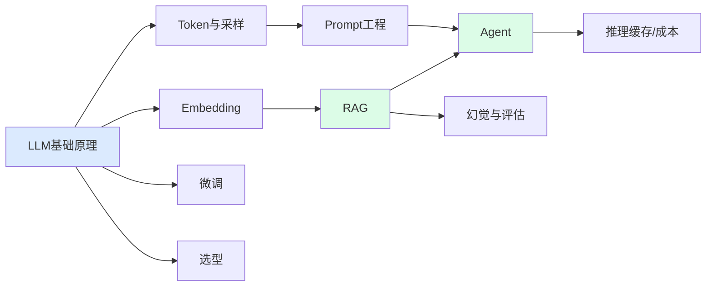

---
tags:
  - basic-knowledge
  - kb/llm
  - kb/meta
---

# 🧠 大模型基础知识索引

> 本目录是**大模型原理基础层**，面向模型应用开发（RAG / Agent / 应用工程）。
> 与仓库 `🤖Agent`、`📚RAG`、`🧚DeepSeek`、`📓MCP&A2A`（应用实践层）互补：这里讲**为什么**，那里讲**怎么做**。
> 标签：`kb/llm` + 子主题；写作规范见 [知识库写作规范](../知识库写作规范.md)。

---

## 基础原理

- [LLM基础原理](LLM基础原理.md) ⭐ — Transformer、自注意力、Token、训练流程（预训练→SFT→对齐）
- [Token上下文窗口与采样参数](Token上下文窗口与采样参数.md) — temperature/Top-p、上下文窗口、成本控制
- [Embedding与向量检索](Embedding与向量检索.md) — 向量化、余弦相似度、HNSW、混合检索

## 交互工程

- [Prompt工程基础](Prompt工程基础.md) ⭐ — Few-shot、CoT、结构化输出、反模式
- [RAG基础原理](RAG基础原理.md) ⭐ — 检索增强生成、Chunking、Rerank、高级模式
- [Agent与Function-Calling基础](Agent与Function-Calling基础.md) ⭐ — ReAct、工具调用、记忆与规划

## 工程优化

- [大模型推理缓存-KV-Cache与Prompt-Caching](大模型推理缓存-KV-Cache与Prompt-Caching.md) ⭐ — KV Cache、PagedAttention、Prompt Caching 省钱提速
- [模型微调基础](模型微调基础.md) — LoRA/PEFT、QLoRA、何时该微调
- [大模型选型与对比](大模型选型与对比.md) — 开源/闭源、选型决策树、降本策略
- [大模型幻觉与评估](大模型幻觉与评估.md) — 幻觉缓解、RAGAS、LLM-as-Judge

---

## 学习路径建议

1. 先理解 [LLM基础原理](LLM基础原理.md) 打地基
2. 学 [Prompt工程](Prompt工程基础.md) 和 [RAG](RAG基础原理.md)（应用最高频）
3. 进阶 [Agent](Agent与Function-Calling基础.md)、[推理缓存](大模型推理缓存-KV-Cache与Prompt-Caching.md) 做工程优化
