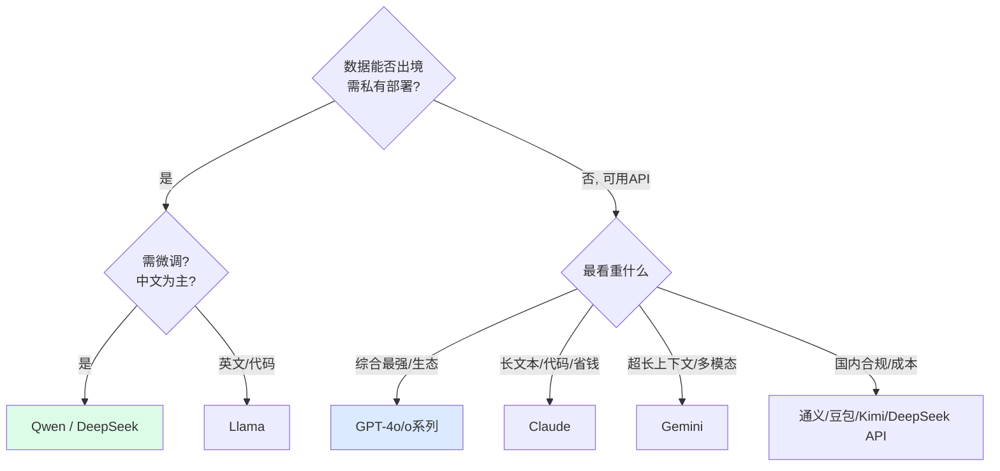

---
tags:
  - basic-knowledge
  - kb/llm
  - kb/llm/model-selection
  - model-selection
  - gpt
  - claude
  - gemini
  - deepseek
---

# 大模型选型与对比

> 做模型应用，第一步就是选模型。本文给一个**选型框架**（注意：模型迭代极快，具体型号请以官方最新为准）。

## 相关笔记

- [LLM基础原理](LLM基础原理.md)：base vs chat
- [Token上下文窗口与采样参数](Token上下文窗口与采样参数.md)：上下文长度与成本
- [模型微调基础](模型微调基础.md)：需微调则选开源
- [大模型推理缓存-KV-Cache与Prompt-Caching](大模型推理缓存-KV-Cache与Prompt-Caching.md)：成本优化

---

## 一、选型维度

| 维度             | 考量                                          |
| ---------------- | --------------------------------------------- |
| **能力**         | 推理/代码/多模态/中文，是否够用               |
| **上下文长度**   | RAG/长文档需 128K+                            |
| **成本**         | 输入/输出 token 单价，是否支持 Prompt Caching |
| **速度/延迟**    | 首 token 延迟、吞吐                           |
| **开源 vs 闭源** | 是否需要私有部署/微调/数据合规                |
| **生态**         | Function Calling、JSON Mode、视觉等能力成熟度 |
| **合规/可用性**  | 国内可用性、数据出境、企业合规                |

---

## 二、闭源主流（按能力/场景）

| 厂商          | 代表                     | 强项                                             |
| ------------- | ------------------------ | ------------------------------------------------ |
| **OpenAI**    | GPT-4o / o 系列          | 综合强、生态最全、推理（o 系列）                 |
| **Anthropic** | Claude 3.5/4 系列        | 长文本、代码、**Prompt Caching 成熟**、Artifacts |
| **Google**    | Gemini 2.x               | **超长上下文（1M+）**、多模态、便宜              |
| **国内**      | 文心/通义/豆包/Kimi/智谱 | **国内合规可用**、中文、价格低                   |

> 闭源优点：能力强、免运维、Function Calling 稳定。缺点：数据出境、长期成本、不可微调、API 依赖。

---

## 三、开源主流（可自建/微调）

| 系列                  | 出品       | 特点                                             |
| --------------------- | ---------- | ------------------------------------------------ |
| **Qwen（通义千问）**  | 阿里       | **中文最强开源之一**，全尺寸全模态，license 友好 |
| **DeepSeek**          | 深度求索   | 性价比高、推理（R1）/V3 系列，**国内热门**       |
| **Llama**             | Meta       | 国际开源标杆，生态最大                           |
| **GLM/ChatGLM**       | 智谱       | 中文、Agent 能力                                 |
| **Mistral / Mixtral** | Mistral AI | 欧洲、MoE 架构、效率高                           |

> 开源优点：私有部署、数据不出、可微调、长期可控。缺点：需 GPU/运维、能力通常略逊顶级闭源。

---

## 四、选型决策树

---

## 五、成本与规模权衡

- **大模型**（GPT-4o/Claude Opus）：关键决策、复杂推理、高质量场景。
- **小模型**（GPT-4o-mini/Claude Haiku/Qwen-7B）：分类、抽取、路由、高并发低成本场景。
- **混合路由**：用小模型先判断，复杂才升级大模型（**LLM 路由**是降本利器）。

| 任务                   | 推荐档位         |
| ---------------------- | ---------------- |
| 简单分类/抽取/格式化   | 小模型（最便宜） |
| 通用对话/RAG 问答      | 中模型（性价比） |
| 复杂推理/代码/关键决策 | 大模型（最强）   |

---

## 六、实践建议

1. **从 API 起步**验证业务，再决定是否自建开源。
2. **解耦模型层**：用统一接口（如 LiteLLM、LangChain 抽象），方便换模型。
3. **关注厂商特性**：Prompt Caching、Batch API（半价离线）、Structured Output。
4. **建评估集**：用你的真实任务评测，别只看榜单。
5. **预算成本**：预估 token 量 × 单价，注意长上下文和输出成本。

---

## 七、面试速答

> **Q：什么场景用闭源，什么场景用开源？**
> A：闭源（GPT/Claude）适合追求最强能力、免运维、能接受数据出境和 API 依赖；开源（Qwen/DeepSeek/Llama）适合需私有部署、数据合规、可微调、长期控成本，但要承担 GPU 和运维。

> **Q：怎么给项目降本？**
> A：① 任务分级用小/中/大模型（LLM 路由）；② 启用 Prompt Caching 复用前缀；③ Batch API 处理离线任务（半价）；④ RAG 控制上下文长度；⑤ 必要时微调小模型替代大模型。

---

## 参考

- [LMSYS Chatbot Arena（众包榜单）](https://chat.lmsys.org/)
- [OpenAI 定价](https://openai.com/api/pricing/) / [Anthropic 定价](https://www.anthropic.com/pricing)
- [Hugging Face Open LLM Leaderboard](https://huggingface.co/spaces/open-llm-leaderboard/open_llm_leaderboard)
- [Qwen 系列](https://github.com/QwenLM/Qwen2.5) / [DeepSeek](https://github.com/deepseek-ai)
- 你仓库 `🗨️GPT/Openai主要用到的模型及其用途.md`、`🧚DeepSeek/DeepSeek架构原理.md`
