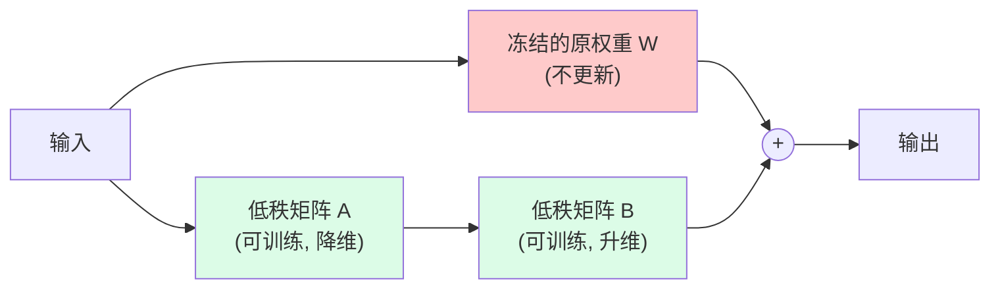
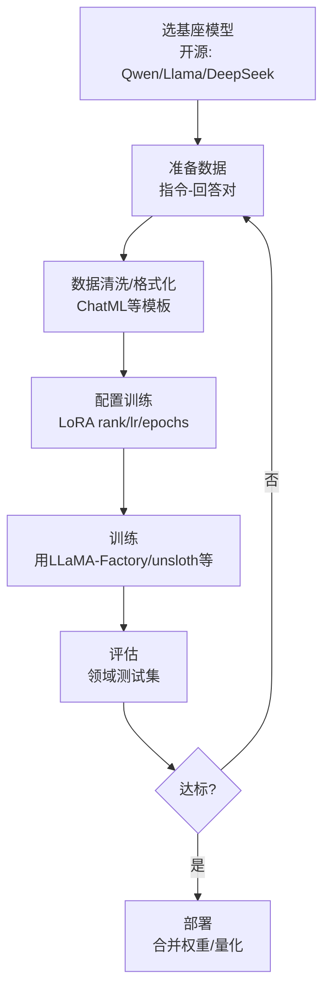

---
tags:
  - basic-knowledge
  - kb/llm
  - kb/llm/fine-tuning
  - fine-tuning
  - lora
  - peft
  - sft
---

# 模型微调基础：LoRA 与 PEFT

> 当 Prompt/RAG 不够时，微调能让模型「更像你的业务」。本文讲清楚**什么时候微调、怎么微调、微调什么**。

## 相关笔记

- [LLM基础原理](LLM基础原理.md)：预训练→SFT→对齐的完整链路
- [RAG基础原理](RAG基础原理.md)：RAG vs 微调的选择
- [大模型选型与对比](大模型选型与对比.md)：开源模型才能微调

---

## 一、什么时候需要微调

微调解决的是**模型行为/能力**问题，而非知识问题。

| 用 RAG/Prompt     | 用微调                              |
| ----------------- | ----------------------------------- |
| 注入事实/时效知识 | 固定输出风格、格式                  |
| 可溯源、实时更新  | 特定领域术语/推理方式               |
| 即改即用          | 提升 JSON/结构化输出稳定性          |
| 单次问答          | 降低 token 成本（把长 Prompt 内化） |

> **决策原则**：先 Prompt → 再 RAG → 最后微调。微调成本高、迭代慢、需数据，且不能替代 RAG 的知识注入。

---

## 二、微调的几种类型

| 类型                                     | 数据               | 目的                              |
| ---------------------------------------- | ------------------ | --------------------------------- |
| **Continued Pre-training（继续预训练）** | 大量领域无标注文本 | 注入领域知识/语言（如代码、医学） |
| **SFT（监督微调）**                      | 指令-回答对        | 学会按你的格式/风格/任务回答      |
| **偏好对齐（DPO/RLHF）**                 | 偏好对（A好于B）   | 对齐人类偏好、安全                |

> 应用层微调**绝大多数是 SFT**。

---

## 三、全参微调 vs PEFT（LoRA）

### 全参微调（Full Fine-Tuning）

更新模型**所有参数**：效果上限高，但需要巨量显存、易灾难性遗忘、每个任务存一份完整模型（动辄几十 GB）。

### PEFT（参数高效微调）

只训练**少量新增参数**，冻结原模型：

| 方法                    | 思路                                       |
| ----------------------- | ------------------------------------------ |
| **LoRA** ⭐             | 给权重矩阵旁加一对低秩矩阵 A·B，只训 A、B  |
| **QLoRA**               | LoRA + 4bit 量化基座，**单卡可微调大模型** |
| Adapter / Prefix Tuning | 加小模块或调前缀向量                       |

### LoRA 原理示意

> 假设 W 是 d×d，LoRA 用两个 d×r 和 r×d 小矩阵（r 远小于 d，如 r=8）近似 ΔW，可训练参数从 d² 降到 2dr，**显存和存储大幅下降**，效果接近全参。

---

## 四、微调流程

### 数据准备（最关键）

- **质量 >> 数量**：几百条高质量样本常胜过几万条噪声。
- 格式遵循基座的对话模板（如 ChatML、Qwen 格式）。
- 覆盖任务的多样性，避免过拟合单一模式。

### 常用工具

- **LLaMA-Factory**：低代码微调框架，国人常用
- **unsloth**：极致加速、省显存
- **Axolotl**：配置驱动，社区流行

---

## 五、常见坑

| 坑                         | 对策                                   |
| -------------------------- | -------------------------------------- |
| 数据质量差，越调越差       | 人工清洗，宁缺毋滥                     |
| 灾难性遗忘（丢了通用能力） | 混入通用数据；用小 lr；LoRA 比 full 轻 |
| 过拟合（只会背训练集）     | 控制 epochs（通常 1~3）；留验证集      |
| 评估只看 loss              | 必须用领域任务人工/LLM 评估            |
| 以为微调能注入新事实       | 事实用 RAG，微调管行为                 |

---

## 六、面试速答

> **Q：LoRA 为什么省资源？**
> A：用两个低秩小矩阵 A·B 近似权重更新 ΔW，可训练参数从 d² 降到 2dr（r≪d），显存和存储都大幅下降，且推理时可合并回原权重、不增加延迟。

> **Q：RAG 和微调怎么选？**
> A：知识/事实/时效→RAG；风格/格式/特定推理行为→微调。可叠加：微调改行为 + RAG 注知识。

> **Q：微调数据要多少？**
> A：SFT 几百到几千条高质量样本往往够用；质量远比数量重要。继续预训练才需要大量无标注文本。

---

## 参考

- [LoRA 论文](https://arxiv.org/abs/2106.09685)
- [QLoRA 论文](https://arxiv.org/abs/2305.14314)
- [LLaMA-Factory](https://github.com/hiyouga/LLaMA-Factory)
- [unsloth](https://github.com/unslothai/unsloth)
- [Hugging Face PEFT](https://huggingface.co/docs/peft)
