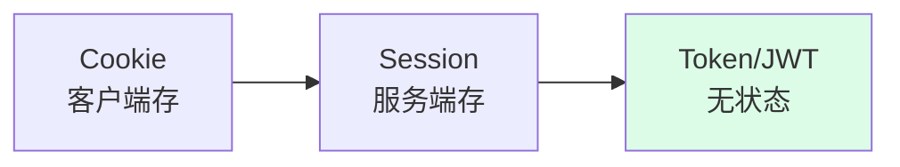
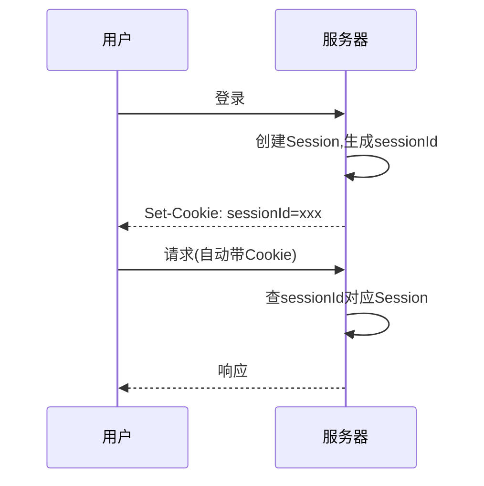
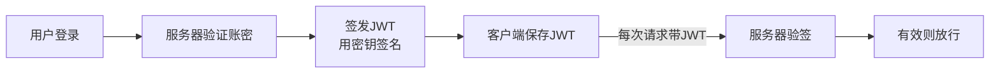

---
tags:
  - basic-knowledge
  - kb/network
  - kb/security
  - cookie
  - session
  - jwt
  - authentication
---

# Cookie / Session / Token / JWT

> 鉴权是 Web 高频考点。**Cookie/Session 是有状态方案，Token/JWT 是无状态方案**，搞清区别和场景。

## 相关笔记

- [HTTP与HTTPS](HTTP与HTTPS.md)：HTTP 无状态
- [OAuth2授权码模式原理](../运维/OAuth2授权码模式原理.md)：第三方鉴权
- [对称加密和非对称加密](../运维/对称加密和非对称加密.md)：JWT 签名

---

## 一、HTTP 无状态问题

HTTP 协议本身无状态（每次请求独立），但业务需要「记住用户登录态」。解决方案演化：

---

## 二、Cookie（客户端）

服务器通过 `Set-Cookie` 响应头种到浏览器，浏览器后续请求自动带上。

| 特点 | 说明                                                                 |
| ---- | -------------------------------------------------------------------- |
| 存储 | **客户端**（浏览器），4KB 限制                                       |
| 传递 | 每次 HTTP 请求**自动携带**（同域）                                   |
| 属性 | `HttpOnly`（防 XSS 读）、`Secure`（仅 HTTPS）、`SameSite`（防 CSRF） |

> Cookie 不适合存敏感/大数据，适合存标识（如 sessionId）。

---

## 三、Session（服务端，有状态）

服务端为每个用户保存会话数据，用 **sessionId**（存在 Cookie 里）关联。

| 优点                         | 缺点                                       |
| ---------------------------- | ------------------------------------------ |
| 服务端可控、可强制下线       | **有状态**，服务端存 session 占内存        |
| 安全性较好（数据不在客户端） | 分布式下需**session 共享**（Redis/Sticky） |

> 分布式下 Session 要共享（存 Redis 或一致性哈希粘性），是痛点。

---

## 四、Token / JWT（无状态）⭐

服务器不存会话，签发一个**自包含的 Token** 给客户端，客户端每次请求带上，服务器**验证签名**即可。

### JWT（JSON Web Token）结构

`Header.Payload.Signature`（Base64 编码，用 `.` 连接）：

| 部分          | 内容                                                         |
| ------------- | ------------------------------------------------------------ |
| **Header**    | 算法类型（如 HS256）+ 类型 JWT                               |
| **Payload**   | 声明（用户ID、过期时间等，**不要放敏感信息**，只编码非加密） |
| **Signature** | `HMAC(Header + Payload, 密钥)`，防篡改                       |

### JWT 优缺点

| 优点                           | 缺点                               |
| ------------------------------ | ---------------------------------- |
| **无状态**，服务端不存，易扩展 | **签发后难撤销**（除非维护黑名单） |
| 自包含，跨服务/跨域方便        | Payload 仅编码非加密，不能放密码   |
| 适合移动端/微服务/SSO          | 续签/登出处理复杂                  |

> JWT 一旦签发在过期前都有效，**登出需配合黑名单（Redis）**；续签用 Refresh Token。

---

## 五、对比与选型

| 方案          | 状态       | 存储   | 分布式      | 适用                |
| ------------- | ---------- | ------ | ----------- | ------------------- |
| Cookie        | -          | 客户端 | -           | 存标识              |
| Session       | 有状态     | 服务端 | 需共享      | 传统 Web、单体      |
| **Token/JWT** | **无状态** | 客户端 | 天然支持 ⭐ | 微服务、移动端、SSO |

---

## 六、安全注意

| 威胁                 | 防护                                                    |
| -------------------- | ------------------------------------------------------- |
| **XSS**（脚本窃取）  | Cookie 设 `HttpOnly`；Token 存内存不存 localStorage     |
| **CSRF**（伪造请求） | Cookie 设 `SameSite`；Token 方案天然防 CSRF（不自动带） |
| **Token 泄露**       | HTTPS 传输、短过期 + Refresh Token、敏感操作二次验证    |

---

## 七、面试速答

> **Q：Cookie、Session、Token 区别？**
> A：Cookie 存客户端、请求自动带；Session 存服务端、用 sessionId（存 Cookie）关联，有状态；Token（JWT）无状态，自包含+签名，客户端带、服务端验签，适合分布式。

> **Q：JWT 怎么验签？为什么不能被篡改？**
> A：JWT = Header.Payload.Signature，Signature 是用服务端密钥对 Header+Payload 做 HMAC。篡改 Payload 后 Signature 对不上（攻击者没有密钥），验签失败。

> **Q：JWT 怎么实现登出？**
> A：JWT 无状态，签发后过期前都有效。登出需在服务端维护**黑名单**（Redis 记已登出的 token 直到过期），或用短过期 + Refresh Token 轮换。

> **Q：Session 分布式怎么做？**
> A：集中存 Redis（所有节点共享）；或粘性 Session（同一用户固定路由到同一节点）；或 JWT 直接绕过。

---

## 参考

- [JWT 官方](https://jwt.io/introduction)
- [RFC 7519 · JWT](https://datatracker.ietf.org/doc/html/rfc7519)
- [Cookie MDN](https://developer.mozilla.org/zh-CN/docs/Web/HTTP/Cookies)
