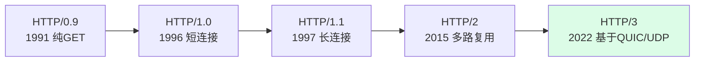
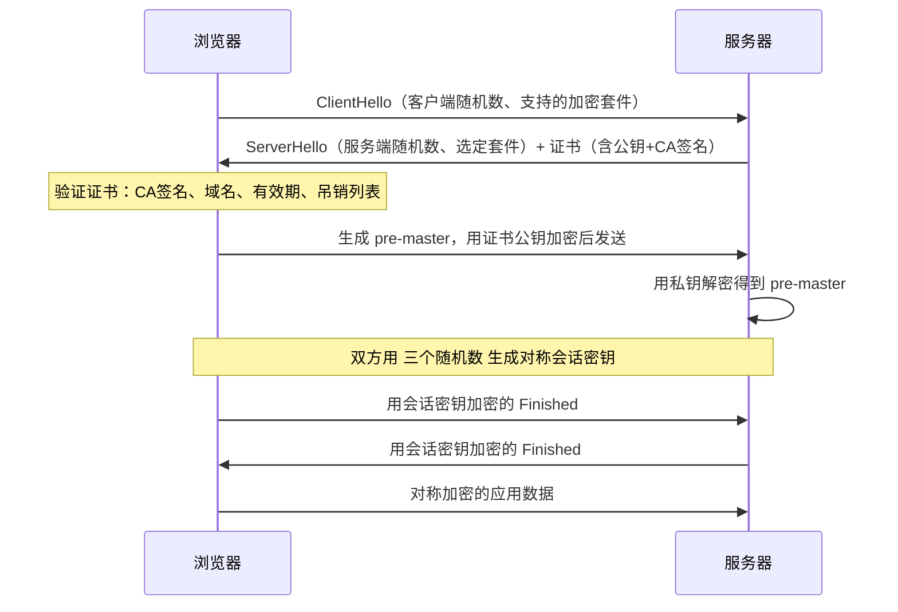

---
tags:
  - basic-knowledge
  - kb/network
  - kb/network/http
  - http
  - https
  - tls
  - http3
---

# HTTP 与 HTTPS

> HTTP 版本演进 + HTTPS/TLS 握手是网络高频面试题。注意：**HTTP/3（基于 QUIC）和 TLS 1.3 已是主流**，老资料只讲 HTTP/1.1 已过时。

## 相关笔记

- [TCP-IP协议](TCP-IP协议.md)、[TCP三次握手，四次挥手](TCP三次握手，四次挥手.md)：HTTP 基于 TCP（HTTP/3 例外）
- [GET与POST的区别](GET与POST的区别.md)
- [对称加密和非对称加密](../运维/对称加密和非对称加密.md)：HTTPS 混合加密的基础

---

## 一、HTTP 版本演进

### 版本对比

| 版本    | 传输层          | 关键特性                                              | 痛点                               |
| ------- | --------------- | ----------------------------------------------------- | ---------------------------------- |
| **1.0** | TCP 短连接      | 每次请求新建连接                                      | 连接开销大                         |
| **1.1** | TCP 长连接      | 持久连接、管线化、缓存字段、Host 头                   | **队头阻塞**（一个慢请求阻塞后续） |
| **2.0** | TCP             | 二进制分帧、**多路复用**、头部压缩(HPACK)、服务器推送 | TCP 层队头阻塞（丢包阻塞所有流）   |
| **3.0** | **QUIC（UDP）** | 无 TCP 队头阻塞、**0-RTT 建连**、连接迁移             | 生态仍在普及                       |

> **HTTP/1.1 队头阻塞**：同一连接上请求需按序响应，前一个慢了后面全堵。HTTP/2 多路复用在**应用层**解决了它，但 TCP 层丢包仍会阻塞所有流；HTTP/3 改用 UDP（QUIC）彻底解决。

### HTTP/2 要点

- **二进制分帧**：数据拆成二进制帧，可交错发送
- **多路复用**：一个 TCP 连接上并行多个请求/响应（流 stream）
- **头部压缩**：HPACK 算法压缩重复头
- **服务器推送**：服务端可主动推送资源（注：HTTP/3 已弃用，Chrome 也移除了对 HTTP/2 push 的支持）

### HTTP/3 / QUIC 要点 ⭐

- 基于 **UDP**，在用户态实现可靠传输（QUIC = Quick UDP Internet Connections）
- **解决 TCP 队头阻塞**：每个流独立，丢包只影响自己
- **0-RTT/1-RTT 建连**：把传输层 + TLS 握手合并，首包更快
- **连接迁移**：网络切换（WiFi→4G）不断连接

---

## 二、HTTPS = HTTP + TLS

HTTPS 在 HTTP 和 TCP 之间加一层 **TLS**（Transport Layer Security，前身 SSL），提供**加密、认证、完整性**。

### 混合加密

- **非对称加密**（RSA/ECDHE）用于**握手阶段交换密钥**（慢但安全）
- **对称加密**（AES）用于**后续数据传输**（快）

> 为什么混合？非对称加密计算昂贵，不适合大量数据；对称加密快但密钥分发不安全。所以用非对称安全交换对称密钥，再用对称加密传输。

### TLS 握手流程（以 TLS 1.2 为例）

> ⚠️ **关键纠错**：证书里**只有公钥 + CA 签名**，**私钥绝不发给客户端**，永远只在服务器。客户端用证书里的**公钥**加密 pre-master，只有持有**私钥**的服务器能解密。

### TLS 1.3（2018，现主流）的改进 ⭐

- 握手从 **2-RTT 减到 1-RTT**，支持 **0-RTT** 恢复（更快）
- 废弃不安全算法（RSA 密钥交换、SHA-1、RC4 等），强制 **前向安全**（ECDHE）
- 握手消息加密（更隐私）
- 简化加密套件选择

> **前向安全（Forward Secrecy）**：即使长期私钥泄露，历史加密流量也无法被解密——因为每次会话密钥都是临时协商的（ECDHE）。

---

## 三、HTTP 状态码

| 分类    | 含义       | 高频                                                                       |
| ------- | ---------- | -------------------------------------------------------------------------- |
| **1xx** | 指示       | 100 Continue, **101 Switching Protocols**（升级到 WebSocket/HTTP/2）       |
| **2xx** | 成功       | **200 OK**, **201 Created**, **204 No Content**                            |
| **3xx** | 重定向     | **301 永久**, **302 临时**, **304 Not Modified**（缓存）                   |
| **4xx** | 客户端错误 | **400 参数错**, **401 未认证**, **403 拒绝**, **404 不存在**, **429 限流** |
| **5xx** | 服务端错误 | **500 内部错误**, **502 网关错误**, **503 不可用**, **504 网关超时**       |

### 面试高频区分

| 对比                   | 区别                                                           |
| ---------------------- | -------------------------------------------------------------- |
| **301 vs 302**         | 301 永久重定向（缓存，SEO 权重转移）；302 临时重定向（不缓存） |
| **401 vs 403**         | 401 未认证（没登录/没身份）；403 已认证但无权限（拒绝执行）    |
| **301/302 vs 307/308** | 307/308 保留请求方法（POST 不变 GET），更规范                  |

---

## 四、面试速答

> **Q：HTTP/1.1、2、3 的区别？**
> A：1.1 长连接但有队头阻塞；2 二进制分帧 + 多路复用 + 头部压缩，解决应用层队头阻塞，但 TCP 层仍会阻塞；3 基于 QUIC（UDP），彻底解决队头阻塞，0-RTT 建连，支持连接迁移。

> **Q：HTTPS 握手过程？**
> A：客户端发 ClientHello（随机数+加密套件）→ 服务端回证书（公钥+CA签名）+ 随机数 → 客户端验证证书后，生成 pre-master 用公钥加密发回 → 双方用三个随机数生成对称会话密钥 → 后续用对称加密通信。TLS 1.3 简化为 1-RTT 并强制前向安全。

> **Q：证书里有什么？私钥会发出去吗？**
> A：证书含**公钥 + CA 签名 + 域名/有效期等信息**。**私钥永远只在服务器**，绝不外发。客户端用公钥加密，只有持私钥的服务器能解密。

> **Q：为什么 HTTPS 用混合加密？**
> A：非对称加密安全但慢，用于握手交换密钥；对称加密快，用于数据传输。兼顾安全与性能。

---

## 参考

- [MDN · HTTP 概述](https://developer.mozilla.org/zh-CN/docs/Web/HTTP/Overview)
- [HTTP/3 RFC 9114](https://www.rfc-editor.org/rfc/rfc9114)
- [TLS 1.3 RFC 8446](https://www.rfc-editor.org/rfc/rfc8446)
- [QUIC RFC 9000](https://www.rfc-editor.org/rfc/rfc9000)
- [图解 HTTPS - 小林coding](https://www.xiaolincoding.com/network/2_http/http_https.html)
