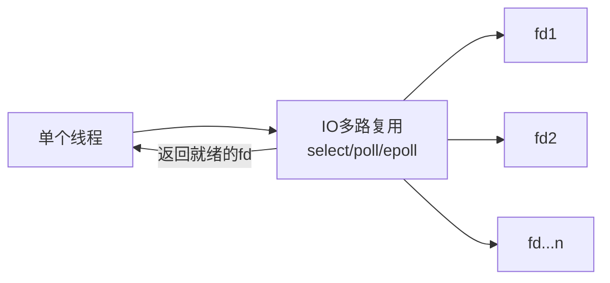
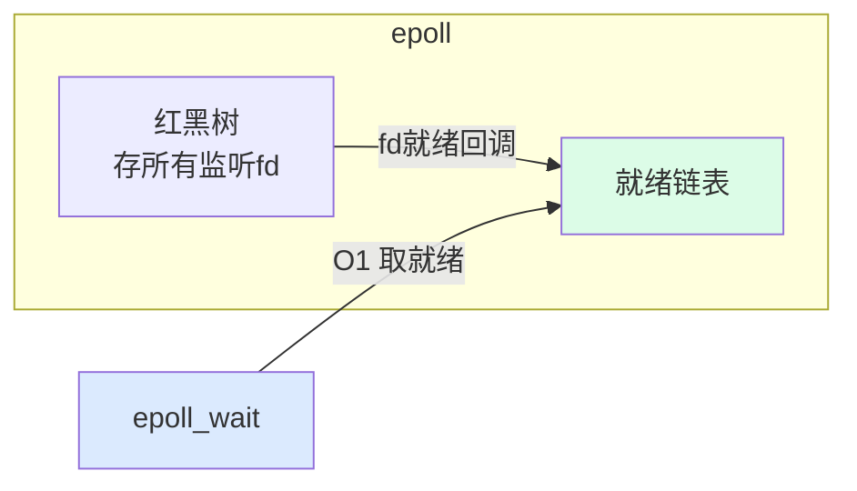

---
tags:
  - basic-knowledge
  - kb/os
  - kb/os/io
  - io-multiplexing
  - epoll
  - poll
  - select
---

# select、poll、epoll（IO 多路复用）

> IO 多路复用：**一个线程同时监听多个 fd**，谁就绪处理谁。是 Redis/Nginx/Netty 高并发的底层基石。三者是演进关系，epoll 是终极方案。

## 相关笔记

- [异步如何实现的](异步如何实现的.md)：事件循环基于 epoll
- [进程、线程、协程](进程、线程、协程.md)：并发模型
- [Redis的底层原理](../redis/Redis的底层原理.md)：Redis 用 epoll

---

## 一、为什么需要 IO 多路复用

阻塞 IO 模型下，一个连接一个线程，连接多了线程爆炸。**IO 多路复用**让一个线程同时管理大量连接：调用一次接口，告诉内核「这些 fd 我都关心，谁就绪了告诉我」。



---

## 二、select（1983，最古老）

```c
int select(int nfds, fd_set *readfds, ..., struct timeval *timeout);
```

- 用**位图（bitmap）`fd_set`** 传关心的 fd 集合
- 内核遍历检查每个 fd 是否就绪，**返回就绪数量**
- 用户态**再次遍历**整个集合找出就绪的 fd

### 缺点

| 缺点          | 说明                                       |
| ------------- | ------------------------------------------ |
| **数量限制**  | 默认 **1024** 个 fd（`FD_SETSIZE`）        |
| **O(n) 遍历** | 每次都要遍历全部 fd 找就绪的，连接多时低效 |
| **全量拷贝**  | 每次调用要把整个 fd 集合从用户态拷到内核态 |
| **位图重置**  | 每次调用后 fd_set 被改写，需重新设置       |

---

## 三、poll（改进 select）

```c
int poll(struct pollfd *fds, nfds_t nfds, int timeout);
```

- 用**链表/数组**（`pollfd` 结构）替代位图
- **解除了 1024 数量限制**

但本质问题和 select 一样：**仍 O(n) 遍历、仍全量拷贝**。只是数量上限放开。

---

## 四、epoll（Linux 终极方案）⭐

```c
int epoll_create(int size);          // 创建 epoll 实例
int epoll_ctl(int epfd, ...);        // 增删改关心的 fd（红黑树）
int epoll_wait(int epfd, ...);       // 等待就绪事件
```

### 为什么高效

| 创新             | 说明                                                                     |
| ---------------- | ------------------------------------------------------------------------ |
| **红黑树存 fd**  | `epoll_ctl` 增删改 O(log n)，**不用每次重传**                            |
| **就绪链表**     | fd 就绪时内核通过**回调**把它加入就绪链表，`epoll_wait` 直接取，**O(1)** |
| **只返回就绪的** | 不用遍历全部 fd 找就绪的                                                 |



### 两种触发模式

| 模式                     | 说明                                                                                  |
| ------------------------ | ------------------------------------------------------------------------------------- |
| **LT（水平触发，默认）** | 只要 fd 有数据可读，**一直通知**直到处理完。编程简单                                  |
| **ET（边缘触发）**       | fd **状态变化时只通知一次**，必须一次性读完（非阻塞 IO + 循环读）。效率更高但易漏数据 |

> Nginx 用 epoll + ET；Redis 用 epoll + LT。

---

## 五、三者对比

| 维度       | select   | poll             | epoll                          |
| ---------- | -------- | ---------------- | ------------------------------ |
| fd 上限    | **1024** | 无限制（受系统） | 无限制                         |
| 时间复杂度 | O(n)     | O(n)             | **O(1)**（就绪）               |
| fd 拷贝    | 每次全量 | 每次全量         | **注册时一次**                 |
| 内核实现   | 位图遍历 | 链表遍历         | **红黑树+就绪链表回调**        |
| 跨平台     | ✅ 通用  | ✅               | ❌ Linux 专属（BSD 用 kqueue） |

> 「连接数少且都活跃时 select/poll 可能不输 epoll」——这个说法被夸大了。实际上 epoll 开销主要在 epoll_ctl 注册（一次性），活跃连接多时 epoll 的 O(1) 优势明显。**现代场景一律 epoll**。

---

## 六、典型应用

| 系统         | 用法                                   |
| ------------ | -------------------------------------- |
| **Redis**    | epoll + LT（事件循环，单线程扛万连接） |
| **Nginx**    | epoll + ET（高并发 Web）               |
| **Netty**    | 封装 epoll/kqueue（Java 高性能网络）   |
| **Java NIO** | Selector（底层 epoll）                 |

---

## 七、面试速答

> **Q：select/poll/epoll 区别？**
> A：select 有 1024 限制、O(n) 遍历、每次全量拷贝；poll 解除数量限制但仍 O(n)；epoll 用红黑树存 fd、就绪链表回调，O(1) 取就绪、只注册一次，是 Linux 高并发标配。

> **Q：epoll 为什么快？**
> A：① fd 存红黑树，增删改 O(log n) 且不用每次重传；② 就绪的 fd 通过回调进就绪链表，epoll_wait 直接 O(1) 取，不用遍历全部；③ 只返回就绪事件。

> **Q：ET 和 LT 区别？**
> A：LT 水平触发，有数据就一直通知，编程简单（Redis 用）；ET 边缘触发，状态变化只通知一次，必须一次读完，效率高但难写（Nginx 用）。

> **Q：epoll 是跨平台的吗？**
> A：不是，epoll 是 Linux 专属。BSD/macOS 用 kqueue，Windows 用 IOCP。跨平台库（libuv/Java NIO）会自动选择。

---

## 参考

- [Linux man · epoll](https://man7.org/linux/man-pages/man7/epoll.7.html)
- [The C10K problem](https://en.wikipedia.org/wiki/C10k_problem)
- [epoll 原理详解 - 小林coding](https://www.xiaolincoding.com/os/8_network_system/selete_poll_epoll.html)
- 《Unix 网络编程》第 6 章
