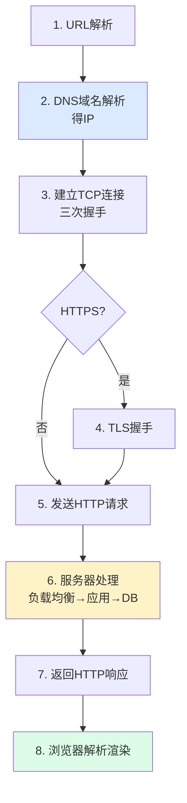
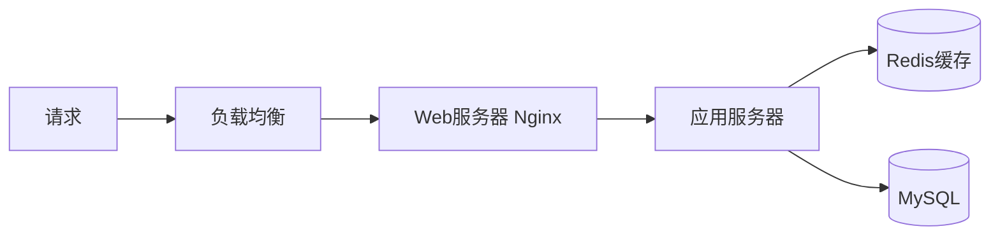
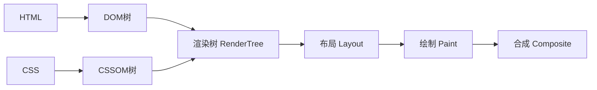

---
tags:
  - basic-knowledge
  - kb/network
  - kb/network/http
  - url
  - browser
  - dns
---

# 从输入 URL 到页面显示的全过程

> **网络面试必考经典题**，几乎每场都会问。串起 DNS、TCP、TLS、HTTP、服务端、浏览器渲染全链路。

## 相关笔记

- [HTTP与HTTPS](HTTP与HTTPS.md)：HTTP 请求与 TLS 握手
- [TCP三次握手，四次挥手](TCP三次握手，四次挥手.md)：建连
- [DNS](../运维/DNS.md)：域名解析
- [计算机网络](计算机网络.md)：分层模型

---

## 一、全流程总览

---

## 二、各步骤详解

### 1. URL 解析

解析协议、域名、端口、路径、参数。

### 2. DNS 解析（域名→IP）

查找顺序（多级缓存）：**浏览器缓存 → 系统缓存 → hosts → 本地 DNS → 根/顶级/权威 DNS**。

### 3. TCP 三次握手

详见 [TCP三次握手](TCP三次握手，四次挥手.md)。

### 4. TLS 握手（HTTPS 才有）

协商密钥、验证证书，建立加密通道。详见 [HTTP与HTTPS](HTTP与HTTPS.md)。

### 5. 发送 HTTP 请求

构造请求行/头/体，发往服务器。

### 6. 服务器处理

可能经 CDN、负载均衡、Web 服务器、应用、缓存、数据库。

### 7. 返回响应

服务器返回状态码、响应头、响应体（HTML）。

### 8. 浏览器解析与渲染 ⭐

- 解析 HTML 构建 **DOM**，解析 CSS 构建 **CSSOM**
- 合成**渲染树** → 布局（计算位置）→ 绘制 → 合成
- 遇 JS 会阻塞（JS 可改 DOM/CSS），async/defer 异步加载

---

## 三、性能优化点（每个环节都能优化）

| 环节   | 优化手段                               |
| ------ | -------------------------------------- |
| DNS    | DNS 预解析、减少域名                   |
| 连接   | 长连接、HTTP/2 多路复用、减少握手      |
| 传输   | Gzip 压缩、CDN 加速、缓存              |
| 服务端 | Redis 缓存、SQL 优化、异步             |
| 渲染   | 压缩 JS/CSS、懒加载、减少重排重绘、SSR |

---

## 四、面试速答

> **Q：从输入 URL 到页面显示经历了什么？**
> A：URL 解析 → DNS 解析得 IP → TCP 三次握手 →（HTTPS 则 TLS 握手）→ 发 HTTP 请求 → 服务器处理（可能经 CDN/LB/Web/应用/DB）→ 返回响应 → 浏览器解析 HTML/CSS 构建 DOM/CSSOM → 合成渲染树 → 布局 → 绘制 → 合成显示。

> **Q：浏览器渲染过程？**
> A：解析 HTML 建 DOM、CSS 建 CSSOM → 合成渲染树 → 布局（算位置）→ 绘制 → 合成。JS 会阻塞解析，async/defer 可异步。

---

## 参考

- [What happens when（开源详解）](https://github.com/alex/what-happens-when)
- [浏览器工作原理 - HTML5 Rocks](https://www.html5rocks.com/zh/tutorials/internals/how-browsers-work/)
- [小林coding · 图解网络](https://www.xiaolincoding.com/network/)
