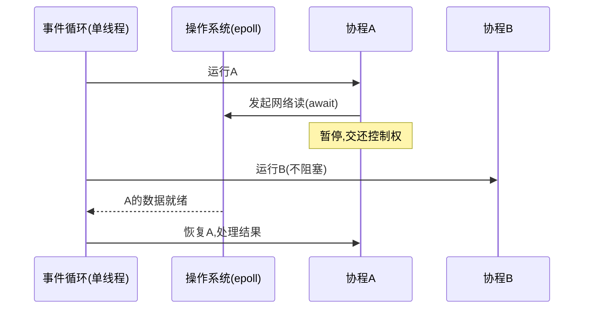
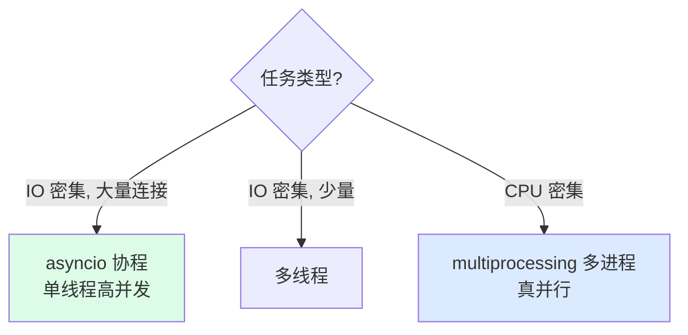

---
tags:
  - basic-knowledge
  - kb/os
  - kb/programming/python
  - asyncio
  - async
  - event-loop
  - coroutine
---

# 异步是如何实现的

> 标题是「如何实现」，不是「怎么用」。本文讲 asyncio 背后的原理：**事件循环 + IO 多路复用 + 协程**。老资料里 `get_event_loop` 的写法已废弃，本文用现代 API。

## 相关笔记

- [GIL](../python/GIL.md)：asyncio 单线程，规避 GIL 竞争，但不能跑 CPU 密集
- [select、poll、epoll](select、poll、epoll.md)：事件循环的底层
- [进程、线程、协程](进程、线程、协程.md)：并发模型对比
- [Httpx与Asyncio](../python/Httpx与Asyncio.md)：实战用法

---

## 一、异步的本质：单线程 + 事件循环 + IO 多路复用

异步 IO 的「并发」**不是多线程**，而是：**一个线程 + 一个事件循环 + IO 多路复用**。

- 同步 IO：发起 IO 后**阻塞等待**，CPU 空转
- 异步 IO：发起 IO 后**不等待**，切去执行其他就绪任务，IO 完成后再回来处理



> 核心：**IO 等待时不浪费 CPU**，让事件循环去执行其他就绪协程。一台单线程机器也能并发处理上万连接。

---

## 二、协程：可暂停恢复的函数

**协程（coroutine）** 是用户态的、**可暂停恢复**的函数：

- `async def` 定义协程函数；调用它**返回协程对象**（不立即执行）
- `await` **暂停**当前协程，把控制权交还事件循环，等结果就绪后**恢复**
- 底层是基于**生成器（yield）的状态机**实现

```python
async def fetch():        # 定义协程函数
    data = await db.get() # 暂停→等IO→恢复
    return data

fetch()  # 只创建协程对象，不会执行！必须被事件循环调度
```

### 协程 vs 线程

| 维度     | 协程                   | 线程                    |
| -------- | ---------------------- | ----------------------- |
| 调度     | 用户态（事件循环）     | 内核态                  |
| 切换开销 | 极小（保存少量寄存器） | 大（内核上下文切换）    |
| 并发     | 单线程内并发           | 多核并行（受 GIL 限制） |
| 编程模型 | `async/await`，需传染  | 普通                    |

---

## 三、事件循环：调度核心

事件循环（Event Loop）是 asyncio 的大脑，循环执行：


1. 从就绪队列取任务执行
2. 协程 `await` 时暂停，注册 IO 回调
3. 调用 **IO 多路复用（epoll/kqueue）** 等待 IO 就绪
4. IO 就绪 → 对应协程恢复执行

> 事件循环的「等待 IO」靠的是操作系统的 [select、poll、epoll](select、poll、epoll.md)，一个线程就能监听成千上万个 fd。

---

## 四、现代写法（Python 3.7+）⭐

```python
import asyncio

async def main():
    # 并发运行多个协程
    await asyncio.gather(foo(), bar())

asyncio.run(main())   # ✅ 现代入口：自动创建/运行/关闭事件循环
```

> ❌ **过时写法**（3.10+ 弃用，勿用）：`loop = asyncio.get_event_loop(); loop.run_until_complete(...)`
> ❌ 网上老教程的「复杂应用要手动管理事件循环」是**错误建议**——现代 Python 一律用 `asyncio.run()`，自定义循环只在框架集成等少数场景。

### 常用 API

| API                                | 作用                       |
| ---------------------------------- | -------------------------- |
| `asyncio.run(coro)`                | 运行入口（推荐）           |
| `asyncio.create_task(coro)`        | 把协程包成 Task 并发调度   |
| `asyncio.gather(*coros)`           | 并发等待多个，按序返回结果 |
| `asyncio.wait_for(coro, t)`        | 带超时等待                 |
| `asyncio.Queue / Lock / Semaphore` | 异步同步原语               |

---

## 五、与 GIL 的关系（重要）

- asyncio **单线程**运行，**不存在 GIL 竞争**（只有一个线程）
- 但代价：**协程里不能跑 CPU 密集代码**——会阻塞整个事件循环，其他协程全部卡住
- CPU 密集部分用 `loop.run_in_executor()` 丢到**线程池/进程池**：

```python
await loop.run_in_executor(None, cpu_heavy_func, arg)  # 不阻塞事件循环
```

---

## 六、asyncio vs 多线程 vs 多进程



---

## 七、常见坑

| 坑                                                                | 后果                                                      | 对策                                          |
| ----------------------------------------------------------------- | --------------------------------------------------------- | --------------------------------------------- |
| 协程里用**同步阻塞 IO**（`requests`、`time.sleep`、阻塞 DB 驱动） | 阻塞整个事件循环，所有协程卡住                            | 用异步库（aiohttp、asyncpg、`asyncio.sleep`） |
| 忘了 `await`                                                      | 协程不执行，`RuntimeWarning: coroutine was never awaited` | 检查 await                                    |
| CPU 密集放协程里                                                  | 阻塞事件循环                                              | `run_in_executor` 丢线程/进程池               |
| 创建协程不调度                                                    | 白创建，警告                                              | `create_task` 或 `gather`                     |

---

## 八、面试速答

> **Q：asyncio 是怎么实现并发的？**
> A：单线程 + 事件循环 + IO 多路复用。协程 `await` 时暂停交还控制权，事件循环用 epoll 监听 IO 就绪后恢复对应协程。IO 等待时不浪费 CPU，实现高并发。

> **Q：协程和线程的区别？**
> A：协程用户态调度、切换开销极小、单线程内并发；线程内核调度、开销大、可多核（受 GIL 限制）。

> **Q：为什么协程里不能跑 CPU 密集任务？**
> A：协程跑在单线程事件循环里，CPU 密集会阻塞循环，其他协程全卡住。要用 `run_in_executor` 丢线程/进程池，或用多进程。

> **Q：asyncio 和 GIL 冲突吗？**
> A：不冲突。asyncio 单线程，没有 GIL 竞争问题；但 CPU 密集仍受单线程限制，需配合多进程。

---

## 参考

- [Python 官方 · asyncio 文档](https://docs.python.org/3/library/asyncio.html)
- [PEP 492 · async/await](https://peps.python.org/pep-0492/)
- [Real Python · Async IO in Python](https://realpython.com/async-io-python/)
- [asyncio 原理 - 小林coding 不适用，改用] [Python 协程原理](https://docs.python.org/3/library/asyncio-task.html)
