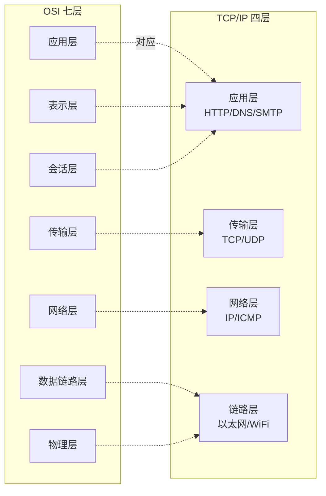

---
tags:
  - basic-knowledge
  - kb/network
  - osi
  - tcp-ip
---

OSI 和 TCP/IP 协议之间的对应关系

OSI（开放系统互联）模型和 TCP/IP（传输控制协议/互联网协议）模型都是用于描述网络协议的分层架构，但它们有不同的起源和层次划分。

### OSI 模型

OSI 模型由七层组成：

1. **物理层（Physical Layer）**
2. **数据链路层（Data Link Layer）**
3. **网络层（Network Layer）**
4. **传输层（Transport Layer）**
5. **会话层（Session Layer）**
6. **表示层（Presentation Layer）**
7. **应用层（Application Layer）**

### TCP/IP 模型

TCP/IP 模型通常由四层或五层组成：

1. **链路层（Link Layer）或网络接口层（Network Interface Layer）**
2. **网络层（Network Layer）**
3. **传输层（Transport Layer）**
4. **应用层（Application Layer）**

### OSI 和 TCP/IP 的对应关系

下面是 OSI 和 TCP/IP 模型之间的一种常见对应关系：

- **物理层（OSI）** 对应于 **链路层（TCP/IP）**
- **数据链路层（OSI）** 对应于 **链路层（TCP/IP）**
- **网络层（OSI）** 对应于 **网络层（TCP/IP）**
- **传输层（OSI）** 对应于 **传输层（TCP/IP）**
- **会话层（OSI）、表示层（OSI）和应用层（OSI）** 通常都被认为对应于 **应用层（TCP/IP）**

需要注意的是，这种对应关系并不是严格的一一对应，而是一种大致的层次映射。实际上，不同的网络协议和应用可能会有不同的层次划分和功能实现。

总体而言，OSI 模型更为详细和严格，而 TCP/IP 模型则更加灵活和实用，更贴近实际的网络协议和应用。

[TCP-IP协议](TCP-IP协议.md)

[OAuth2授权码模式原理](../运维/OAuth2授权码模式原理.md)

[HTTP与HTTPS](HTTP与HTTPS.md)

[GET与POST的区别](GET与POST的区别.md)

[icmp](icmp.md)

[DNS](../运维/DNS.md)

[负载均衡](../分布式&高并发/负载均衡.md)

[Socket粘包](Socket粘包.md)

[Socket断点续传](Socket断点续传.md)
